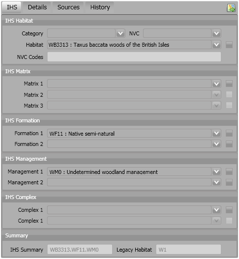

==========
Background
==========

In August 2009 Hampshire Biodiversity Information Centre (HBIC) awarded exeGesIS SDM the contract to develop a new toolkit which would manage their Habitat and Land Use spatial data. The new toolkit would be used by HBIC and Local Record Centres in the South-East of England, and therefore needed to be compatible with both ArcGIS and MapInfo.

The Habitat and Land Use (HLU) data consisted of a set of habitat polygons. Each habitat polygon had approximately 80 attributes. The decision was taken by Local Records Centres to split these habitat polygons into Ordnance Survey (OS) Mastermap derived polygons.

Benefits
--------
Whilst there are benefits to splitting the habitat polygons by OS Mastermap, such as ensuring polygon boundaries are accurate, the splitting process significantly increases the volume of data. On average, there are 33.5 Mastermap-derived polygons for each habitat polygon in the HLU data.

For example, the table below indicates the effect on a 500 polygon dataset if the data was held in a single GIS layer.

+------------+----------+--------------------+
|            | Original | Split by Mastermap |
+============+==========+====================+
| Polygons   | 500      | 16,750             |
+------------+----------+--------------------+
| Attributes | 40000    | 1,340,000          |
+------------+----------+--------------------+
| Total      | 40,500   | 1,356,750          |
+------------+----------+--------------------+

Data Separation
---------------
Due to the complexity of the attribute data required by the Local Records Centres and to minimise data duplication, the habitat attribute and spatial data were split into a relational database with an associated GIS layer. Splitting the attribute and spatial data, reduces the number of attributes required for the spatial layer to 6.

Literal ``hi`` *emphasis* **strong emphasis** [1]_

.. [1] Test footnote

.. tip::

  Test tip
  line 2

.. note::

  Test note
  line 2

.. warning::
	It is dangerous ...

.. sidebar:: Sidebar Title

  Before following this tutorial you need a website running Instant Indicia, 
  with the Forms and Surveys Library feature installed.

Some text

.. todo::
  Todo text

.. seealso::
	See also text

	HLU GIS Tool interface - IHS tab

	This is the legend following the figure.

.. |export| image:: ../images/icons/FileExport.png

Some text |export| some more text

.. index::
	Index item

.. glossary::
	Incid
		An 'incremental identifier' used as a unique reference to a logical group of one or more features.

In this `paragraph`:index:, several words are being
`marked`:index: inline as implicit `index`:index:
entries.

.. index:: markup
.. index:: syntax

The explicit index directives above would refer to
this paragraph.  It might also make sense to allow multiple
entries in an ``index`` directive:

.. index:: indextitle: subindextitle

More |export| text.

.. topic:: Topic title

	Topic body text
	spread over several
	lines

