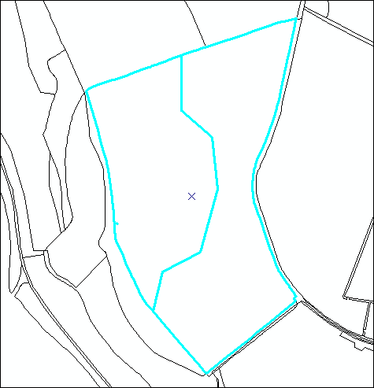
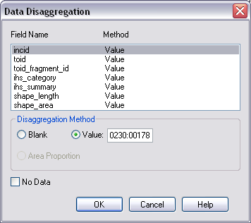
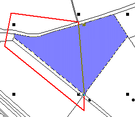
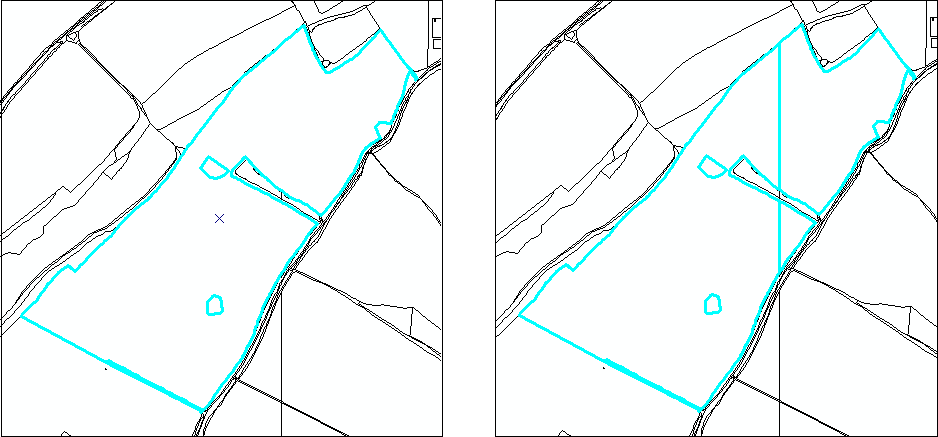

.. index::
	single: Key concepts

********
Concepts
********

.. index::
	single: OS Mastermap
	single: toid
	single: toid_fragment_id
	see: Topographical identifier; toid
	see: fragment; toid_fragment_id

.. _mastermap:

OS MasterMap Framework
======================

Mastermap is the largest scale national mapping produced by the Ordnance Survey.

For the mapping framework, vector polygons from the Topographic Area layer of the Mastermap data were used as the spatial base. The polygons form a subdivision or segmentation of the landscape which is complete and continuous, detailed and accurate.

OS Mastermap Topographic Area polygons have a number of associated attributes that provide information about the real world object that the polygon represents, along with others relevant to data management, including a numeric ID that uniquely identifies each object. The real world description attributes, chiefly the Descriptive Group and Descriptive Term, were used for habitat classification and are covered later in this document.
The habitat framework product retains only two of the original Mastermap attributes, the unique ID known as the Topographic Identity or TOID

TOID
TOID_Fragment_Id

.. raw:: latex

	\newpage

.. index::
	single: incid
	see: Incremental Identifier; incid

.. _incid:

Incremental Identifier
======================

INCID

.. raw:: latex

	\newpage

GIS layer and Database Separation
=================================

Due to the number and complexity of data attributes and the need to minimise data duplication and reduce data volume the spatial data and attribute data are separated into separate components:

1. The spatial data is stored in one or more GIS layers together with a minimal set of attributes that uniquely identifies and summarises each spatial feature. Separating the spatial data from the attribute data reduces the number of attributes required for the spatial layer which improves performance in the GIS application.

2. The attribute data is stored in a relational database in a ‘normalised’ relational structure (i.e. groups of related attributes are divided into smaller, separate tables and relationships are defined between the tables). A normalised relational database enables the attributes to be retrieved and maintained in a very logical, and universal, way whilst simultaneously reducing the data storage requirements and improving the data structure and integrity.
   
The HLU Tool provides an interface that links the spatial and attribute data and presents them to the user as a single entity.

.. raw:: latex

	\newpage

Priority Habitats
=================

.. tabularcolumns:: |L|C|C|C|

.. table:: Determination Quality matrix for different survey types and ages

+------------------------------------------+-----------------------------------------+
|               Survey Type                | Age of Survey                           |
|                                          +---------------+------------+------------+
|                                          | < 5 years     | 5-10 years | > 10 years |
+==========================================+===============+============+============+
| NVC quadrat                              | High (1)      | Medium (2) | Medium (3) |
+------------------------------------------+---------------+------------+------------+
| NVC rapid                                | Medium (2)    | Medium (3) | Medium (4) |
+------------------------------------------+---------------+------------+------------+
| Phase 1 and target notes                 | Medium (3)    | Medium (4) | Low (5)    |
+------------------------------------------+---------------+------------+------------+
| Phase 1 map only                         | Low(5)        | Low (5)    | Low (6)    |
+------------------------------------------+---------------+------------+------------+
| ESA/ SSSI site description/ species list | Medium (3)    | Medium (3) | Medium (4) |
+------------------------------------------+---------------+------------+------------+
| Aerial Photo, Landcover                  | Low (5)       | Low (6)    | Low (7)    |
+------------------------------------------+---------------+------------+------------+
| Expert knowledge of site quality         | Medium(4)     | Medium (4) | Low (5)    |
+------------------------------------------+---------------+------------+------------+

.. raw:: latex

	\newpage

Splits and Merges
=================

.. index::
	single: split

.. _split:

Split Features
--------------

Split features will performs two types of split depending upon the filter active in the tool. If one or more features from a single INCID are present in the current filter then the tool will perform a logical split. If two or more fragments from the same TOID and with the same TOID_Fragment_Id are present in the current filter then the tool will perform a physical split.

.. Note:: If two or more fragments from the same TOID and with the same TOID_Fragment_Id are selected in the GIS and :guilabel:`Get Map Selection` is clicked then the tool will recognise that the fragments must have been split by the user in the GIS layer and will automatically perform a physical split before displaying the attributes.

.. index::
	single: logical split

.. _logical_split:

Logical Split
^^^^^^^^^^^^^

Logical split is used to create a new INCID in the database based upon the subset of features selected from a single INCID in the GIS layer. The habitat details for the new INCID can then be updated independently of the other features in the original INCID.

To perform a logical split:

* Click ‘Switch to GIS Window’ and select the required features in the GIS layer.
* Return to the HLU main window and click ‘Get Map Selection’.
* Select one of the options in the ‘Process’ list.
* Click on ‘Split Features’. The new INCID will be created and set as the current record.

.. Note:: The selected features must all belong to the same INCID.

.. index::
	single: physical split

.. _physical_split:

Physical Split
^^^^^^^^^^^^^^

Physical split creates one or more new TOID fragments in the database based upon a single TOID which has been split in the GIS layer.

.. note::

	* Only one feature should be split in a single operation. Splitting multiple features will cause database synchronisation issues. 
	* If several features have been split, select the fragments for one original feature and split using the tool. Repeat this operation for the remaining features.
	* Ensure that the physical split is completed in the database prior to commencing any other operations such as ‘Select by attributes…’ to avoid database synchronisation issues.

ArcGIS
""""""

To perform a physical split:

* On the ‘Editor’ toolbar, click on ‘Editor’ and select ‘Start Editing’.
* Select the feature to be split.
* On the ‘Editor’ toolbar, select the ‘Cut Polygons Tool’ (for polygon features) or `Split Tool` (for lines) button as shown in the figure :ref:`figArcEMB`.

.. _figArcEMB:

	Edit Settings for Physical Split (ArcGIS)

* Using the Sketch tool on ‘Editor’ toolbar, draw a polyline.
* On the ‘Editor’ toolbar, click on ‘Editor’ and select ‘Save Edits’.
* The feature will be split but still selected as shown in the figure :ref:`figArcSFD`. Return to the HLU GIS Tool and click ‘Get Map Selection’.

.. _figArcSFD:

	Split Features (ArcGIS)

* Select one of the options in the ‘Process’ list.
* Click on ‘Split Features’. The record will be updated and details added to the History tab for the INCID.

MapInfo
"""""""

To perform a physical split:

* Set the Cosmetic layer as ‘Editable’ and draw the feature to split by.

.. Tip:: The Cosmetic layer should be used due to the time required for MapInfo to add a new feature to the full HLU layer.

* Set the HLU layer as ‘Editable’.
* Select the feature to be split and go to Objects > Set Target.
* Select the polygon in the Cosmetic layer and go to Objects > Split.
* In the Data Disaggregation box, ensure that ‘Method’ for all fields is set to ‘Value’ as shown in the figure :ref:`figMIDD`, then click OK.

.. _figMIDD:

	Data Disaggregation Dialog (MapInfo)

* The feature will be split but still selected as shown in :ref:`figMISF`. Return to the HLU GIS Tool and click ‘Get Map Selection’.

.. _figMISF:

	Split Features (MapInfo)

* Select one of the options in the ‘Process’ list.
* Click on ‘Split Features’. The record will be updated and details added to the History tab for the INCID. The Cosmetic layer will be cleared.

.. index::
	single: merge

.. _merge:

Merge Features
--------------

Merge features will performs two types of merge depending upon the filter active in the tool. If two or more features from multiple INCIDs are present in the current filter then the tool will perform a logical merge. If two or more fragments from the same TOID and with different TOID_Fragment_Ids are present in the current filter then the tool will perform a physical merge.

.. index::
	single: Logical merge

.. _logical_merge:

Logical Merge
^^^^^^^^^^^^^

Logical merge combines all the features selected in the GIS into a single INCID chosen from from the selected features. This assigns the attributes from the chosen INCID to all the other selected features and logically groups the features into a single INCID so that they can be updated together in the future.

To perform a logical merge:

* Click ‘Switch to GIS Window’ and select the features to be merged and a feature from the INCID they are to be merged with in the GIS layer.
* Return to the HLU main window and click ‘Get Map Selection’.
* Select one of the options in the ‘Process’ list.
* Click on ‘Merge Features’. A list of INCIDs will be displayed as shown in the figure :ref:`figLMD`.

.. _figLMD:

.. figure:: ../images/figures/LogicalMergeDialog.png
	:align: center

	Select INCID to Keep Dialog

* Click on the grey box to the left of the row to select an INCID. The associated feature will blink in the GIS window. Click ‘OK’.
* The selected features will be assigned to the selected INCID and details added to the History tab.
* If the merged features are fragments of the same TOID the user will be given the option to then perform a physical merge.

.. index::
	single: Physical merge

.. _physical_merge:

Physical Merge
^^^^^^^^^^^^^^

Physical merge combines fragments of a single TOID into a single, larger, feature in the GIS layer. As the fragments must already belong to the same INCID there are no attribute updates but the boundaries between adjacent features will be removed.

To perform a physical merge:

* Select two or more fragments from one TOID in the GIS layer as shown in the figure :Ref:`figPMD` (left).
* Return to the HLU main window and click ‘Get Map Selection’.
* Select one of the options in the ‘Process’ list.
* Click on ‘Merge Features’. The features will be combined in the GIS layer as shown in figure :Ref:`figPMD` (right).

.. _figPMD:

	Physical Merge – Before (left) and After (right)

.. Note:: Only fragments belonging to the same TOID can be merged in a single operation. If fragments for several TOIDs need to be merged, the operation must be repeated for each TOID.