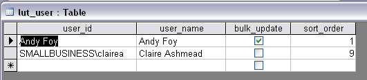
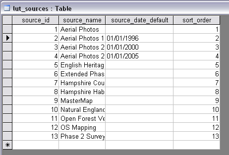
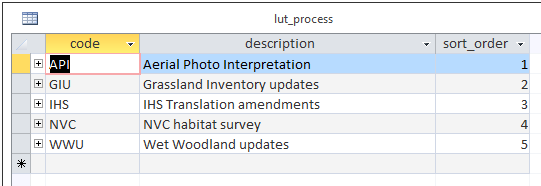
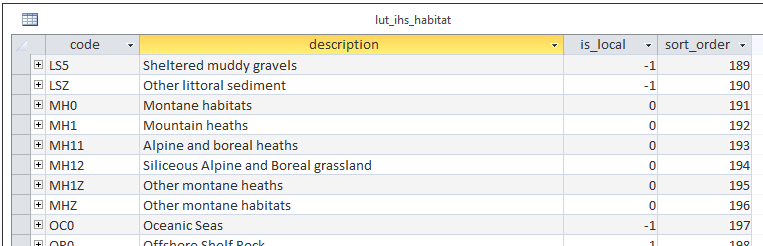
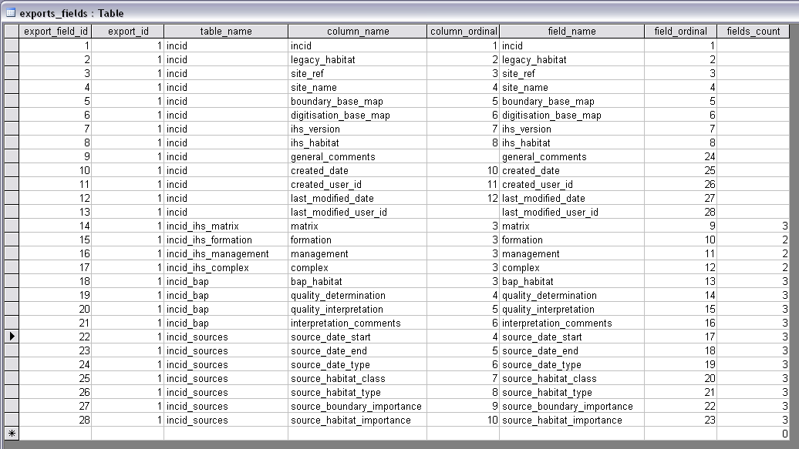

******************
Database Structure
******************

.. index::
	single: Data tables

.. _data_tables:

Data Tables
===========

.. _lookup_tables:

.. index::
	single: Lookup tables
	see: lut; Lookup tables

Lookup Tables
=============

Tables in the database prefixed by `lut_` are *lookup tables* and are used in many drop-down lists in the user interfaces to restrict choices to only valid values. Some of these lookup tables can be updated (preferably by the database administrator) to tailor them to the requirements of each system.

.. note::
	Many lookup tables contain a 'sort_order' field that will determine the order that the values appear in any drop-down lists. **All** records in these tables must have a 'sort_order' value or they may not appear in the relevant drop-down lists.

.. caution::
	Lookup table values are relevant to the **whole** database system and hence will affect **all** users of that database.

.. index::
	single: Adding; Users

Users
-----

New users of the HLU GIS Tool can be added to the ‘lut_user’ table. The format of the table is shown in the figure :ref:`figDTLU`.

.. tip::
	Users will be able to use the tool even if their user details have not been entered into the lut_user table. However, '[Read Only]' will appear in the user interface title bar and they will not be able to apply any changes.

.. _figDTLU:

	Format of **lut_user** table

**Fields**

:user_id:
	The user’s *Windows* login ID. If the user logs in to a domain, the login should be entered in the format: [Domain]\[LoginID] as shown in the second record.

:user_name:
	The name which will be displayed in the ‘By’ fields of the INCID box and the History tab.

:bulk_update:
	Determines whether the user has permissions to run a bulk update to change attributes for all selected records. Ticking this box gives the user permission to run bulk updates.

:sort_order:
	Determines the order user names would be displayed in any relevant drop-down lists. This field is not currently used (as there are no drop-down lists that display users.)

.. note::
	Existing user records cannot be removed from the 'lut_user' table if they are referenced by any of the data records (i.e. if they have applied any changes to the data). This is because data integrity must be retained.

.. caution::
	Bulk update permission should only be assigned to **expert** users and should only be used with caution as mistakes can have major affects on the data.

.. index::
	single: Adding; Sources

Sources
-------

Additional sources can be added to the ‘lut_sources’ table . The format of the table is shown in the figure :ref:`figDTLS`.

.. _figDTLS:

	Format of **lut_sources** table

**Fields**

:source_id:
	A unique ID for each source.

:source_name:
	The name which appears in the ‘Name’ drop-down list in the 'Sources' tab.

:source_date_default:
	[Optional]. If a date is entered, the ‘Vague Date’ field in the 'Sources' tab will be set to this value (if blank) when this source is selected. If the date is left blank, the ‘Vague Date’ field will not be altered.

:sort_order:
	Determines the order source names are displayed in the ‘Name’ drop-down list in the 'sources' tab.

.. note::
	Existing source records cannot be removed from the 'lut_sources' table if they are referenced by any of the data records (i.e. if they have been used in any incid data records). This is because data integrity must be retained.

.. index::
	single: Adding; Processes

Processes
---------

New processes can be added to the ‘lut_process’ table. The format of the table is shown in the figure :ref:`figDTLP`.

.. _figDTLP:

	Format of **lut_process** table

**Fields**

:code:
	A unique 3 character field for each source.

:description:
	A brief description or name that will appear in the 'Process' drop-down list in the main window.

:sort_order:
	Determines the order processes are displayed in the 'Process' drop-down list in the main window.

.. index::
	single: Adding; IHS Habitats

IHS Habitats
------------

IHS Habitats can be flagged as **local** in the ‘lut_ihs_habitat` table. The format of the table is shown in the figure :ref:`figDTLH`.

.. note::
	Only IHS Habitats flagged as **local** will appear in the 'IHS Habitat' drop-down list in the main window. This enables habitats that are not found in the local area to be hidden to avoid being selected in error (e.g. coastal habitats in land-locked counties.)

.. _figDTLH:

	Format of **lut_ihs_habitat** table

**Fields**

:code:
	[Read only]. The unique 8 character field for each IHS Habitat. **Do not edit this value.**

:description:
	[Read only]. The brief description or name that appears in the 'IHS Habitat' drop-down list in the main window. **Do not edit this value.**

:is_local:
	Indicates if the IHS Habitat can be found in the local area.

		==	====================
		-1	True (is local)
		0	False (is not local)
		==	====================

:sort_order:
	Determines the order IHS Habitats are displayed in the 'IHS Habitat' drop-down list in the main window.

.. raw:: latex

	\newpage

.. _configuring_exports:

.. index::
	single: Exports; Configuring

Configuring Exports
===================

Adding Export Types
-------------------

Export types can be added or removed in the ‘exports’ table shown in the figure :ref:`figDTE`.

.. _figDTE:

	Format of **exports** table

**Fields**

:export_id:
	A unique identifier used to determines which fields are selected from the ‘exports_fields’ table – see section ?.?.?.

:export_name:
	The name which will be displayed in the ‘Export Format’ drop-down list – see section 2.3.1.

Adding Fields to an Export Type
-------------------------------

The ‘exports_fields’ table shown in the figure :ref:`figDTEF` defines which fields are exported for each export type in the ‘exports’ table.

.. _figDTEF:

	Format of **exports_fields** table

**Fields**

:export_field_id:
	A unique identifier for the field.

:export_id:
	The unique identifier for the export type in the ‘exports’ table – see section 3.3.1.

:table_name:
	The name of the source table in the database containing the column to be exported.

:column_name:
	The name of the column within the source table.

:column_ordinal:
	The number of the column within the source table starting from 1. The export function does not require this column to be completed.

:field_name:
	The name of the column in the exported GIS layer. [1]_

.. [1] The 'column_name ' must be a valid ArcGIS/MapInfo column name (i.e. containing no spaces or special characters.)

:field ordinal:
	Sets the order of the fields in the exported GIS layer.

:fields_count:
	Allows users to determine the number of child records to be exported.

.. Note:: As shown in the example in the figure :ref:`figDTEF`, geometry fields should not be included. This includes: obj, shape, perimeter, area, x, y etc. These fields will be added automatically to the exported layer.

