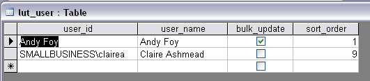

**********************
Database Configuration
**********************

Adding Sources
==============

Additional sources should be added to the ‘lut_sources’ table by the database administrator. The format of the table is shown in the figure :ref:`figDTLS`.

.. _figDTLS:

.. figure:: ../images/figures/DatabaseTableLutSources.png
	:align: center

	Format of **lut_sources** table

* ‘source_id’ is a unique ID for each source.
* ‘source_name’ is the name which appears in the ‘Name’ drop-down list.
* ‘source_date_default’ is an optional field. If a date is entered, the ‘Vague Date’ field will be overwritten with this value when this data source is selected. If this field is blank, the existing entry in the ‘Vague Date’ field will not be altered.
* ‘sort_order’ determines the order names are displayed in the ‘Name’ drop-down list.

Adding Users
============

Each user of the HLU GIS Tool should be added to the ‘lut_user’ table by the database administrator. The format of the table is shown in the figure :ref:`figDTLU`.

.. _figDTLU:

	Format of **lut_user** table

* ‘user_id’ is the user’s Windows login ID. If the user logs in to a domain, the login should be entered in the format: [Domain]\[LoginID] as shown in the second record.
* ‘user_name’ is the name which will be displayed in the ‘By’ fields of the INCID box and History tab.
* ‘bulk_update’ determines whether the user has permissions to run a bulk update to change attributes for all selected records. Ticking this box gives the user permission to run bulk updates.
* ‘sort_order’ determines the order names would be displayed in drop-down lists. This field is not currently used.

Users will be able to use the tool even if their user details have not been entered into the lut_user table, however the ‘By’ fields in the INCID box and History tab will display the login ID and bulk updates will be disabled.

Configuring Exports
===================

Adding Export Types
-------------------

Export types can be added or removed in the ‘exports’ table shown in the figure :ref:`figDTE`.

.. _figDTE:

.. figure:: ../images/figures/DatabaseTableExportsFields.png
	:align: center

	Format of **exports** table

* ‘export_id’ is a unique identifier used to determines which fields are selected from the ‘exports_fields’ table – see section ?.?.?.
* ‘export_name’ is the name which will be displayed in the ‘Export Format’ drop-down list – see section 2.3.1.

Adding Fields to an Export Type
-------------------------------

The ‘exports_fields’ table shown in the figure :ref:`figDTEF` defines which fields are exported for each export type in the ‘exports’ table.

.. _figDTEF:

.. figure:: ../images/figures/DatabaseTableExportsFields.png
	:align: center

	Format of **exports_fields** table

* ‘export_field_id’ is a unique identifier for the field.
* ‘export_id’ is the unique identifier for the export type in the ‘exports’ table – see section 3.3.1.
* ‘table_name’ is the name of the source table in the database containing the column to be exported.
* ‘column_name’ is the name of the column within the source table.
* ‘column_ordinal’ is the number of the column within the source table starting from 1. The export function does not require this column to be completed.
* ‘field_name’ is the name of the column in the exported GIS layer.

.. Note:: This must be a valid ArcGIS/MapInfo column name i.e. no spaces or special characters.

* ‘field ordinal’ sets the order of the fields in the exported GIS layer.
* ‘fields_count’ allows you to determine the number of child records to be exported.

.. Note:: As shown in the example in the figure :ref:`figDTEF`, geometry fields should not be included. This includes: obj, shape, perimeter, area, x, y etc. These fields will be added automatically to the exported layer.
