.. |filterbyattr| image:: ../icons/FilterByAttributes.png
	:height: 16px
	:width: 16px

.. |selectonmap| image:: ../icons/SelectOnMap.png
	:height: 16px
	:width: 16px

.. |logicalsplit| image:: ../icons/LogicalSplit.png
	:height: 16px
	:width: 16px

.. |logicalmerge| image:: ../icons/LogicalMerge.png
	:height: 16px
	:width: 16px

.. |getmapselection| image:: ../icons/GetMapSelection.png
	:height: 16px
	:width: 16px

.. |physicalsplit| image:: ../icons/PhysicalSplit.png
	:height: 16px
	:width: 16px

.. |physicalmerge| image:: ../icons/PhysicalMerge.png
	:height: 16px
	:width: 16px

.. index::
	single: Functions

*********
Functions
*********

.. index::
	single: Updates; Attribute Update

.. _attribute_update:

Attribute Update
================

Attribute Updates are the main mechanism for updating existing INCID details. Attributes can be changed at any time in the user interface, even when the user is not authorised for editing or when the active GIS layer is not being edited, but they can only be applied when not in read-only mode.

.. note::
	For details on configuring users see 'Lookup Tables' in the HLU Tool Technical Guide `readthedocs.org/projects/hlutool-technicalguide <https://readthedocs.org/projects/hlutool-technicalguide/>`_.

To update the attributes of an INCID:

* Ensure that the active HLU GIS layer is editable (for ArcGIS users click :guilabel:`Editor` on the Editor toolbar, select :guilabel:`Start Editing` and choose the active HLU layer, for MapInfo users set the active HLU layer as 'Editable').
* Select the feature or features to be updated.
* Click |getmapselection| :guilabel:`Get Map Selection`.
* Make the required changes to the INCID attributes, ensuring that any fields highlighted as missing or in error are addressed.
* Click |apply|. The INCID will be updated and details will be added to the History tab.

.. note::
	The :guilabel:`Apply` button will only be displayed if:
		* The user is listed in the lut_user table.
		* The active GIS layer is in edit mode.
		* The user has made one or more changes to the current INCID.
		* There are no fields in error.

.. caution::
	If changes are made to an INCID and applied when only a subset of the TOIDs or fragments for that INCID are selected in GIS the user may be notified (depending upon their user Options) as shown in the figure :ref:`figAUWD`. See :ref:`options_interface` for more details.

.. _figAUWD:

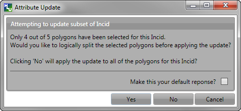

	Attribute Update Warning Dialog

.. _split:

Split Features
==============

Features can be split logically or physically depending upon the filter active in the tool. If one or more features from a single INCID are present in the current filter then the tool will allow a logical split to be performed. If two or more fragments from the same TOID and with the same TOID_Fragment_Id are present in the current filter then the tool will allow a physical split to be performed.

.. raw:: latex

	\newpage

.. index::
	single: Split; Logical

.. _logical_split:

Logical Split
-------------

Logical split is used to create a new INCID in the database based upon a subset of features selected from a single INCID in the GIS layer. Logically splitting one or more features assigns them to a different INCID than the other features in the current INCID which then allows them to be updated independently of the remaining features in the original INCID.

	.. note::
		All selected features must belong to the same INCID.

To perform a logical split:

* Select the subset of features to be split in the GIS layer as shown in the **right** part of the figure :ref:`figLSFD`.
* Return to the HLU Tool window and click |getmapselection| :guilabel:`Get Map Selection`.
* Click |logicalsplit| :guilabel:`Logical Split`. A new INCID will be created and displayed as the current record and details will be added to the History tab for the INCID.

.. _figLSFD:

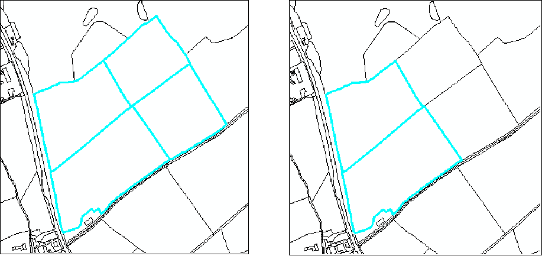

	Logical Split – Before (left) and After (right)

To display all the features in the INCID of a given feature:

* Select the feature of interest in the GIS layer.
* Return to the HLU main window and click |getmapselection| :guilabel:`Get Map Selection`.
* Click |selectonmap| :guilabel:`Select Current INCID on Map`. All the features associated with the current INCID will be displayed as shown in the **left** part of the figure :ref:`figLSFD`.

.. raw:: latex

	\newpage

.. index::
	single: Split; Physical

.. _physical_split:

Physical Split
--------------

Physical split is use to create one or more new TOID fragments in the database based upon a single TOID that has already been split in the GIS layer. Physically splitting a feature into fragments allows the fragments to be updated independently of each other (once they have also been assigned to different INCIDs - see :ref:`logical_split`.)

.. note::

	* Only one feature should be split in a single operation. Splitting multiple features will cause database synchronisation issues. 
	* If several features have been split, select the fragments for one original feature and split using the tool. Repeat this operation for the remaining features.
	* Ensure that the physical split is completed in the database prior to commencing any other operations such as 'Select by attributes …' to avoid database synchronisation issues.

.. tip::
	If two or more fragments from the same TOID and with the same TOID_Fragment_Id are selected in the GIS and **Get Map Selection** is clicked then the tool will recognise that the fragments must have been split by the user in the GIS layer and will **automatically** perform a physical split before displaying the attributes.

ArcGIS
^^^^^^

To perform a physical split in ArGIS:

* On the 'Editor' toolbar (shown in the figure :ref:`figArcEMB`), click :guilabel:`Editor` and select :guilabel:`Start Editing`.

.. _figArcEMB:

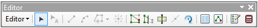

	Edit Settings for Physical Split (ArcGIS)

* Select the feature to be split.
* On the 'Editor' toolbar, click :guilabel:`Cut Polygons Tool` draw a polyline through the feature to be split.

	.. tip::
		It is not necessary to **Save Edits** after splitting the feature in GIS because the changes will be saved automatically once the split has been completed with the tool.

* The feature will be split but still selected as shown in the figure :ref:`figArcSFD`. At this stage both features will have the same fragment ID.

.. _figArcSFD:

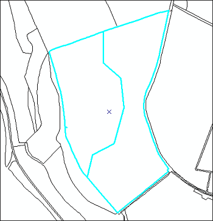

	Split Features (ArcGIS)

* Return to the HLU Tool and click |getmapselection| :guilabel:`Get Map Selection`. The feature will be split into separate fragments with unique fragment IDs and details will be added to the History tab for the INCID.

MapInfo
^^^^^^^

To perform a physical split in MapInfo:

* Set the Cosmetic layer as 'Editable' and draw the feature to split by.

.. tip::
	The Cosmetic layer should be used to save time with MapInfo adding a new feature to a large HLU layer.

* Set the HLU layer as 'Editable'.
* Select the feature to be split and go to Objects > Set Target.
* Select the polygon in the Cosmetic layer and go to Objects > Split.
* In the Data Disaggregation dialog ensure that 'Method' for all fields is set to 'Value' as shown in the figure :ref:`figMIDD`, then click :guilabel:`OK`.

.. _figMIDD:

.. figure:: figures/MapInfoDataDisaggregationDialog.png
	:align: center

	Data Disaggregation Dialog (MapInfo)

* The feature will be split but still selected as shown in the figure :ref:`figMISF`.

.. _figMISF:

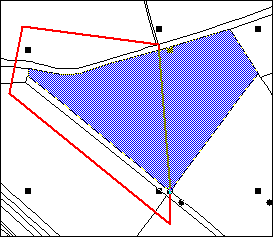

	Split Features (MapInfo)

* Return to the HLU Tool and click |getmapselection| :guilabel:`Get Map Selection`. The feature will be split into separate fragments with unique fragment IDs and details will be added to the History tab for the INCID. The Cosmetic layer will also be cleared.

.. raw:: latex

	\newpage

.. _merge:

Merge Features
==============

Merge features will performs two types of merge depending upon the filter active in the tool. If two or more features from multiple INCIDs are present in the current filter then the tool will allow a logical merge to be performed. If two or more fragments from the same TOID and with different TOID_Fragment_Ids are present in the current filter then the tool will allow a physical merge to be performed.

.. index::
	single: Merge; Logical

.. _logical_merge:

Logical Merge
-------------

Logical merge combines all the features selected in the GIS into a single INCID chosen from the selected features. This assigns the attributes from the chosen INCID to all the other selected features and logically groups the features into a single INCID so that they can be updated together in the future.

To perform a logical merge:

* Select the features to be merged and a feature from the INCID they are to be merged with in the GIS layer.
* Return to the HLU main window and click |getmapselection| :guilabel:`Get Map Selection`.
* Select one of the options in the 'Process' list.
* Click |logicalmerge| :guilabel:`Logical Merge`. A list of INCIDs will be displayed as shown in the figure :ref:`figLMD`.

.. _figLMD:

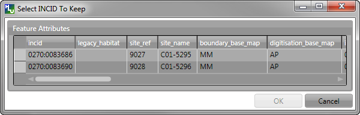

	Select INCID to Keep Dialog

* Click on the grey box to the left of the row to select an INCID. Any features with the selected INCID will flash in the GIS window.
* Click :guilabel:`OK`. The selected features will be assigned to the selected INCID and details added to the History tab for the INCID.

.. note::
	If the merged features are all fragments of the same TOID the user will then be given the option to perform a physical merge.

.. raw:: latex

	\newpage

.. index::
	single: Merge; Physical

.. _physical_merge:

Physical Merge
--------------

Physical merge combines fragments of a single TOID into a single, larger, feature in the GIS layer. As the fragments must already belong to the same INCID there are no attribute updates but the boundaries between adjacent features will be removed.

.. note::
	Only fragments belonging to the same TOID can be merged in a single operation. If fragments for several TOIDs need to be merged, the operation must be repeated for each TOID.

To perform a physical merge:

* Select two or more fragments from one TOID in the GIS layer as shown in the **left** part of the figure :ref:`figPMD`.
* Return to the HLU main window and click |getmapselection| :guilabel:`Get Map Selection`.
* Select one of the options in the 'Process' list.
* Click |physicalmerge| :guilabel:`Physical Merge`. The features will be combined in the GIS layer as shown in the **right** part of the figure :ref:`figPMD` and details will be added to the History tab for the INCID.

.. _figPMD:

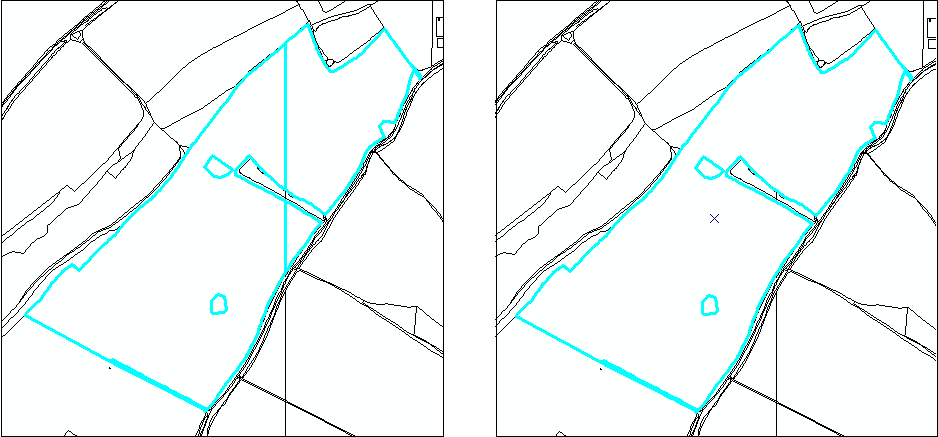

	Physical Merge – Before (left) and After (right)

.. raw:: latex

	\newpage

.. _filter_by_attributes:

Filter by Attributes
====================

Users can select which INCID records appear in the user interface, and correspondingly which features are selected in the active GIS layer, by performing a filter. The filter is performed by building a SQL query that will select one or more INCIDs based on a chosen set of criteria, or by entering a single INCID value. There are two main interfaces available:

	* **HLU Query Builder** - the original interface supplied with the HLU Tool.
	* **HLU Advanced Query Builder** - a new interface that provides more user-friendly and flexible functionality.

.. note::
	Users can choose their preferred interface for building a SQL query in the user Options (see :ref:`options_filter` for details).

.. index::
	single: Filter; Query Builder

Query Filter
------------

.. _figQB:

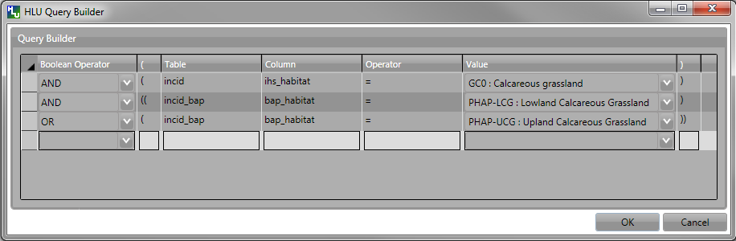

	Query Builder Window

To apply a filter using the standard query filter:

* Ensure that the user option 'Use Advanced Query Builder' is unchecked (see :ref:`options_filter` for details).
* Click |filterbyattr| or :guilabel:`Select... --> Filter by Attributes...` to open the Query Builder window.
* Select a Table, Column, Operator and Value in the first row in Query Builder table.
* Add further criteria as required by selecting values in additional rows.
* Ensure that the Boolean Operator and opening :guilabel:`(` and :guilabel:`)` closing brackets are entered as required.
* Click :guilabel:`OK`. The query will be executed and the resulting INCIDs will be selected in the user interface.

Depending on the setting of the user option 'Warn Before GIS Select', and depending on how many INCID records the query would return, a warning message may appear before executing the query (see :ref:`options_filter` for details). The message will indicate the expected number of features that will be selected (as shown in the figure :ref:`figGSWD`).

.. _figGSWD:

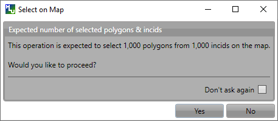

	GIS Selection Warning Dialog

.. tip::
	Clicking the 'Don't ask again' check box will stop the warning window appearing again in future. This option can also be set in the user options (see :ref:`options_filter` for details).

In the event that the SQL query required to select the features in GIS would be very long or complex a different message may appear warning the user that a temporary join (which may take some time) will need to be performed in GIS (as shown in the figure :ref:`figGSJWD`).

.. _figGSJWD:

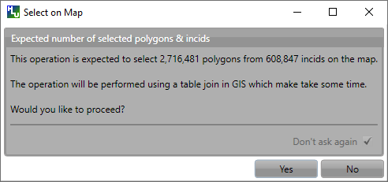

	GIS Selection with Join Warning Dialog

.. note::
	Clicking the 'Don't ask again' check box in this instance will **not** stop the warning window appearing again in future when performing a temporary join. This warning can only be disabled in the user options (see :ref:`options_filter` for details).

.. index::
	single: Filter; Advanced Query Builder

Advanced Query Filter
---------------------

.. _figAQB:

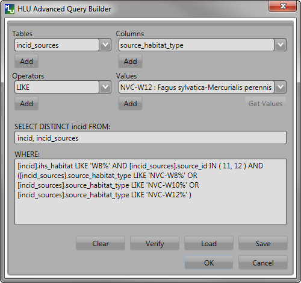

	Advanced Query Builder Window

To apply a filter using the advanced query filter:

* Ensure that the user option 'Use Advanced Query Builder' is checked (see :ref:`options_filter` for details).
* Click |filterbyattr| or :guilabel:`Select... --> Filter by Attributes...` to open the Advanced Query Builder window.
* Select a Table in the list and click :guilabel:`Add` to add it to the 'SELECT DISTINCT incid FROM' field and WHERE field.
* Select a Column, Operator and Value in a similar way to build up a SQL clause.
* Add further criteria as required by selecting values and adding them to the SQL clause.
* Click :guilabel:`Verify` to check that the SQL clause is valid. A warning message explaining the error will appear if not.
* Click :guilabel:`OK`. The query will be executed and the resulting INCIDs will be selected in the user interface.

.. note::
	The last query executed will appear next time the Advanced Query Builder window is opened (whilst the tool remains running).

To **save** an advanced query:

* Click |filterbyattr| or :guilabel:`Select... --> Filter by Attributes...` to open the Advanced Query Builder window.
* Create a valid query as above.
* Before executing the query click :guilabel:`Save`. A save dialog will open prompting you to selected a folder and file name.
* Select a destination folder, enter a suitable file name and click :guilabel:`Save`. The query will be saved.

To **load** a previously saved advanced query:

* Click |filterbyattr| or :guilabel:`Select... --> Filter by Attributes...` to open the Advanced Query Builder window.
* Click :guilabel:`Load`. A load dialog will open prompting you to selected an existing SQL query (*.hsq) file.
* Select the required file and click :guilabel:`Open`.
* The query will be loaded into the query window. It can now be verified and then executed.

.. index::
	single: Filter; Filter by INCID

.. _filter_by_incid:

Filter by Incid
---------------

.. _figFBI:

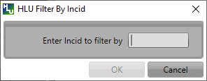

	Filter By Incid Window

To filter by a single INCID:

* Click :guilabel:`Select... --> Filter by Incid...` to open the Filter by INCID window.
* Enter or paste a valid INCID into the 'Enter Incid to filter by' field.
* Click :guilabel:`OK`. The query will be executed and the resulting INCID will be selected in the user interface.

.. raw:: latex

	\newpage

.. index::
	single: Update; Bulk Updates

.. _bulk_updates:

Bulk Updates
============

Users can update the attributes for multiple INCID database records, and associated features in the active GIS layer, by performing a bulk update. Bulk updates can only be applied to a subset of INCID records by applying a filter. Attribute updates applied in bulk update mode will be applied to all INCIDs in the active filter.

.. note::

	* Bulk update mode can only be started once a filter is applied to the INCID records and the active GIS layer is editable.
	* Bulk update mode is only available to configured users who have been given bulk update permissions. For details on configuring users see 'Lookup Tables' in the HLU Tool Technical Guide `readthedocs.org/projects/hlutool-technicalguide <https://readthedocs.org/projects/hlutool-technicalguide/>`_.

.. _figUIBU:

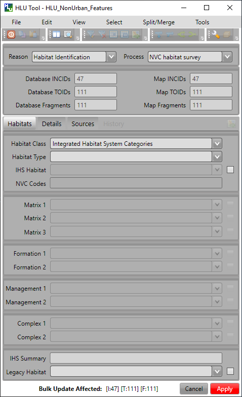

	Main window - Bulk Update Mode

To bulk apply updates:

* Filter the database records using 'Select by attributes' or select polygons in the GIS layer and click :guilabel:`Get Map Selection`. For details on filtering records see :ref:_filter_by_attributes`.
* Click :guilabel:`Edit... --> Bulk Apply Updates` to enter bulk update mode. An empty form is displayed as shown in the figure :ref:`figUIBU` and the 'Bulk Update' section displays the number of INCIDs, TOIDs and fragments affected by the update.
* Enter the update details in the Habitats, Details, and Sources tabs, then click :guilabel:`Apply`. The Bulk Update confirmation window will appear as shown in the figure :ref:`figUIBUC`.
* Select the required options for the bulk update and click :guilabel:`OK`. The INCIDs in the active filter will be updated.

.. _figUIBUC:

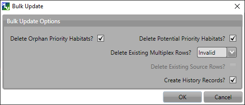

	Bulk Update Confirmation Window

.. caution::
	Bulk updates should be used with caution as unexpected results may occur if users do not understand the implications of any updates made and options applied.

To cancel the bulk update mode:

* Click :guilabel:`Cancel` or click :guilabel:`Edit... --> Cancel Bulk Apply Updates`. The main window will return to the standard interface.

.. raw:: latex

	\newpage

.. index::
	single: Update; Review OSMM Updates

.. _review_osmm_updates:

Review OSMM Updates
===================

If the habitat framework has been externally processed against a more recent OS MasterMap (OSMM) update there may be proposed OSMM updates to review and apply. Proposed updates can either be skipped (so that they can be reviewed again later), accepted (when they become pending updates to be applied later) or rejected (so that they cannot be applied later). They can be reviewed one INCID at a time or all remaining INCIDs in the active filter can be rejected or accepted en-mass.

.. _figUIOUF:

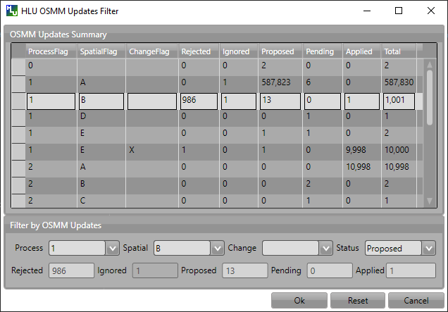

	Review OSMM Updates Filter Window

To filter proposed OSMM Updates:

* Click :guilabel:`Edit... --> Review OSMM Updates` to enter review OSMM update mode. The OSMM Updates Filter window will appear as shown in figure :ref:`figUIOUF`.
* Select a row in the table or manually select the required values for any or all of the Process, Spatial, Change and Status fields.
* Click :guilabel:`Ok` to apply the selected filter to the INCID records in the main interface.

.. note::
	To apply another filter at any time click |filterbyattr| or :guilabel:`Select... --> Filter by Attributes...` to re-open the OSMM Updates Filter window.

.. _figUIOU:

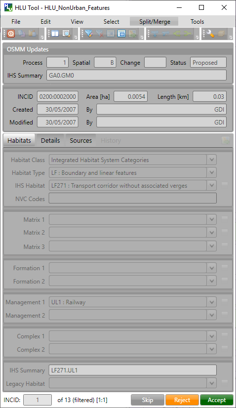

	Review OSMM Updates Window

To process proposed OSMM Updates:

* Once a filter has been applied the main interface appears as shown in the figure :ref:`figUIBOU` and the 'Bulk Update' section displays the number of INCIDs, TOIDs and fragments that will be affected by the update.
* Click :guilabel:`Skip` to skip the proposed update for the current INCID. It can then be reviewed again at a later time.
* Click :guilabel:`Reject` to reject the proposed update for the current INCID. It will no longer be available for reviewing or applying.
* Click :guilabel:`Accept` to accept the proposed update for the current INCID. The update will now be 'Pending' and must be applied by bulk applying OSMM Updates (see :ref:`bulk_osmm_update` for details).

.. note::
	Holding down the :guilabel:`Ctrl` key changes the :guilabel:`Reject` and :guilabel:`Accept` buttons to :guilabel:`Reject All` and :guilabel:`Accept All` thereby allowing the user to Reject or Accept all remaining INCIDs in the active filter.

Once all the INCIDs in the active filter have been processed a message will appear as shown in figure :ref:`figUIOUW`. The user can apply another filter or cancel the review OSMM Updates mode.

.. _figUIOUW:

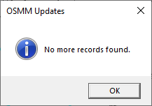

	Review OSMM Updates - No more records found

To cancel the review OSMM Updates mode:

* Click :guilabel:`Edit... --> Cancel Review OSMM Updates`. The main window will return to the standard interface.

.. raw:: latex

	\newpage

.. index::
	single: Update; Bulk OSMM Update

.. _bulk_osmm_update:

Bulk Apply OSMM Updates
=======================

Once proposed OSMM updates have been accepted they become 'Pending' and must be bulk processed in order to apply them.

.. note::

	* Bulk apply OSMM update mode can only be started when the active GIS layer is editable.
	* Bulk apply OSMM update mode is only available to configured users who have been given bulk update permissions. For details on configuring users see 'Lookup Tables' in the HLU Tool Technical Guide `readthedocs.org/projects/hlutool-technicalguide <https://readthedocs.org/projects/hlutool-technicalguide/>`_.

.. _figUIBOUF:

	Review OSMM Updates Filter Window

To filter pending OSMM Updates:

* Click :guilabel:`Edit... --> Bulk Apply OSMM Updates` to enter bulk OSMM update mode. The OSMM Updates Filter window will appear as shown in figure :ref:`figUIBOUF`.
* Select a row in the table or manually select the required values for any or all of the Process, Spatial, Change and Status fields.
* Click :guilabel:`Ok` to apply the selected filter to the INCID records in the main interface.

.. note::
	To apply another filter at any time click |filterbyattr| or :guilabel:`Select... --> Filter by Attributes...` to re-open the OSMM Updates Filter window.

.. _figUIBOU:

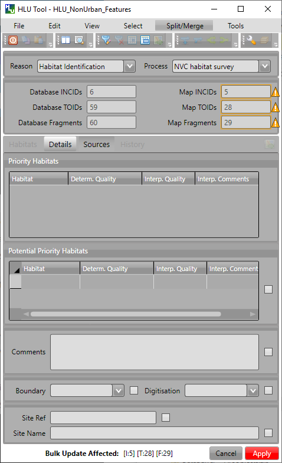

	Bulk OSMM Update Window

To bulk apply OSMM updates:

* Once a filter has been applied an empty form is displayed as shown in the figure :ref:`figUIBOU` and the 'Bulk Update' section displays the number of INCIDs, TOIDs and fragments that will be affected by the update.
* The Habitats tab will be disabled as changes to the habitat attributes are determined by the pending OSMM update for each INCID.
* Enter any required update details in the Details and Sources tabs, then click :guilabel:`Apply`. The Bulk Update confirmation window will appear as shown in the figure :ref:`figUIBOUC`.
* Select the required options for the bulk update and click :guilabel:`OK`. The INCIDs in the active filter will be updated.

.. _figUIBOUC:

	Bulk Update Confirmation Window

.. note::
	If a default OSMM Source Name has been set (see :ref:`options_bulk_update` for details) this will automatically appear in the Sources tab.

.. caution::
	Performing bulk OSMM updates should be used with caution as unexpected results may occur if users do not understand the implications of any update details or options applied.

To cancel the bulk apply OSMM update mode:

* Click :guilabel:`Cancel` or click :guilabel:`Edit... --> Cancel Bulk Apply OSMM Updates`. The main window will return to the standard interface.

.. raw:: latex

	\newpage

.. index::
	single: Export

.. _export_function:

Export
======

Export allows users to combine spatial geometries from a HLU GIS layer and attribute data from the HLU database into a combined GIS layer using a pre-defined export format.

.. _figED:

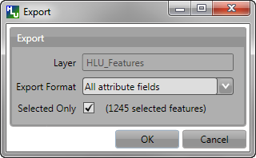

	Export Window

To perform an export:

	* Select the required INCID and GIS features to be exported (either by selecting the features in GIS and clicking :guilabel:`Get Map Selection` or performing a **Filter by Attributes**).
	* Click :guilabel:`File... --> Export` to open the Export window.
	* Select one of the pre-defined export formats from the 'Export Format' drop-down list.
	* Tick the 'Selected only' checkbox to export **only** the selected features or clear the checkbox to export **all** of the features in the active GIS layer as required.
	  
	.. note::
		If a filter is active based on the features selected in the active GIS layer then the 'Selected only' checkbox is automatically ticked and the number of selected GIS features is shown (as seen in :ref:`figED`). Only the selected INCIDs and associated GIS features will be exported. Untick this checkbox to export all records. For details on how to filter records see :ref:`filter_by_attributes`.

	* Click :guilabel:`Ok` to start the export. Select a destination folder and suitable file name for the new GIS layer when prompted.
	* A pop-up message will appear informing when the export has completed and prompting if the new GIS layer should be loaded into the active GIS document/workspace.

	.. note::
		The default export folder destination can be set by MapInfo users (see :ref:`options_gis` for more details).

	.. warning::
		Exporting all features or a large number of features can take a long time depending upon the number of features and the configuration of the HLU Tool GIS application and database system.

During the export process checks and validation are performed to avoid potential errors and frustrations. As a result warnings may appear under the following circumstances:

	* If the export contains more than 50,000 INCIDs and hence may take a long time to complete (the count of 50,000 is only an arbitrary value and does not represent any processing limit).
	* If ArcGIS users have chosen to export to a shapefile (as opposed to a file or personal geodatabase feature class) and have selected an export format that contains field names that exceed 10 characters as this will result in the field names being automatically truncated or renamed by ArcGIS.
	* If MapInfo users have selected an export format where the total length of the output fields (including the fields included from the GIS layer) exceeds 4,000 bytes as this is the maximum record length supported by MapInfo.
	* If MapInfo users have initiated an export where the total size of the output .dbf attribute file is likely to exceed 2 GBs as this is the maximum file size supported by MapInfo.

	.. seealso::
		For details on defining export formats see 'Configuring Exports' in the HLU Tool Technical Guide at `readthedocs.org/projects/hlutool-technicalguide <https://readthedocs.org/projects/hlutool-technicalguide/>`_.

