.. index::
	single: Windows

*********
Interface
*********

.. index::
	single: Windows; Main Window

.. _main_window:

HLU Tool Window
===============

Once the HLU GIS Tool has been configured, the tool will start the associated GIS, then the main window will appear as shown in the figure :ref:`figUIMW`.

.. _figUIMW:

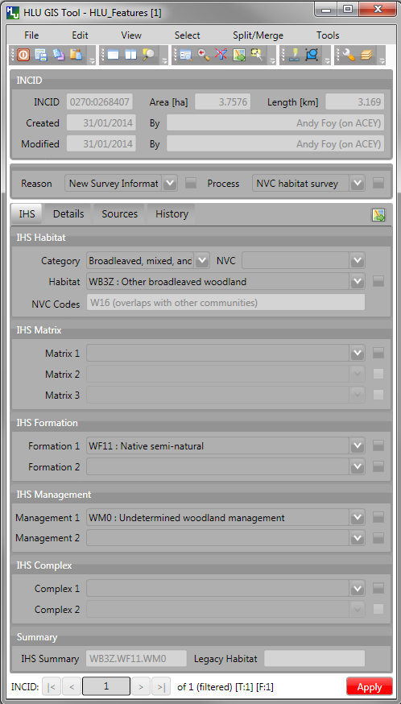

	HLU GIS Tool - Main Window

Records can be viewed or updated through the main window of the HLU GIS Tool. The following sections summarise the details available for each record. 

Required fields are highlighted in red on each tab. The 'Apply' button will be active when the required fields have been completed on all tabs.

.. _incid_section:

INCID Section
-------------

The 'INCID' section displays summary information for each INCID in the database, including area, perimeter, date created and date last modified as shown in the figure :ref:`figUIIS`.

.. note::
	If the user is not configured, the 'By' fields will display their Windows login. For details on configuring users see 'Lookup Tables' in the `HLUTool-TechnicalGuide <https://readthedocs.org/projects/hlutool-technicalguide/>`_.

.. _figUIIS:

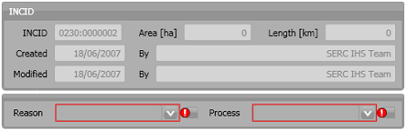

	Main window - INCID Section

.. _reason_section:

Reason/Process Section
----------------------

'Reason' and 'Process' (as shown in the figure :ref:`figUIRPS`) are required fields for all updates and are used on the History tab to indicate why the record was last updated. These fields are sticky i.e. the selected reason and process will be used for all updates in the current session unless they are altered manually.

.. _figUIRPS:

	Main window - Reason/Process Section

.. raw:: latex

	\newpage

.. _ihs_tab:

IHS Tab
-------

The IHS tab displays the IHS details for the current database record as shown in the figure :ref:`figUIIT`.

.. _figUIIT:

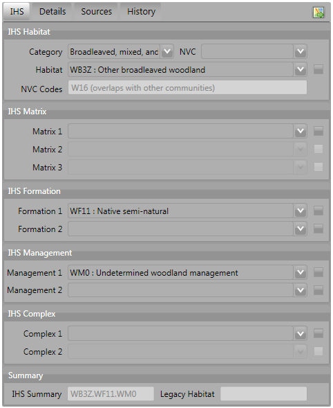

	Main window - IHS Tab

Category
	Drop-down list of broad habitats used to filter the 'Habitat' drop-down list to relevant IHS codes. The entries in this field correspond to the first 2 characters of the IHS Habitat code.

NVC
	Drop-down list of National Vegetation Classification (NVC) types used to filter the 'Habitat' drop-down list to relevant IHS codes. The entries in this field are not saved to the database.

Habitat
	Drop-down list of the IHS habitat codes relating to the selected Category or NVC.

IHS Matrix / Formation / Management / Complex
	Drop-down lists allowing users to refine the habitat definition by adding 'multiplex' codes according to the guidelines of IHS.

IHS Summary
	[Read only]. Automatically generated concatenation of the IHS habitat and multiplex codes selected from the preceding drop-down lists.

Legacy Habitat
	[Read only]. Displays the primary 'pre-IHS' habitat code (if present).

.. raw:: latex

	\newpage

.. _details_tab:

Details Tab
-----------

Click on **Details** to display the Details tab as shown in the figure :ref:`figUIDT`.

.. _figUIDT:

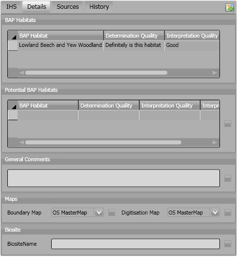

	Main window - Details Tab

Priority Habitats
	Automatically added based upon the Habitat and multiplex codes selected on the :ref:`ihs_tab`. For new priority habitats, 'Determination Quality' and 'Interpretation Quality' must be entered.

Potential Priority Habitats
	Allows users to define other priority habitats that may also be present in the future given appropriate management or restoration. An INCID may have a potential priority habitat even if no priority habitats are present.

General Comments
	A free-text field which allows users to enter any additional comments up to 254 characters.

Boundary Map
	Drop-down lists defining the source data map used to identify the boundary.

Digitisation Map
	Drop-down lists defining the map used to digitise the boundary.

Biosite Name
	A free-text field which allows users to enter the name or reference of the site.

.. note::
	To delete a potential priority habitat click on the grey box to the left of the potential priority habitat to select the row, then press the keyboard :kbd:`Delete` key to remove it.

.. raw:: latex

	\newpage

.. _source_tab:

Sources Tab
-----------

Click on **Sources** to display the Sources tab as shown in the figure :ref:`figUIST`. Up to three sources can be defined for each INCID.

.. _figUIST:

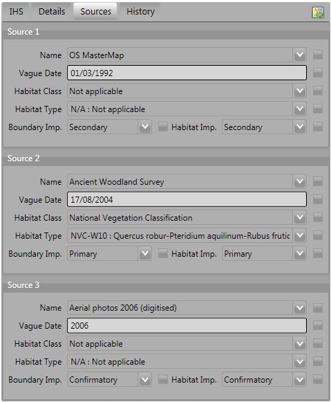

	Main window - Sources Tab

Name
	Drop-down list containing a list of data sources. For details on adding new sources see 'Lookup Tables' in the `HLUTool-TechnicalGuide <https://readthedocs.org/projects/hlutool-technicalguide/>`_.

Vague Date
	Allows users to enter the date of the dataset. This can be either a precise date e.g. 01/04/2010 or a vague date e.g. Spring 2010-Summer 2010, 1980-2010 or 'Unknown'. For details on configuring vague dates see :ref:`vague_date_options`.

Habitat Class
	Drop-down list defining the habitat classification used for this data source. If no habitat classification is used, select 'Not Applicable'.

Habitat Type
	Drop-down list defining the type of habitat. This list is filtered based upon the habitat class.

Boundary Imp
	Drop-down list defining the importance of the source data in determining the habitat boundary.

Habitat Imp.
	Drop-down list defining the importance of the source data in determining the habitat type.

.. note::

	* If the default date for the selected data source has been configured, the 'Vague Date' field will be updated to the default date. If the default date has not been defined, then the 'Vague Date' field must be updated manually. See 'Lookup Tables' in the `HLUTool-TechnicalGuide <https://readthedocs.org/projects/hlutool-technicalguide/>`_ for details of how to define default source dates.
	* For boundary importance and habitat importance there can only be one source set as 'Primary' or 'Secondary' for each field.

.. raw:: latex

	\newpage

.. _history_tab:

History Tab
-----------

The History tab displays a list of modifications made to the current INCID and the associated TOIDs. Each entry details what modification was made, when and by whom as shown in Figure 20. Entries are shown in descending date order. The number of entries can be configured in the Options (see :ref:`gis_options` for more details).

.. _figUIHT:

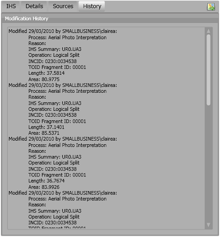

	Main window - History Tab

.. raw:: latex

	\newpage

.. index::
	single: Bulk Updates

.. _bulk_update_window:

Bulk Updates
============

Allows users to update the attributes for multiple selected database records simultaneously.

.. note::
	This feature is only available to configured users who have been given bulk update permissions. For details on configuring users see 'Lookup Tables' in the `HLUTool-TechnicalGuide <https://readthedocs.org/projects/hlutool-technicalguide/>`_.

.. _figUIBU:

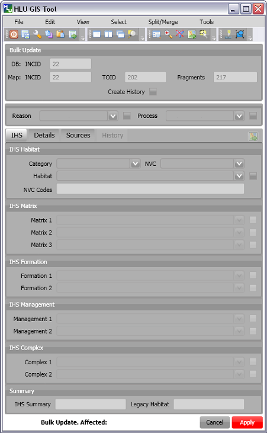

	Main window - Bulk Update Mode

To perform a bulk update:

* Filter the database records using 'Select by attributes' or select polygons in the GIS layer and click **Get Map Selection**. For details on filtering records see :ref:`query_builder_window`.

* Click **Edit... --> Bulk Update** to enter bulk update mode. An empty form is displayed as shown in the figure :ref:`figUIBU`.

* The 'Bulk Update' section displays the number of INCIDs, TOIDs and fragments affected by the update and allows users to select whether to create a History record for this process.

* Enter the updated details in the IHS, Details, and Sources tabs, then click **Apply**. These fields will be updated for all the selected INCIDs.

.. caution::
	If 'Delete Empty Bulk Update Rows' is checked in the Options, child records will be deleted if these fields are not completed in the bulk update form. See :ref:`database_options` for more details.

.. raw:: latex

	\newpage

.. index::
	single: Windows; Options Window

.. _options_window:

Options Window
==============

Click |options| or **Tools... --> Options** to open the window.

Allows users to alter the HLU configuration. There are three categories of options as shown in the figure :ref:`figOD`.

.. _figOD:

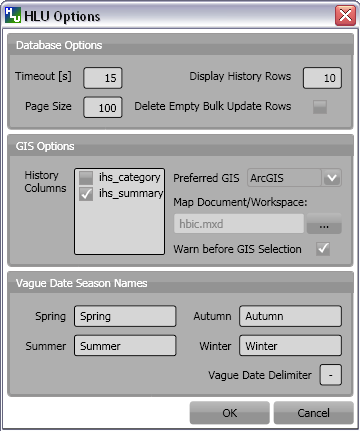

	HLU Options Dialog

.. _database_options:

Database Options
----------------

Timeout
	Sets the amount of time the tool will wait for the database to respond. The default value is 15. This value should be increased if an error occurs such as 'The connection to the database timed out'.

Page Size
	Sets how many records are retrieved from the database and stored in memory. The default value is 100. Increasing this value can improve performance when browsing records, however this will increase the amount of RAM required by the application and significant increases in the page size value could cause the tool to stop responding.

Display History Rows
	Sets the number of entries displayed in the 'History' tab of the main window. For more details on the 'History' tab see :ref:`history_tab`.

Delete Empty Bulk Update Rows
	Removes the details of child records if they are these fields are not completed in the bulk update form if this checkbox is ticked. By default this box is unticked.

	This option affects the following sections of the main window when performing bulk updates:

		* IHS Matrix
		* IHS Formation
		* IHS Management
		* IHS Complex
		* Priority Habitats
		* Potential Priority Habitats
		* Sources

	.. caution::

		If the 'Delete Empty Bulk Update Rows' option is checked and a bulk update record has only 1 source record completed then, for each of the selected records, source 1 will be updated and if the selected record has data entered in sources 2 and 3, it will be deleted.

.. _gis_options:

GIS Options
-----------

History Display Columns
	Allows users to select which additional columns from the GIS layer are displayed in the History tab for each update. If the checkbox is ticked, the field will be displayed.

Preferred GIS Application
	Allows users to select whether the tool should use ArcGIS or MapInfo if both applications are installed on their computer.

	.. note::
		The tool must be closed and restarted for this change to take effect.

Map Document/Workspace
	Sets the default map document or workspace opened by the HLU GIS Tool. As this field cannot be edited directly, users must click on the **…** button and browse to the new map document or workspace. 

	.. note::
		If the 'Preferred GIS' option is altered, this field must also be updated.

Warn Before Applying GIS Selection
	Allows users to enable or disable the warning message indicating the number of polygons which will be selected by the current query as shown in the figure :ref:`figGSWD`.

.. _figGSWD:

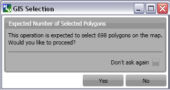

	GIS Selection Warning Dialog

.. _vague_date_options:

Vague Date Season Names
-----------------------

Seasons
	These fields allow users to define how seasonal dates, such as 'Spring 2009' or 'Winter 2010', are entered so that they can be converted to dates in the HLU database.

Vague Date Delimiter
	This field allow users to define how date ranges, such as 'Spring 2010-Autumn 2010' or '1989-2010', are entered so that they can be converted to dates in the HLU database.

	.. note::
		The default value for the 'Vague Date Delimiter' is a hyphen ( - ). This can be altered to any character, however, it must not be the same delimiter used by the computer to enter precise dates, such as 01/04/2010. The default delimiter used by Windows for English-format dates is a forward slash ( / ).

.. raw:: latex

	\newpage

.. index::
	single: Windows; Export Window

.. _export_window:

Export Window
=============

.. |export| image:: ../images/icons/FileExport.png
	:height: 16px
	:width: 16px

Click |export| or **File... --> Export** to open the window.

Allows users to export data from the HLU database to a GIS layer using a pre-defined export format (see the figure :ref:`figED`).

For details on defining export formats see 'Configuring Exports' in the `HLUTool-TechnicalGuide <https://readthedocs.org/projects/hlutool-technicalguide/>`_.

.. _figED:

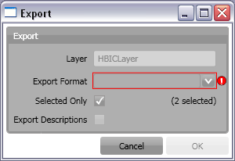

	Export Dialog

* Select one of the export formats from the drop-down list.

* If the database records have been filtered, the 'Selected only' checkbox is automatically ticked as shown in Figure 2 and only the records related to the selected INCIDs will be exported. Untick this checkbox to export all records. For details on how to filter records see :ref:`query_builder_window`.

* The 'Export Descriptions' checkbox replaces habitat codes with textual descriptions. This feature is only available for ArcGIS users due to record length restrictions in MapInfo.

.. raw:: latex

	\newpage

.. index::
	single: Windows; Query Builder Window

.. _query_builder_window:

Query Builder Window
====================

.. |selectbyattr| image:: ../images/icons/SelectByAttributes.png
	:height: 16px
	:width: 16px

Click |selectbyattr| or **Select... --> Select by Attributes** to open the window.

Allows users to filter the database records using the query builder shown in the figure :ref:`figQB`.

.. _figQB:

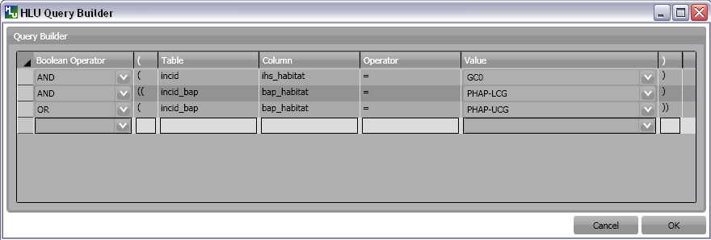

	HLU Query Builder

Boolean Operator
	Allows users to perform logical selections using:

		* 'AND'
		* 'AND NOT'
		* 'OR'
		* 'OR NOT'.

	.. note::
		The value of the 'Boolean Operator' field on the first row is not used.

'(' and ')'
	Allow users to add additional brackets as shown in the example in the figure :ref:`figQB` to define how the query is executed.

Table
	Identifies the table to be searched.

Column
	Identifies the field in the selected table to be searched.

Operator
	Drop-down list of the available operators as shown in the figure :ref:`figSOL`.

Value
	The value to search for. Values can either be entered as free-text or selected from the drop-down list (where available).

.. _figSOL:

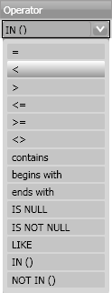

	List of Operators

Once users have entered the values for the current row, click on another row in the query builder to confirm the entry and enable the 'OK' button.

If a mistake has been made when entering the selection criteria, click on the grey box to the left of 'Boolean Operator' to select the row, then press the keyboard :kbd:`Delete` key to remove it.

.. Tip::
	If features are likely to be selected from multiple INCIDs it will typically be much quicker to select features in the GIS (if the available attributes are sufficient for the selection) then use 'Get Map Selection'.

.. raw:: latex

	\newpage

.. index::
	single: Windows; Switch GIS Layer Window

.. _switch_layer_window:

.. raw:: latex

	\newpage

Switch GIS Layer Window
=======================

.. |switch| image:: ../images/icons/SwitchGISLayer.png
	:height: 16px
	:width: 16px

Click |switch| or **Tools... --> Switch GIS Layer** to open the window.

Allows users to switch between GIS layers by selecting a different layer in the drop-down list (see the figure :ref:`figSGLD`). Only layers from the current workspace/document that are valid HLU layers (i.e. have the correct attribute names and formats) will appear in the drop-down list.

.. _figSGLD:

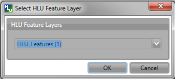

	Switch GIS Layer Dialog

.. note::
	The currently active GIS layer is automatically selected in the drop-down list when the Switch GIS Layer window opens. The active layer also appears in the main window title bar.

