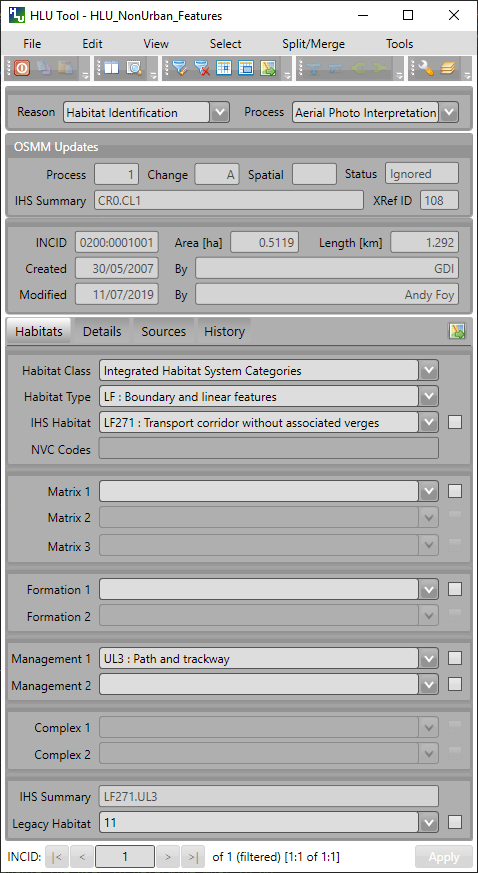
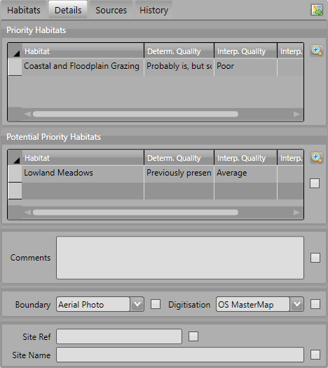
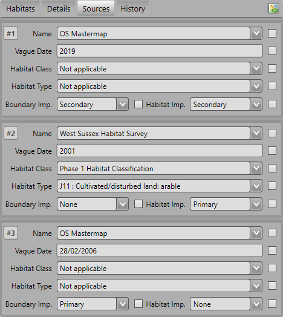
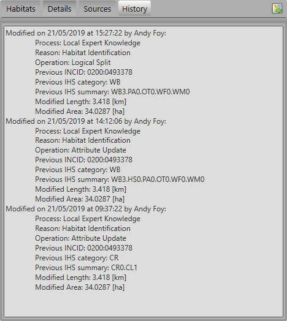
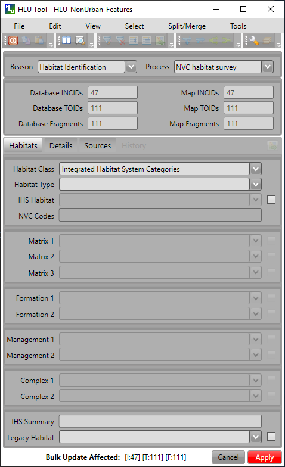

.. index::
	single: Windows

*********
Interface
*********

.. index::
	single: Windows; Main Window

.. _main_window:

Main Window
===========

Once the HLU GIS Tool has been configured, the tool will start the associated GIS, then the main window will appear as shown in the figure :ref:`figUIMW`.

.. _figUIMW:

	HLU Tool Main Window

Records can be viewed or updated through the main window of the HLU GIS Tool. Missing or invalid fields are highlighted in red and the relevant tab is also highlighted. The 'Apply' button will be active when all required fields have been completed and are valid on all tabs.

The following sections summarise the details available for each record.

.. _incid_section:

INCID Section
-------------

The 'INCID' section displays summary information for each INCID in the database, including area, perimeter, date created and date last modified as shown in the figure :ref:`figUIIS`.

.. tip::
	The displayed INCID value can be copied to the clipboard by selecting the value and then either right-clicking in the field and selecting **Copy** or pressing :kbd:`Ctrl-C`.

.. note::
	If the created or modified users are not configured, the 'By' fields will display their Windows login instead of their user name. For details on configuring users see 'Lookup Tables' in the `HLUTool-TechnicalGuide <https://readthedocs.org/projects/hlutool-technicalguide/>`_.

.. _figUIIS:

.. figure:: figures/UserInterfaceIncidSection.png
	:align: center
	:scale: 85

	Main window - INCID Section

.. _reason_section:

Reason/Process Section
----------------------

The 'Reason/Process' section contains the 'Reason' and 'Process' fields as shown in the figure :ref:`figUIRPS`. These fields are required values for all update actions (splits, merges and attribute updates) and are recorded in the History table (and displayed on the History tab) to indicate **why** the record was updated. These fields are **sticky**, i.e. the selected reason and process will be retained and used for all subsequent update actions in the current session unless/until they are altered by the user.

.. _figUIRPS:

.. figure:: figures/UserInterfaceReasonProcessSection.png
	:align: center
	:scale: 85

	Main window - Reason/Process Section

..note::
	If the tool is in **read-only** mode the 'Reason/Process Section' will not be displayed.

	..seealso::
		See 'Why does the tool title bar show [READ ONLY]?' in :doc:`FAQ <../faq/faq>` for more information.

.. _incid_status_section:

INCID Status Section
--------------------

The 'INCID Status' section contains record selectors to enable users to move back and forward between INCID records and displays the record position and the total number of records in the active filter (or the total number of INCID records in the database if there is no active filter). It also displays the number of TOIDs and TOID fragments selected in GIS for the current INCID when the filter was applied as well as the total number of TOIDs and TOID fragments related to the current INCID in the database.

For example, figure :ref:`figUIISS` indicates that the interface is currently displaying record 4 of the 6 records in the active filter, and also shows that 2 TOIDs and 2 fragments from those TOIDs were selected out of a total of 3 TOIDs with 3 fragments associated with the current INCID. Hence, only a **subset** of the TOIDs or fragments associated with the current INCID are selected in GIS.

.. note::
	All INCIDs in the active filter will always be retrieved in INCID order, so moving backwards or forwards through the records using the record selector will always select the previous or next available INCID from those in the filter.

.. _figUIISS:

.. figure:: figures/UserInterfaceIncidStatusSection.png
	:align: center
	:scale: 85

	Main window - Incid Status Section

This section also contains the :guilabel:`Apply` button which is used to apply any attribute changes to the current INCID. See :ref:`attribute_updates` for more details.

..note::
	The :guilabel:`Apply` button will only be displayed if:
		* The user is listed in the lut_user table.
		* The active GIS layer is in edit mode.
		* The user has made one or more changes to the current INCID.
		* There are no fields in error.

.. raw:: latex

	\newpage

.. _ihs_tab:

IHS Tab
-------

The IHS tab displays the Integrated Habitat System (IHS) details for the current database record as shown in the figure :ref:`figUIIT`.

.. _figUIIT:

.. figure:: figures/UserInterfaceIHSTab.png
	:align: center
	:scale: 85

	Main window - IHS Tab

Class
	Drop-down list of habitat classifications used to filter the 'Type' drop-down list to a specific habitat class. The contents in the list are based on entries in the lut_habitat_class table. [6]_

	..note::
		The entries in this field are only used to assist the user to select the most suitable Habitat value and are not saved to the database. Use Sources if you wish to record the source habitat classification and type in the database (see :ref:`source_tab` for more details).

Type
	Drop-down list of habitat classification types used to filter the 'Habitat' drop-down list to relevant IHS codes. The contents in the list are based on entries in the lut_habitat_type table that relate to the selected Class (above). [6]_
 
	..note::
		The entries in this field are only used to assist the user to select the most suitable Habitat value and are not saved to the database. Use Sources if you wish to record the source habitat classification and type in the database (see :ref:`source_tab` for more details).

Habitat
	Drop-down list allowing users to select the desired IHS Habitat code. The contents of the list will vary and relate directly to the selected Class and Type (above) and entries in the lut_habitat_type_ihs_habitat table.

IHS Matrix / Formation / Management / Complex
	Drop-down lists allowing users to refine the habitat definition by adding 'multiplex' codes according to the guidelines of IHS.

IHS Summary
	[Read only]. Automatically generated concatenation of the IHS habitat and multiplex codes selected from the preceding drop-down lists.

Legacy Habitat
	[Read only]. Displays the primary 'pre-IHS' habitat code (if present).

.. [6] The habitat 'Class' and 'Type' list contents are based only on entries in the relevant lookup tables where the 'is_local' flag is set to True (-1). See 'Lookup Tables' in the `HLUTool-TechnicalGuide <https://readthedocs.org/projects/hlutool-technicalguide/>`_ for details of how to update lookup table entries.

.. raw:: latex

	\newpage

.. _details_tab:

Details Tab
-----------

Click on :guilabel:`Details` to display the Details tab as shown in the figure :ref:`figUIDT`.

.. _figUIDT:

	Main window - Details Tab

Priority Habitats
	Automatically added based upon the Habitat and multiplex codes selected on the :ref:`ihs_tab`. For new priority habitats, 'Determination Quality' and 'Interpretation Quality' must be entered.

Potential Priority Habitats
	Allows users to define other priority habitats that may also be present in the future given appropriate management or restoration. An INCID may have a potential priority habitat even if no priority habitats are present.

General Comments
	A free-text field which allows users to enter any additional comments up to 254 characters.

Boundary Map
	Drop-down lists defining the source data map used to identify the boundary.

Digitisation Map
	Drop-down lists defining the map used to digitise the boundary.

Site Ref
	A free-text field which allows users to enter the reference code or key of the site containing the INCID features.

Site Name
	A free-text field which allows users to enter the name of the site containing the INCID features.

.. note::
	To delete a potential priority habitat click on the grey box to the left of the potential priority habitat to select the row, then press the keyboard :kbd:`Delete` key to remove it.

.. raw:: latex

	\newpage

.. _source_tab:

Sources Tab
-----------

Click on :guilabel:`Sources` to display the Sources tab as shown in the figure :ref:`figUIST`. Up to three sources can be defined for each INCID.

.. _figUIST:

	Main window - Sources Tab

Name
	Drop-down list containing a list of data sources. For details on adding new sources see 'Lookup Tables' in the `HLUTool-TechnicalGuide <https://readthedocs.org/projects/hlutool-technicalguide/>`_.

	.. note::
		The following source fields will not be unlocked until a source name has been selected.

Vague Date
	Allows users to enter the date of the dataset. This can be either a precise date e.g. 01/04/2010 or a vague date e.g. Spring 2010-Summer 2010, 1980-2010 or 'Unknown'. For details on configuring vague dates see :ref:`vague_date_options`.

	.. note::
		If a default date for the selected data source has been defined in the lut_sources table, the 'Vague Date' field will be set to the default date. If a default date has not been defined, then the 'Vague Date' field must be updated manually. See 'Lookup Tables' in the `HLUTool-TechnicalGuide <https://readthedocs.org/projects/hlutool-technicalguide/>`_ for details of how to define default source dates.

Habitat Class
	Drop-down list defining the habitat classification used for this data source. If no habitat classification is used, select 'Not Applicable'.

Habitat Type
	Drop-down list defining the type of habitat. This list is filtered based upon the habitat class.

Boundary Imp
	Drop-down list defining the importance of the source data in determining the INCID boundary (in relation to the other sources). Select 'None' if the data source played no part in determining the boundary.

Habitat Imp.
	Drop-down list defining the importance of the source data in determining the INCID habitat type (in relation to the other sources). Select 'None' if the data source played no part in determining the habitat type.

	.. important::
		For Boundary Importance and Habitat Importance there can only be one source set as 'Primary', 'Secondary' or 'Confirmatory' for each field. The importances must also be applied in order, i.e.:

			* If there is only one source - it must be set to 'Primary' (or 'None' if it played no part in determining the habitat or boundary).
			* If there are two sources - one must be set to 'Primary' and one to 'Secondary' (or 'None' if either played no part in determining the habitat or boundary).
			* If there are three sources - one must be set to 'Primary', one to 'Secondary' and one to 'Confirmatory' (or 'None' if any played no part in determining the habitat or boundary).

.. raw:: latex

	\newpage

.. _history_tab:

History Tab
-----------

The History tab displays a list of modifications made to the current INCID and the associated TOIDs. Each entry details what modification was made, when and by whom as shown in Figure 20. Entries are shown in **descending** date and time order with the most recent changes at the top. The maximum number of entries to appear in the history tab can be configured in the Options (see :ref:`gis_options` for more details).

.. _figUIHT:

	Main window - History Tab

.. _error_messages:

Error Messages
--------------

Any fields that are in error, either as a result of invalid values in the current database records for the current INCID or as a result of changes made by the user to the field values, will be highlighted with a red border and exclamation mark (as seen in the figure :ref:`figUIEM`). The appropriate tab header for any invalid fields will also be highlighted to help users locate any errors in fields currently hidden on an inactive tab. Hovering over a field in error will display a *tooltip* message indicating the nature of the error.

.. note::
	Whilst **any** fields are in error the :guilabel:`Apply` button will not appear.

.. _figUIEM:

	Error Messages

.. raw:: latex

	\newpage

.. index::
	single: Bulk Updates

.. _bulk_update_window:

Bulk Updates
============

Allows users to update the attributes for multiple selected database records simultaneously.

.. note::
	This feature is only available to configured users who have been given bulk update permissions. For details on configuring users see 'Lookup Tables' in the `HLUTool-TechnicalGuide <https://readthedocs.org/projects/hlutool-technicalguide/>`_.

.. _figUIBU:

	Main window - Bulk Update Mode

To perform a bulk update:

* Filter the database records using 'Select by attributes' or select polygons in the GIS layer and click :guilabel:`Get Map Selection`. For details on filtering records see :ref:`query_builder_window`.

* Click *:guilabel:`Edit... --> Bulk Update` to enter bulk update mode. An empty form is displayed as shown in the figure :ref:`figUIBU`.

* The 'Bulk Update' section displays the number of INCIDs, TOIDs and fragments affected by the update and allows users to select whether to create a History record for this process.

* Enter the updated details in the IHS, Details, and Sources tabs, then click :guilabel:`Apply`. These fields will be updated for all the selected INCIDs.

.. caution::
	If 'Delete Empty Bulk Update Rows' is checked in the Options, child records will be deleted if these fields are not completed in the bulk update form. See :ref:`database_options` for more details.

.. raw:: latex

	\newpage

.. index::
	single: Windows; Options Window

.. _options_window:

Options Window
==============

Allows users to alter the HLU Tool configuration features specific to their user id. There are five categories of options as shown in the figure :ref:`figOD`.

.. |options| image:: ../icons/Options.png
	:height: 16px
	:width: 16px

Click |options| or :guilabel:`Tools... --> Options` to open the window.

.. _figOD:

.. figure:: figures/OptionsDialog.png
	:align: center
	:scale: 90

	HLU Options Dialog

.. _database_options:

Database Options
----------------

Timeout
	Sets the amount of time the tool will wait for the database to respond. The default value is 15. This value should be increased if an error occurs such as 'The connection to the database timed out'.

Page Size
	Sets how many records are retrieved from the database and stored in memory. The default value is 100. Increasing this value can improve performance when browsing records, however this will increase the amount of RAM required by the application and significant increases in the page size value could cause the tool to stop responding.

Display History Rows
	Sets the number of entries displayed in the 'History' tab of the main window. For more details on the 'History' tab see :ref:`history_tab`.

Delete Empty Bulk Update Rows
	If this checkbox is ticked the details of child records are removed if the corresponding fields in the bulk update form are not completed. By default this box is unticked.

	This option affects the following sections of the main window when performing bulk updates:

		* IHS Matrix
		* IHS Formation
		* IHS Management
		* IHS Complex
		* Priority Habitats
		* Potential Priority Habitats
		* Sources

	.. caution::

		If the 'Delete Empty Bulk Update Rows' option is checked and a bulk update record has only 1 source record completed then, for each of the selected records, source 1 will be updated and if the selected record has data entered in sources 2 and 3, it will be deleted.

.. _gis_options:

GIS Options
-----------

History Display Columns
	Allows users to select which additional columns from the GIS layer are displayed in the History tab for each update. If the checkbox is ticked, the field will be displayed.

Preferred GIS Application
	Allows users to select whether the tool should use ArcGIS or MapInfo if both applications are installed on their computer.

	.. note::
		The tool must be closed and restarted for this change to take effect.

Map Document/Workspace
	Sets the default map document or workspace opened by the HLU GIS Tool. As this field cannot be edited directly, users must click on the :guilabel:`…` button and browse to the new map document or workspace. 

	.. note::
		If the 'Preferred GIS' option is altered, this field must also be updated.

Export Default Directory
	Enables MapInfo users to set a default destination folder path for new GIS layers when performing an export (see :ref:`export_window` for more details). A different path to the default can also be selected during the export process.

		.. note::
			This option is only available if MapInfo is selected as the 'Preferred GIS Application'.

		.. note::
			The default export folder path for ArcGIS users is controlled by ArcGIS and cannot be altered by the HLU Tool.

.. _interface_options:

Interface Options
-----------------

Action to Take When Updating Subset
	Allows users to select what action to take if they attempt to apply attribute changes to only a subset of features for an INCID (see :Ref:`attribute_updates` for more details). The available actions are:

		* Prompt - Always **prompt** the user when attempting to update a subset of INCID features (see :Ref:`attribute_updates` for an example of the prompt dialog).
		* Split - Always perform a **logical split** before applying the attribute updates.
		* All - Always apply the attribute update to **all** features belonging to the INCID regardless of which features of the INCID are currently selected.

Preferred Habitat Class
	Allows the user to choose which Habitat Class in the INCID tab (see :ref:`ihs_tab` for more details) is automatically selected each time the HLU Tool is started.

Notify After Completing Split/Merge?
	Enable users to specify if a pop-up message should be displayed following the completion of any of the split or merge operations.

.. _sql_query_options:

SQL Query Options
-----------------

Warn Before Applying GIS Selection
	Allows users to determine if/when a pop-up warning/information message should be displayed prior to selecting features in GIS (e.g. whilst performing a SQL query or in order to select the features for all INCIDs in the active filter).

	The message will indicate the expected number of features that will be selected (as shown in the figure :ref:`figGSWD`).

	.. _figGSWD:

	.. figure:: figures/GISSelectionWarningDialog.png
		:align: center

		GIS Selection Warning Dialog

	In the event that the SQL query that would be required to select the features in GIS would be too long or complex the message will also warn the user that a temporary join (which may take some time) will need to be performed in GIS (as shown in the figure :ref:`figGSWD2`).

	.. _figGSWD2:

	.. figure:: figures/GISSelectionJoinWarningDialog.png
		:align: center

		GIS Selection with Join Warning Dialog

	The available options are:

		* Always - Warn/inform the user before **every** GIS select, regardless of the expected number of features to be select or the method of selection to be used. 
		* Joins - Only warn/inform the user when a temporary **join** will be performed in GIS in order to select the features.
		* Never - Do not warn/inform the user regardless of the expected number of features to be select or the method of selection to be used.

Use Advanced Query Builder?
	Allows the user to choose their preferred SQL query builder interface (see :ref:`query_builder_window` and :ref:`advanced_query_builder_window` for details).

Get Values Count
	Allows the user to select the maximum number of unique field values that will be retrieved each time the :guilabel:`Get Values` button is pressed when using the 'Advanced Query Builder' (see :ref:`advanced_query_builder_window` for details). The maximum number of rows that can be retrieved at any time cannot exceed 100,000. This number should be reduced if performance issues are experienced when the :guilabel:`Get Values` button is pressed or when the drop-down list is used on the 'Advanced Query Builder'.

	.. note::
		This option is only available if 'Use Advanced Query Builder?' is selected.

Sql Query Default Directory
	Enables users to set a default folder path that will be used when saving or loading queries with the 'Advanced Query Builder' (see :ref:`advanced_query_builder_window` for details). A different path to the default can also be selected during the save and load process.

	.. note::
		This option is only available if 'Use Advanced Query Builder?' is selected.

.. _vague_date_options:

Vague Date Season Names
-----------------------

Seasons
	These fields allow users to define how seasonal dates, such as 'Spring 2009' or 'Winter 2010', are entered so that they can be converted to dates in the HLU database.

Vague Date Delimiter
	This field allow users to define how date ranges, such as 'Spring 2010-Autumn 2010' or '1989-2010', are entered so that they can be converted to dates in the HLU database.

	.. note::
		The default value for the 'Vague Date Delimiter' is a hyphen ( - ). This can be altered to any character, however, it must not be the same delimiter used by the computer to enter precise dates, such as 01/04/2010. The default delimiter used by Windows for English-format dates is a forward slash ( / ).

.. raw:: latex

	\newpage

.. index::
	single: Windows; Filter by Attributes

.. _filter_by_attributes:

Filter by Attributes
====================

.. sidebar:: SQL Query Builders

	There are two interfaces available for building a SQL query:

		* The **HLU Query Builder** originally supplied with the HLU Tool
		* The new **HLU Advanced Query Builder** which provides a more user-friendly and flexible interface.
		  
	Users can choose their preferred interface in the user Options (see :ref:`sql_query_options` for details).

Allows users to filter the INCID records that appear in the user interface and correspondingly which features are selected in the active GIS layer. The filter is performed by building a SQL query that will select one or more INCIDs based on a chosen set of criteria.

.. index::
	single: Windows; Query Builder Window
	single: Filter by Attributes; Query Builder

.. _query_builder_window:

Query Builder Window
--------------------

Allows users to filter the database records using the query builder shown in the figure :ref:`figQB`.

.. |filterbyattr| image:: ../icons/FilterByAttributes.png
	:height: 16px
	:width: 16px

Click |filterbyattr| or :guilabel:`Select... --> Filter by Attributes` to open the window.

.. _figQB:

.. figure:: figures/QueryBuilder.png
	:align: center

	HLU Query Builder

Boolean Operator
	Allows users to perform logical selections using:

		* 'AND'
		* 'AND NOT'
		* 'OR'
		* 'OR NOT'.

	.. note::
		The value of the 'Boolean Operator' field on the first row is not used.

'(' and ')'
	Allow users to add additional brackets to **nest** criteria and boolean operators to meet specific selection requirements

	For example, the query in the figure :ref:`figQB` will select records where:

		* ihs_habitat equals 'GC0' **AND** bap_habitat equals **EITHER** 'PHAP-LCG' **OR** 'PHAP-UCG'
		
	In other words records **must** match the specified ihs_habitat value and **must also** match **either** of the specified bap_habitat values.

	.. note::

		Without the additional set of brackets around the last two lines in the above example the query would select records that either:

			* match the ihs_habitat specified value **AND** the first specified bap_habitat value, **OR**
			* match the second specified bap_habitat value (regardless of the ihs_habitat value)

Table
	Identifies the table to be searched.

Column
	Identifies the field in the selected table to be searched.

Operator
	Drop-down list of the available operators as shown in the figure :ref:`figSOL`.

Value
	The value to search for. Values can either be entered as free-text or selected from the drop-down list (where available).

.. _figSOL:

.. figure:: figures/SQLOperatorList.png
	:align: center

	List of Operators

Once users have entered the values for the current row, click on another row in the query builder to confirm the entry and enable the 'OK' button.

If a mistake has been made when entering the selection criteria, click on the grey box to the left of 'Boolean Operator' to select the row, then press the keyboard :kbd:`Delete` key to remove it.

.. tip::
	If features are likely to be selected from multiple INCIDs it will typically be much quicker to select features in the GIS (if the available attributes are sufficient for the selection) then use 'Get Map Selection'.

.. raw:: latex

	\newpage

.. index::
	single: Windows; Advanced Query Builder Window
	single: Filter by Attributes; Advanced Query Builder

.. _advanced_query_builder_window:

Advanced Query Builder Window
-----------------------------

Allows users to filter the database records using the advanced query builder shown in the figure :ref:`figAQB`.

Click |filterbyattr| or :guilabel:`Select... --> Filter by Attributes` to open the window.

.. _figAQB:

.. figure:: figures/AdvancedQueryBuilder.png
	:align: center

	HLU Advanced Query Builder

Tables
	Identifies the table to be queried.

Columns
	Identifies the field in the selected table to be searched.

Operators
	Drop-down list of the available operators as shown in the figure :ref:`figASOL`.

Values
	The value to search for.  Values may automatically be loaded in the drop-down list, if the selected Table and Column refer to one of the lookup tables, or can be manually loaded using the :guilabel:`Get Values` button.

Add Buttons
	The :guilabel:`Add` buttons will paste the selected item from the relevant Tables, Columns, Operators or Values field into the **SELECT DISTINCT incid FROM:** text box or the **WHERE:** text box (as appropriate).

.. _figASOL:

.. figure:: figures/AdvancedSQLOperatorList.png
	:align: center

	List of Operators

SELECT DISTINCT incid FROM:
	A text box that should contain a comma-separated list of the tables that are referenced in the **WHERE** text box.

WHERE:
	A text box that should contain the SQL clause which will select the required INCID values from the HLU Tool database.

Clear
	Click the :guilabel:`Clear` button to remove any existing text from the **SELECT DISTINCT incid FROM:** and **WHERE:** text boxes.

Verify
	Click :guilabel:`Verify` to determine if the query is valid by checking the syntax of the text boxes and hence will execute successfully on the HLU Tool database. If the syntax is valid it will also determine if any records will be returned by the query.

Load
	Click :guilabel:`Load` to copy an existing query file into the text boxes. Users will be prompted for the source path and file name of an existing **.hsq** file. The default folder path can be set in the Options (see :ref:`sql_query_options` for more details).

Save
	Click :guilabel:`Save` to copy the text boxes to a query file. Users will be prompted for the destination path and file name of the **.hsq** file to save the query to. The default folder path can be set in the Options (see :ref:`sql_query_options` for more details).

OK
	Click :guilabel:`OK` to execute the query. If the user has requested to be warned before applying the GIS selection then a pop-up message will appear advising how many expected INCIDs and features will be selected and if a 'Join' will be used to select the features in GIS (see :ref:`sql_query_options` for more details).

Cancel
	Click :guilabel:`Cancel` to close the 'HLU Advanced Query Builder' window without executing a query.

.. tip::
	Whilst the Tables and Where Clause can be entered as free-text by the user, it is recommended that users use the drop-down lists and :guilabel:`Add` buttons to reduce the likelihood of syntax errors.

.. raw:: latex

	\newpage

.. index::
	single: Windows; Export Window

.. _export_window:

Export Window
=============

Click :guilabel:`File... --> Export` to open the Export window. This function allows users to combine both GIS features and associated attribute data from the HLU database and export the results to a new GIS layer using a pre-defined export format. If the database records have been filtered the 'Selected only' checkbox is automatically ticked and the number of selected GIS features is shown (as seen in :ref:`figED`). Only the records related to the selected INCIDs and the GIS features will be exported. Untick this checkbox to export all records. For details on how to filter records see :ref:`filter_by_attributes`.

.. _figED:

.. figure:: figures/ExportDialog.png
	:align: center

	Export Dialog

To perform an export:

	* Select the required INCID and GIS features to be exported (either by selecting the features in GIS and clicking :guilabel:`Get Map Selection` or performing a **Filter by Attributes**).
	* Click :guilabel:`File... --> Export` to open the Export window.
	* Select one of the pre-defined export formats from the 'Export Format' drop-down list.
	* Tick the 'Selected only' checkbox to export **only** the selected features or clear the checkbox to export **all** of the features in the active GIS layer as required.
	* Click :guilabel:`Ok` to perform the export.
	* You will be prompted to select a destination folder and file name for the new GIS layer.
	* A pop-up message will appear informing when the export has completed and prompting if the new GIS layer should be loaded into the active GIS document/workspace.

	.. note::
		The default export folder destination can be set by MapInfo users (see :ref:`gis_options` for more details).

	.. warning::
		Exporting all features or a large number of features can take a long time depending upon the number of features and the configuration of the HLU Tool and the associated GIS application and attribute database system.

During the export process checks and validation are performed to avoid potential errors and frustrations. As a result warnings may appear under the following circumstances:

	* If the export contains more than 5,000 INCIDs and hence may take some time to complete (the count of 5,000 is only an arbitrary value and does not represent any processing limit).
	* If ArcGIS users have chosen to export to a shapefile (as opposed to a file or personal geodatabase feature class) and have selected an export format that contains field names that exceed 10 characters as this will result in the field names being automatically truncated or renamed by ArcGIS.
	* If MapInfo users have selected an export format where the total length of the output fields (including the fields included from the GIS layer) exceeds 4,000 bytes as this is the maximum record length supported by MapInfo.
	* If MapInfo users have initiated an export where the total size of the output .dbf attribute file is likely to exceed 2 GBs as this is the maximum file size supported by MapInfo.

	.. seealso::
		For details on defining export formats see 'Configuring Exports' in the `HLUTool-TechnicalGuide <https://readthedocs.org/projects/hlutool-technicalguide/>`_.

.. raw:: latex

	\newpage

.. index::
	single: Windows; Switch GIS Layer Window

.. _switch_layer_window:

Switch GIS Layer Window
=======================

.. |switch| image:: ../icons/SwitchGISLayer.png
	:height: 16px
	:width: 16px

Click |switch| or :guilabel:`Tools... --> Switch GIS Layer` to open the window.

Allows users to switch between GIS layers by selecting a different layer in the drop-down list (see the figure :ref:`figSGLD`). Only layers from the current workspace/document that are valid HLU layers (i.e. have the correct attribute names and formats) will appear in the drop-down list. The name of the layer will be followed by a number (e.g. 'HLU Non-urban Features [1]') indicating which map/document each layer is part of.

.. _figSGLD:

.. figure:: figures/SwitchGISLayerDialog.png
	:align: center

	Switch GIS Layer Dialog

.. note::
	The currently active GIS layer is automatically selected in the drop-down list when the Switch GIS Layer window opens. The active layer also appears in the main window title bar.

