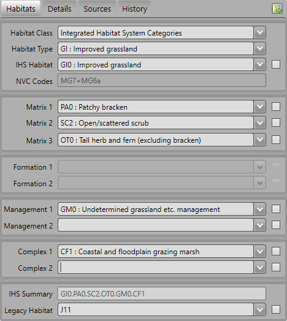

.. |filterbyattr| image:: ../icons/FilterByAttributes.png
	:height: 16px
	:width: 16px

**********
Interfaces
**********

.. index::
	see: Interfaces; Windows
	single: Windows; Main Window

.. _main_window:

Main Window
===========

Once the HLU Tool has been configured, starting the tool will start the associated GIS application, then the main window will appear as shown in the figure :ref:`figUIMW`.

.. _figUIMW:

.. figure:: figures/UserInterfaceMainWindow.png
	:align: center
	:scale: 60

	Main Window

.. raw:: latex

	\newpage

Records can be viewed or updated through the main window of the HLU Tool. Missing or invalid fields are highlighted in red and the relevant tab is also highlighted. The 'Apply' button will be active when all required fields have been completed and are valid on all tabs.

The following sections summarise the different sections of the main window.

Title Bar
---------

The main window title bar displays the following information:

* The tool title, i.e. **HLU Tool**
* The active GIS layer, e.g. **HLU_NonUrban_Features**.
* Whether the tool is in read-only mode, i.e. **[READONLY]**
  

.. note::
	 The title bar may also display a number (e.g. **[1]**) representing which Map Window (MapInfo) or Data Frame (ArcGIS) contains the active GIS layer if there are multiple windows/frames in the associated GIS application.

.. _figUITB:

	Main Window - Title Bar

.. seealso::
		See 'Why does the tool title bar show [READ ONLY]?' in :doc:`FAQ <../faq/faq>` for more information.

.. _reason_section:

Reason/Process Section
----------------------

The 'Reason/Process' section contains the 'Reason' and 'Process' fields as shown in the figure :ref:`figUIRPS`. These fields are required values for all update actions (attribute updates, splits, merges and bulk updates) and are recorded in the History table (and displayed on the History tab) to indicate **why** the record was updated. These fields are **sticky**, i.e. the selected reason and process will be retained and used for all subsequent actions in the current session until they are altered by the user.

.. note::
	If the tool is in **read-only** mode the 'Reason/Process Section' will not be displayed.

.. _figUIRPS:

	Main Window - Reason/Process Section

Reason
	The underlying explanation for the change in habitat or land use. It may be as a result of known changes in the habitat (such as habitat restoration), because new information indicates the existing data is wrong or because there has been a change but the underlying the cause is unknown.

Process
	The activity being undertaken that has lead to applying this change to the spatial or attribute data of the current INCID. It may relate to a specific project, an ongoing process or an adhoc update.

.. _osmm_update_section:

OSMM Updates Section
--------------------

The 'OSMM Updates' section displays summary information of any proposed or pending OSMM updates for each INCID in the database, including the update process flag, change flag, spatial flag, status and proposed new IHS Summary as shown in the figure :ref:`figUIOUS`.

.. note::
	If/when the OSMM Update section appears can be configured in the user options. For details see :ref:`options_interface`.

.. _figUIOUS:

	Main Window - OSMM Updates Section

For a description of the fields see :ref:`review_osmm_section`.

.. raw:: latex

	\newpage

.. _incid_section:

INCID Section
-------------

The 'INCID' section displays summary information for each INCID in the database, including area, perimeter, date created and date last modified as shown in the figure :ref:`figUIIS`.

.. _figUIIS:

.. figure:: figures/UserInterfaceIncidSection.png
	:align: center
	:scale: 85

	Main Window - INCID Section

INCID
	The unique reference for the current record.

Area
	The total area of all the selected features for the current INCID.

Length
	The total perimeter length of all the selected features for the current INCID.

Created/By
	The date the current INCID was first created and the name of the user that created it. For most INCIDs this will relate to when the data was first loaded into the framework. For INCIDs that have been created as a result of a logical split this relate to when the split was performed.

Modified/By
	The date the current INCID was last modified and the name of the user that modified it. If the INCID has not been modified this will correspond with when the data was first loaded into the framework.

.. tip::
	The displayed INCID value can be copied to the clipboard by selecting the value and then either right-clicking in the field and selecting **Copy** or pressing :kbd:`Ctrl-C`.

.. note::
	If the created or modified users are not configured, the 'By' fields will display their Windows login instead of their user name. For details on configuring users see 'Lookup Tables' in the HLU Tool Technical Guide at `readthedocs.org/projects/hlutool-technicalguide <https://readthedocs.org/projects/hlutool-technicalguide/>`_.

.. raw:: latex

	\newpage

.. _habitats_tab:

Habitats Tab
------------

Click on :guilabel:`Habitats` to display the Habitats tab as shown in the figure :ref:`figUIHT`. The Habitats tab displays the Integrated Habitat System (IHS) and legacy habitat details for the current INCID record.

.. _figUHIT:

	Main Window - Habitats Tab

Class
	Drop-down list of habitat classifications used to filter the 'Type' drop-down list to a specific habitat class. The contents in the list are based on entries in the lut_habitat_class table. [6]_

	.. note::
		The entries in this field are only used to assist the user to select the most suitable Habitat value and are not saved to the database. Use Sources if you wish to record the source habitat classification and type in the database (see :ref:`source_tab` for more details).

Type
	Drop-down list of habitat classification types used to filter the 'Habitat' drop-down list to relevant IHS codes. The contents in the list are based on entries in the lut_habitat_type table that relate to the selected Class (above). [6]_
 
	.. note::
		The entries in this field are only used to assist the user to select the most suitable Habitat value and are not saved to the database. Use Sources if you wish to record the source habitat classification and type in the database (see :ref:`source_tab` for more details).

Habitat
	Drop-down list allowing users to select the desired IHS Habitat code. The contents of the list will vary and relate directly to the selected Class and Type (above) and entries in the lut_habitat_type_ihs_habitat table.

NVC Codes
	[Read only]. Automatically displays a list of any potential NVC Codes related to the IHS habitat codes selected in the preceding drop-down list.

IHS Matrix / Formation / Management / Complex
	Drop-down lists allowing users to refine the habitat definition by adding 'multiplex' codes according to the guidelines of IHS.

IHS Summary
	[Read only]. Automatically generated concatenation of the IHS habitat and multiplex codes selected from the preceding drop-down lists.

Legacy Habitat
	Drop-down list allowing users to view and maintain a legacy habitat definition (if required). The contents of the list are based on entries in the lut_legacy_habitat table.

.. [6] The habitat 'Class' and 'Type' list contents are based only on entries in the relevant lookup tables where the 'is_local' flag is set to True (-1). See 'Lookup Tables' in the HLU Tool Technical Guide at `readthedocs.org/projects/hlutool-technicalguide <https://readthedocs.org/projects/hlutool-technicalguide/>`_ for details of how to update lookup table entries.

.. raw:: latex

	\newpage

.. _details_tab:

Details Tab
-----------

Click on :guilabel:`Details` to display the Details tab as shown in the figure :ref:`figUIDT`. The Details tab displays any priority and potential priority habitats, general comments, maps and site details.

.. _figUIDT:

.. figure:: figures/UserInterfaceDetailsTab.png
	:align: center
	:scale: 85

	Main Window - Details Tab

Priority Habitats
	Automatically added based upon the Habitat and multiplex codes selected on the :ref:`habitats_tab`. For new priority habitats, 'Determination Quality' and 'Interpretation Quality' must be entered.

	Click |zoomtable| to open the Priority Habitats window.

Potential Priority Habitats
	Allows users to define other priority habitats that may also be present in the future given appropriate management or restoration. An INCID may have one or more potential priority habitats even if no priority habitats are present.

	Click |zoomtable| to open the Potential Priority Habitats window.

General Comments
	A free-text field which allows users to enter any additional comments up to 254 characters.

Boundary Map
	Drop-down lists defining the source data map used to identify the boundary.

Digitisation Map
	Drop-down lists defining the map used to digitise the boundary.

Site Ref
	A free-text field which allows users to enter the reference code or key of the site containing the INCID features.

Site Name
	A free-text field which allows users to enter the name of the site containing the INCID features.

.. note::
	To delete a potential priority habitat click on the grey box to the left of the potential priority habitat to select the row, then press the keyboard :kbd:`Delete` key to remove it.

.. raw:: latex

	\newpage

.. _source_tab:

Sources Tab
-----------

Click on :guilabel:`Sources` to display the Sources tab as shown in the figure :ref:`figUIST`. The Sources tab shows any sources of information that were used to determine the habitat and boundary of all features relating to the current INCID, plus the priorities that were applied to each source. Up to three sources can be defined for each INCID.

.. _figUIST:

.. figure:: figures/UserInterfaceSourcesTab.png
	:align: center
	:scale: 85

	Main Window - Sources Tab

Name
	Drop-down list containing a list of data sources. For details on adding new sources see 'Lookup Tables' in the HLU Tool Technical Guide at `readthedocs.org/projects/hlutool-technicalguide <https://readthedocs.org/projects/hlutool-technicalguide/>`_.

	.. note::
		The following source fields will not be unlocked until a source name has been selected.

Vague Date
	Allows users to enter the date of the dataset. This can be either a precise date e.g. 01/04/2010 or a vague date e.g. Spring 2010-Summer 2010, 1980-2010 or 'Unknown'. For details on configuring vague dates see :ref:`options_dates`.

	.. note::
		If a default date for the selected data source has been defined in the lut_sources table, the 'Vague Date' field will be set to the default date. If a default date has not been defined, then the 'Vague Date' field must be updated manually. See 'Lookup Tables' in the HLU Tool Technical Guide at `readthedocs.org/projects/hlutool-technicalguide <https://readthedocs.org/projects/hlutool-technicalguide/>`_ for details of how to define default source dates.

Habitat Class
	Drop-down list defining the habitat classification used for this data source. If no habitat classification is used, select 'Not Applicable'.

Habitat Type
	Drop-down list defining the type of habitat. This list is filtered based upon the habitat class.

Boundary Imp.
	Drop-down list defining the importance of the source data in determining the INCID boundary (in relation to the other sources). Select 'None' if the data source played no part in determining the boundary.

Habitat Imp.
	Drop-down list defining the importance of the source data in determining the INCID habitat type (in relation to the other sources). Select 'None' if the data source played no part in determining the habitat type.

	.. important::
		For Boundary Importance and Habitat Importance there can only be one source set as 'Primary', 'Secondary' or 'Confirmatory' for each field. The importances must also be applied in order, i.e.:

			* If there is only one source - it must be set to 'Primary' (or 'None' if it played no part in determining the habitat or boundary).
			* If there are two sources - one must be set to 'Primary' and one to 'Secondary' (or 'None' if either played no part in determining the habitat or boundary).
			* If there are three sources - one must be set to 'Primary', one to 'Secondary' and one to 'Confirmatory' (or 'None' if any played no part in determining the habitat or boundary).

.. raw:: latex

	\newpage

.. _history_tab:

History Tab
-----------

Click on :guilabel:`History` to display the History tab as shown in the figure :ref:`figUIHT`. The History tab displays a list of previous modifications made to the current INCID and the associated TOIDs. 

.. _figUIHT:

.. figure:: figures/UserInterfaceHistoryTab.png
	:align: center
	:scale: 85

	Main Window - History Tab

Each entry details what modifications were made, when and by whom. Entries are shown in **descending** date and time order with the most recent changes at the top. The maximum number of entries to appear in the history tab can be configured in the Options (see :ref:`options_gis` for more details).

.. _incid_status_section:

INCID Status Section
--------------------

The 'INCID Status' section contains record selectors to enable users to move back and forward between INCID records and displays the record position and the total number of records in the active filter (or the total number of INCID records in the database if there is no active filter). It also displays the number of TOIDs and TOID fragments selected in GIS for the current INCID when the filter was applied as well as the total number of TOIDs and TOID fragments related to the current INCID in the database.

.. _figUIISS:

	Main Window - INCID Status Section

For example, figure :ref:`figUIISS` indicates that the interface is currently displaying record 4 of the 6 records in the active filter, and also shows that 2 TOIDs and 2 fragments from those TOIDs were selected in the active GIS layer out of a total of 3 TOIDs with 3 fragments associated with the current INCID. Hence, only a **subset** of the TOIDs or fragments associated with the current INCID are selected in GIS.

.. note::
	All INCIDs in the active filter will always be retrieved in INCID order, so moving backwards or forwards through the records using the record selector will always select the previous or next available INCID from those in the filter.

This section also contains the :guilabel:`Apply` button which is used to apply any attribute changes to the current INCID. See :ref:`attribute_update` for more details.

.. note::
	The :guilabel:`Apply` button will only be displayed if:

		* The user is listed in the lut_user table.
		* The active GIS layer is in edit mode.
		* The user has made one or more changes to the current INCID.
		* There are no fields in error.

.. raw:: latex

	\newpage

.. index::
	single: Windows; Warning and Error Messages

.. _error_messages:

Warning and Error Messages
--------------------------

Any fields that either have a warning associated with them or are in error will be highlighted

Warnings
	Warnings will be highlighted with an orange border and exclamation mark in a triangle (as seen in the figure :ref:`figUIWEM`). Hovering over a field with a warning will display a *tooltip* message indicating the nature of the warning.

Errors
	Errors will be highlighted with a red border and exclamation mark in a circle (as seen in the figure :ref:`figUIWEM`). The appropriate tab header for any invalid fields will also be highlighted to help users locate any errors in fields currently hidden on an inactive tab. Hovering over a field with an error will display a *tooltip* message indicating the nature of the error.

.. _figUIWEM:

.. figure:: figures/UserInterfaceErrorMessages.png
	:align: center
	:scale: 85

	Main Window - Warning and Error Messages

.. note::
	Whilst **any** fields are in error the :guilabel:`Apply` button will not appear.

.. raw:: latex

	\newpage

.. index::
	single: Windows; Priority Habitats Window

.. _priority_habitats_window:

Priority Habitats Window
========================

Allows users to edit any priority habitats as shown in the figure :ref:`figUIPHW`.

Click |zoomtable| adjacent to the Priority Habitats table on the Details tab to open the window.

.. _figUIPHW:

	Priority Habitats Window

.. raw:: latex

	\newpage

.. index::
	single: Windows; Potential Priority Habitats Window

.. _potential_priority_habitats_window:

Potential Priority Habitats Window
==================================

Allows users to add, edit or delete any potential priority habitats as shown in the figure :ref:`figUIPPHW`.

Click |zoomtable| adjacent to the Potential Priority Habitats table on the Details tab to open the window.

.. _figUIPPHW:

	Potential Priority Habitats Window

.. raw:: latex

	\newpage

.. index::
	single: Windows; Bulk Updates Window
	single: Bulk Updates

.. _bulk_update_window:

Bulk Update Window
==================

The main window will transform into the bulk update window when the bulk update mode is started. The window appears the same as the main window except for the Bulk Update section and the INCID Status section as shown in the figure :ref:`figUIMWBU`. The History tab will also be disabled.

.. _figUIMWBU:

.. figure:: figures/UserInterfaceBulkUpdate.png
	:align: center
	:scale: 60

	Bulk Update Window

.. note::

	* Bulk update mode can only be started when edit mode is active and once a filter is applied to the INCID records.
	* This function is only available to configured users who have been given bulk update permissions. For details on configuring users see 'Lookup Tables' in the HLU Tool Technical Guide at `readthedocs.org/projects/hlutool-technicalguide <https://readthedocs.org/projects/hlutool-technicalguide/>`_.

INCID Section
-------------

The 'INCID' section displays summary information for all of the INCIDs and GIS features currently filtered (as shown in the figure :ref:`figUIBUS`). The **Database** counts refer to the total number of INCIDs, TOIDs and Fragments found in the database relating to the current filter. The **Map** counts refer to the total number of INCIDs, TOIDs and Fragments currently selected in the active GIS layer.

.. _figUIBUS:

	Bulk Update Window - INCID Section

Database INCIDs
	Displays the number of INCIDs in the database for the active filter that the bulk update will be applied to.

Map INCIDs
	Displays the number of INCIDs for features selected in the active GIS layer that the bulk update will be applied to.

Database TOIDs
	Displays the number of TOIDs in the database for the active filter that the bulk update will be applied to.

Map TOIDs
	Displays the number of TOIDs for features selected in the active GIS layer that the bulk update will be applied to.

Database Fragments
	Displays the number of fragments in the database for the active filter.

Map Fragments
	Displays the number of fragments/features selected in the active GIS layer that the bulk update will be applied to.

.. note::
	Any discrepancies between the **Database** and **Map** counts will be highlighted with warning messages. This indicates that not all INCIDs, TOIDs or Fragments in the database are held within the active GIS layer.

INCID Status Section
--------------------

The Bulk Update 'INCID Status' section shows the total number of INCIDs, TOIDs and Fragments in the active filter.

.. _figUIBUS:

	Bulk Update Window - INCID Status Section

For example, figure :ref:`figUIBUS` indicates that the active filter currently contains 47 INCIDs, 58 TOIDs and 58 fragments from those TOIDs.

.. raw:: latex

	\newpage

.. index::
	single: Windows; Bulk Updates Confirmation Window
	single: Bulk Updates; Confirmation

.. _bulk_update_confirmation_window:

Bulk Update Confirmation Window
-------------------------------

Before a bulk update is applied a confirmation window will appear with a number of options relating to the update as shown in the figure :ref:`figUIBUC`.

.. _figUIBUC:

.. figure:: figures/UserInterfaceBulkUpdateConfirmation.png
	:align: center
	:scale: 85

	Bulk Update Confirmation Window

Delete Orphan Priority Habitats
	Whether existing priority habitats (those automatically associated with the current IHS Habitat) that are **orphaned** (i.e. not associated with the new IHS Habitat) should be deleted following a change to the IHS Habitat during a bulk update. If unchecked, any existing priority habitats are converted to potential priority habitats with the determination quality changed to 'Previous present, by may no longer exist'.

Delete Potential Priority Habitats
	Whether existing potential priority habitats (those added manually by a user) should be deleted following during a bulk update. If unchecked, any existing potential priority habitats will be retained.

Delete Existing Multiplex Rows
	Whether existing multiplex (matrix, formation, management and complex) codes should be deleted following a change to the IHS Habitat during a bulk update. The available options are:

		* All - Deletes **all** existing multiplex codes.
		* Invalid - Deletes only existing multiplex codes that are not valid for the new IHS Habitat.
		* None - All existing multiplex codes will be retained, and any not be compatible with the new IHS Habitat will appear as errors when displayed in the main interface.

	.. caution::
		Use option **All** with caution. A warning message will appear when this option is selected.

	.. note::
		This option will only be displayed if a new IHS Habitat has been entered for the bulk update.

Delete Existing Source Rows
	[Read only] Whether existing source rows will be deleted when one or more new sources are provided for a bulk update.

	.. note::
		This option cannot be controlled by the user - it is automatically determined based on whether one or more new sources are provided or not.

Create History Records
	Whether history records will be created when a bulk update is applied.

	.. note::
		The default values for all of the above fields (except for *Delete Existing Source Rows*) can be set in the options (see :ref:`options_bulk_update` for more details).

.. raw:: latex

	\newpage

.. index::
	single: Windows; Review OSMM Updates Window
	single: OSMM Updates; Review

.. _review_osmm_window:

Review OSMM Updates Window
==========================

The main window will transform into the OSMM review updates window when the review OSMM updates mode is started (see :ref:`review_osmm_updates` for more details). The window appears the same as the main window except for the OSMM Updates section and the INCID Status section as shown in the figure :ref:`figUIMWOU`.

.. _figUIMWOU:

	Review OSMM Updates Window

.. note::

	* OSMM review update mode can only be started when there are proposed OSMM update records in the database.
	* This function is only available to configured users who have been given bulk update permissions. For details on configuring users see 'Lookup Tables' in the HLU Tool Technical Guide at `readthedocs.org/projects/hlutool-technicalguide <https://readthedocs.org/projects/hlutool-technicalguide/>`_.

.. _review_osmm_section:

OSMM Updates Section
---------------------

The 'OSMM Updates' section displays summary details of any proposed or pending OSMM updates for each INCID in the database as shown in the figure :ref:`figUIOUS`.

.. _figUIOUS:

	Review OSMM Updates Window - OSMM Updates Section

Process Flag
	Which step in the external OSMM Update process the proposed update was determined. Values represent the type of change in the IHS habitat class from the original incid feature to the new incid feature, and the number of sources assigned to the original incid feature, as follows:

		* 1 = Built to Built (only 1 source)
		* 2 = Built to Built (two or more sources)
		* 3 = Built to Natural (any number of sources)
		* 4 = Natural to Built (only 1 source)
		* 5 = Natural to Built (two or more sources)
		* 6 = Natural to Natural (only 1 source)
		* 7 = Natural to Natural (two or more sources)
		* 8 = Any to Unknown (any number of sources)
		* 9 = Unknown to any (except unknown) (any number of sources)

Change Flag
	Assists with prioritising proposed updates by summarising the type of habitat change. Values indicate whether the proposed habitat category (e.g. 'WB') is the same as the original habitat category and whether it is a higher or lower level in the habitat hierarchy, as follows:

		* <blank> = Same category and habitat (e.g. GN1 to GN1)
		* A = Same category but proposed habitat is higher level (e.g. WB3 to WB36)
		* B = Same category but proposed habitat is different and same or lower level (e.g. LF271 to LF272, LF271 to LF27)
		* C = Proposed habitat is different and higher level (e.g. WB3 to EM41)
		* D = Proposed habitat is different and same level (e.g. WB3 to EM4)
		* E = Proposed habitat is different and lower level (e.g. WB36 to EM4)

Spatial Flag
	Indicates whether part of the new feature has been changed compared to the original framework. An 'X' denotes when a feature (once the external OSMM Update process has been completed) overlaps two or more features in the original framework, and so a portion of the new feature may now be assigned to a different INCID than it was originally.

Status
	Indicates the current status of the proposed OSMM Update, as follows:

		* Proposed = the OSMM update has not be accepted or rejected by a user yet
		* Pending = the OSMM update has been accepted and is awaiting to be applied (see see :ref:`bulk_osmm_update_window` for more details).
		* Applied = the OSMM update has been accepted and applied
		* Ignored = the INCID was manually updated when an OSMM update was still proposed or pending and hence the OSMM update was ignored
		* Rejected

IHS Summary
	Concatenation of the proposed IHS habitat and multiplex codes based on the new OSMM attributes.

INCID Status Section
--------------------

The Review OSMM Updates 'INCID Status' section shows the total number of INCIDs in the active filter, and the number of TOIDs and fragments for the current INCID.

.. _figUIOUIS:

	Review OSMM Updates Window - INCID Status Section

For example, figure :ref:`figUIOUIS` indicates that the active filter currently contains 13 INCIDs and the current INCID consists of 1 TOID with 1 fragment.

Holding down the :guilabel:`Ctrl` key changes the :guilabel:`Reject` and :guilabel:`Accept` buttons to :guilabel:`Reject All` and :guilabel:`Accept All` thereby allowing the user to Reject or Accept **all** remaining INCIDs in the active filter.

.. _figUIOUIS2:

	Review OSMM Updates Window - INCID Status Section 2

For example, figure :ref:`figUIOUIS2` shows the 'INCID Status' section when the :guilabel:`Ctrl` key is pressed.

.. index::
	single: Windows; OSMM Updates Filter Window
	single: OSMM Updates; Filter

.. _osmm_updates_filter:

OSMM Updates Filter
-------------------

When the review OSMM updates mode is first started, the OSMM Updates Filter window will appear as shown in the figure :ref:`figUIOUF`. This allows the user to filter which subset of proposed OSMM Updates to review.

.. _figUIOUF:

	Review OSMM Updates Filter Window

OSMM Updates Summary
	Displays a tabular summary of all the OSMM Updates in the database. Each row is a unique combination of the Process Flag, Change Flag, Spatial Flag and shows the number of records for each of the possible Status values (Rejected, Ignored, Proposed, Pending and Applied) and the total records for all statuses. Only combinations that exist in the database (rather than all possible combinations) will appear in the table.

	.. tip::
		Selecting one of the rows in the table will set the Process, Change and Spatial values in the Filter by OSMM Updates section to those of the selected row. However, the Status field will not be changed and must be selected manually.

Process
	Allows the user to select a specific value, to select only proposed updates with a given Process flag, or select <all> to select proposed updates with any Process flag.

Change
	Allows the user to select a specific value, to select only proposed updates with a given Change flag, or select <all> to select proposed updates with any Change flag.

Spatial
	Allows the user to select a specific value, to select only proposed updates with a given Spatial flag, or select <all> to select proposed updates with any Spatial flag.

Status
	Allows the user to select a specific value to select only proposed updates with a given pending status (Rejected, Ignored or Proposed).

	.. note::
		Typically only updates with a pending status of 'Proposed' would be selected, but the option to select updates with a pending status of 'Rejected' or 'Ignored' is available to enabled earlier actions to be reviewed or undone. However, it is **not** possible to select updates that have already been accepted or applied (i.e. have a status of 'Pending' or 'Applied').

OK
	Click :guilabel:`Ok` to apply the selected filter to the INCID records in the main interface and close the OSMM Updates Filter window.

Reset
	Click :guilabel:`Reset` to clear all of the Process, Change, Spatial and Status fields.

Cancel
	Click :guilabel:`Cancel` to close the OSMM Updates Filter window without applying a new filter.

.. note::
	The user can change the filter at any time when in Review OSMM Updates mode by clicking:

		* |filterbyattr| or :guilabel:`Select... --> Filter by Attributes...` to open the OSMM Updates Filter window.
		* :guilabel:`Select... --> Filter by Attributes - Advanced ...` to open the Advanced Query Builder window.

.. tip::
	Clicking on any of the column headings will sort the table by that column in ascending order. Clicking on the same column again will sort it in descending order.

.. index::
	single: Windows; OSMM Updates Advanced Filter Window
	single: OSMM Updates; Advanced Filter

.. _osmm_updates_advanced_filter:

OSMM Updates Filter - Advanced
------------------------------

As an alternative to the OSMM Updates Filter window that first appears when the review OSMM updates mode is first started, the advanced filter window can be used. This provides the user with greater control to filter which subset of proposed OSMM Updates to review.

To open the advanced filter window:

	* Close the standard OSMM Updates Filter window
	* Click :guilabel:`Select... --> Filter by Attributes - Advanced...` to open the Advanced Query Builder window.

.. raw:: latex

	\newpage

.. index::
	single: Windows; Bulk Apply OSMM Updates Window
	single: OSMM Updates; Bulk Apply

.. _bulk_osmm_update_window:

Bulk OSMM Update Window
=======================

The main window will transform into the bulk OSMM update window when the bulk OSMM update mode is started. The window appears the same as the main window except for the Bulk Update section and the INCID Status section as shown in the figure :ref:`figUIMWBOU`. The Habitats tab and History tab will also be disabled.

.. _figUIMWBOU:

.. figure:: figures/UserInterfaceBulkOSMMUpdate.png
	:align: center
	:scale: 60

	Bulk OSMM Update Window

.. note::

	* Bulk OSMM update mode can only be started when edit mode is active.
	* This function is only available to configured users who have been given bulk update permissions. For details on configuring users see 'Lookup Tables' in the HLU Tool Technical Guide at `readthedocs.org/projects/hlutool-technicalguide <https://readthedocs.org/projects/hlutool-technicalguide/>`_.

INCID Section
-------------

The 'INCID' section displays summary information for all of the INCIDs and GIS features currently filtered (see :ref:`bulk_update_window` for details).

INCID Status Section
--------------------

The Bulk Update 'INCID Status' section shows the total number of INCIDs, TOIDs and Fragments in the active filter (see :ref:`bulk_update_window` for details).

OSMM Updates Filter
-------------------

When the bulk OSMM updates mode is first started, the OSMM Updates Filter window will appear (see :ref:`osmm_updates_filter` for details). This allows the user to filter which subset of pending OSMM Updates the bulk update will apply to.

.. index::
	single: Windows; Bulk Apply OSMM Updates Confirmation Window

.. _bulk_osmm_update_confirmation_window:

Bulk OSMM Update Confirmation Window
------------------------------------

Before a bulk OSMM update is applied a confirmation window will appear with a number of options relating to the update as shown in the figure :ref:`figUIBOUC`.

.. _figUIBOUC:

	Bulk OSMM Update Confirmation Window

Habitat Determination Quality
	The accuracy with which any priority habitats have been determined (e.g. 'Definitely is the priority habitat'). This will apply to all priority habitats created as a result of the OSMM updates.

Habitat Interpretation Quality
	An assessment of the quality and age of the habitat source, and the relationship between the habitat type and the priority habitat type (e.g. 'Low (5)'). This will apply to all priority habitats created as a result of the OSMM updates.

.. note::
	The default values for these fields can be set in the options (see :ref:`options_bulk_update` for more details).

.. note::
	Some of the options cannot be controlled by the user - they are automatically set for bulk OSMM updates.

.. raw:: latex

	\newpage

.. index::
	single: Windows; Options Window
	single: Options

.. _options_window:

Options Window
==============

Allows users to alter the HLU Tool configuration features specific to their user id. There are seven tabs/categories of options.

.. |options| image:: ../icons/Options.png
	:height: 16px
	:width: 16px

Click |options| or :guilabel:`Tools... --> Options` to open the Options window.

.. index::
	single: Options; Database

.. _options_database:

Database Options
----------------

The following options relate to how the HLU Tool interacts with the underlying database.

.. _figOWD:

	Options Window - Database

Timeout
	Sets the amount of time the tool will wait (in seconds) for the database to respond. The default value is 15. This value should be increased if an error occurs such as 'The connection to the database timed out' or if the network and/or database connection is known to be slow.

Incid Table Page Size
	Sets how many rows are retrieved from the database and stored in memory. The default value is 100. Increasing this value can improve performance when browsing records, however this will increase the amount of RAM required by the application and significant increases in the page size value could cause the tool to stop responding.

.. index::
	single: Options; GIS
	single: Options; Export

.. _options_gis:

GIS/Export Options
------------------

The following options relate to the GIS application associated with the HLU Tool and the export function.

.. _figOWGE:

	Options Window - GIS/Export

Preferred GIS Application
	Allows users to select whether the tool should use ArcGIS or MapInfo if both applications are installed on their computer.

	.. note::
		The tool must be closed and restarted for this change to take effect.

Map Document/Workspace
	Sets the default map document or workspace opened by the HLU Tool. As this field cannot be edited directly, users must click on the :guilabel:`…` button and browse to the new map document or workspace. 

	.. note::
		If the 'Preferred GIS' option is altered, this field must also be updated.

Export Default Directory
	Enables MapInfo users to set a default destination folder path for new GIS layers when performing an export (see :ref:`export_window` for more details). A different path to the default can also be selected during the export process.

	.. note::
		This option is only available if MapInfo is selected as the 'Preferred GIS Application'. The default export folder path for ArcGIS users is controlled by ArcGIS and cannot be altered by the HLU Tool.

.. index::
	single: Options; History

.. _options_history:

History Options
---------------

The following options relate to how history records are displayed in the HLU Tool main interface.

.. _figOWH:

	Options Window - History

History Display Columns
	Allows users to select which additional columns from the GIS layer are displayed in the History tab for each update. If the checkbox for a column is ticked, the column will be displayed.

Display History Rows
	Sets the number of entries displayed in the 'History' tab of the main window. For more details on the 'History' tab see :ref:`history_tab`.

.. index::
	single: Options; Interface

.. _options_interface:

Interface Options
-----------------

The following options relate to how the HLU Tool main interface appears and what happens when attribute updates are applied.

.. _figOWI:

	Options Window - Interface

Preferred Habitat Class
	Allows the user to choose which Habitat Class in the INCID tab (see :ref:`Habitats_tab` for more details) is automatically selected each time the HLU Tool is started.

Action to Take When Updating Subset
	Allows users to select what action to take if they attempt to apply attribute changes to only a subset of features for an INCID (see :ref:`attribute_update` for more details). The available actions are:

		* Prompt - Always **prompt** the user when attempting to update a subset of INCID features (see :ref:`attribute_update` for an example of the prompt dialog).
		* Split - Always perform a **logical split** before applying the attribute updates.
		* All - Always apply the attribute update to **all** features belonging to the INCID regardless of which features of the INCID are currently selected.

Show NVC Codes
	Allows the user to choose if a list of any potential NVC Codes related to the selected IHS habitat code will be shown.

Show Group Headers
	Allows the user to choose if section headers in the main user interface will be shown or hidden (to reduce the height of the interface).

Notify After Completing Split/Merge?
	Enable users to specify if a pop-up message should be displayed following the completion of any of the split or merge operations.

Show OSMM Update Attributes
	Allows the user to choose when Ordnance Survey MasterMap (OSMM) updates should be shown (see :Ref:`osmm_update_section` for more details). The available options are:

		* Never - **Never** show the OSMM Updates section.
		* When Outstanding - Only show the OSMM Updates section when the update is **outstanding** (the status is 'Proposed' or 'Pending').
		* Always - **Always** show the OSMM Updates section.

Reset Pending OSMM Update Status On Manual Update
	Allows the user to choose if the status of OSMM Updates for the current INCID should be reset to 'Ignored' when an **attribute update** is applied.

.. index::
	single: Options; Filter

.. _options_filter:

Filter Options
--------------

The following options relate to the preferred query builder used to filter INCID records.

.. _figOWF:

	Options Window - Filter

Use Advanced Query Builder
	Allows the user to choose their preferred SQL query builder interface (see :ref:`query_builder_window` and :ref:`advanced_query_builder_window` for details).

Get Values Count
	Allows the user to select the maximum number of unique field values that will be retrieved each time the :guilabel:`Get Values` button is pressed when using the 'Advanced Query Builder' (see :ref:`advanced_query_builder_window` for details). The maximum number of rows that can be retrieved at any time cannot exceed 100,000. This number should be reduced if performance issues are experienced when the :guilabel:`Get Values` button is pressed or when the drop-down list is used on the 'Advanced Query Builder'.

	.. note::
		This option is only available if 'Use Advanced Query Builder' is selected.

Warn Before GIS Select
	Allows users to determine if/when a pop-up warning/information message should be displayed prior to selecting features in GIS, e.g. when applying a filter (see :ref:`filter_by_attributes` for details) or when selecting the features for all INCIDs in the active filter. The available options are:

		* Always - Warn/inform the user before **every** GIS select, regardless of the expected number of features to be select or the method of selection to be used. 
		* Joins - Only warn/inform the user when a temporary **join** will be performed in GIS in order to select the features.
		* Never - Do not warn/inform the user regardless of the expected number of features to be select or the method of selection to be used.

Default Query Directory
	Enables users to set a default folder path that will be used when saving or loading queries with the 'Advanced Query Builder' (see :ref:`advanced_query_builder_window` for details). A different path to the default can also be selected during the save and load process.

	.. note::
		This option is only available if 'Use Advanced Query Builder' is selected.

.. index::
	single: Options; Dates

.. _options_dates:

Dates Options
-------------

The following options relate to the formatting of vague dates used in the sources section of the main interface.

.. _figOWDa:

	Options Window - Dates

Seasons
	These fields allow users to define how seasonal dates, such as 'Spring 2009' or 'Winter 2010', are entered so that they can be converted to dates in the HLU database.

Vague Date Delimiter
	This field allow users to define how date ranges, such as 'Spring 2010-Autumn 2010' or '1989-2010', are entered so that they can be converted to dates in the HLU database.

	.. note::
		The default value for the 'Vague Date Delimiter' is a hyphen ( - ). This can be altered to any character, however, it must not be the same delimiter used by the computer to enter precise dates, such as 01/04/2010. The default delimiter used by Windows for English-format dates is a forward slash ( / ).

.. index::
	single: Options; Bulk Update

.. _options_bulk_update:

Bulk Update Options
-------------------

The following options relate to the **default** values to use when applying bulk updates and OSMM bulk updates (see :ref:`bulk_update` for details). All options can be amended during the bulk update process.

.. _figOWBU:

	Options Window - Bulk Update

Delete Orphan Priority Habitats
	The default option for whether existing priority habitats (those automatically associated with the current IHS Habitat) that are **orphaned** (i.e. not associated with the new IHS Habitat) should be deleted following a change to the IHS Habitat during a bulk update. If unchecked, any existing priority habitats are converted to potential priority habitats with the determination quality changed to 'Previous present, by may no longer exist'.

Delete Potential Priority Habitats
	The default option for whether existing potential priority habitats (those added manually by a user) should be deleted following during a bulk update. If unchecked, any existing potential priority habitats will be retained.

Delete Existing Multiplex Rows
	The default option for whether existing multiplex (matrix, formation, management and complex) codes should be deleted following a change to the IHS Habitat during a bulk update. If unchecked, any existing multiplex codes will be retained, and any not be compatible with the new IHS Habitat will appear as errors when displayed in the main interface.

Create History Records
	The default option for whether history records will be created when a bulk update is applied.

Determination Quality
	The default option for which determination quality to apply to any new priority habitats (those automatically associated with the new IHS Habitat) following a change to the IHS Habitat during an OSMM bulk update.

Interpretation Quality
	The default option for which interpretation quality to apply to any new priority habitats (those automatically associated with the new IHS Habitat) following a change to the IHS Habitat during an OSMM bulk update.

OSMM Source Name
	The default option for which Ordnance Survey MasterMap source name to use when automatically adding a new source record during an OSMM bulk update.

.. raw:: latex

	\newpage

.. _filter_Windows:

Filter Windows
==============

Allows users to filter the INCID records that appear in the user interface, and correspondingly which features are selected in the active GIS layer. The filter is performed by building a SQL query that will select one or more INCIDs based on a chosen set of criteria, or by entering a single INCID value. There are two main interfaces available:

	* **HLU Query Builder** - the original interface supplied with the HLU Tool.
	* **HLU Advanced Query Builder** - a new interface that provides more user-friendly and flexible functionality.
		  
Users can choose their preferred interface for building a SQL query in the user Options (see :ref:`options_filter` for details).

.. index::
	single: Windows; Query Builder Window
	single: Filter; Query Builder

.. _query_builder_window:

Query Builder Window
--------------------

Allows users to filter the database records using the query builder shown in the figure :ref:`figQB`.

Click |filterbyattr| or :guilabel:`Select... --> Filter by Attributes...` to open the window.

.. _figQB:

.. figure:: figures/QueryBuilder.png
	:align: center

	Query Builder Window

Boolean Operator
	Allows users to perform logical selections using:

		* 'AND'
		* 'AND NOT'
		* 'OR'
		* 'OR NOT'.

	.. note::
		The value of the 'Boolean Operator' field on the first row is not used.

'(' and ')'
	Allow users to add additional brackets to **nest** criteria and boolean operators to meet specific selection requirements

	For example, the query in the figure :ref:`figQB` will select records where:

		* ihs_habitat equals 'GC0' **AND** bap_habitat equals **EITHER** 'PHAP-LCG' **OR** 'PHAP-UCG'
		
	In other words records **must** match the specified ihs_habitat value and **must also** match **either** of the specified bap_habitat values.

	.. note::

		Without the additional set of brackets around the last two lines in the above example the query would select records that either:

			* match the ihs_habitat specified value **AND** the first specified bap_habitat value, **OR**
			* match the second specified bap_habitat value (regardless of the ihs_habitat value)

Table
	Identifies the table to be searched.

Column
	Identifies the field in the selected table to be searched.

Operator
	Drop-down list of the available operators as shown in the figure :ref:`figSOL`.

Value
	The value to search for. Values can either be entered as free-text or selected from the drop-down list (where available).

.. _figSOL:

.. figure:: figures/SQLOperatorList.png
	:align: center
	:scale: 90

	Query Builder Window - List of Operators

Once users have entered the values for the current row, click on another row in the query builder to confirm the entry and enable the 'OK' button.

If a mistake has been made when entering the selection criteria, click on the grey box to the left of 'Boolean Operator' to select the row, then press the keyboard :kbd:`Delete` key to remove it.

.. tip::
	If features are likely to be selected from multiple INCIDs it will typically be much quicker to select features in the GIS (if the available attributes are sufficient for the selection) then use 'Get Map Selection'.

.. raw:: latex

	\newpage

.. index::
	single: Windows; Advanced Query Builder Window
	single: Filter; Advanced Query Builder

.. _advanced_query_builder_window:

Advanced Query Builder Window
-----------------------------

Allows users to filter the database records using the advanced query builder shown in the figure :ref:`figAQB`.

Click |filterbyattr| or :guilabel:`Select... --> Filter by Attributes...` to open the window.

.. _figAQB:

	Advanced Query Builder Window

Tables
	Identifies the table to be queried.

Columns
	Identifies the field in the selected table to be searched.

Operators
	Drop-down list of the available operators as shown in the figure :ref:`figASOL`.

Values
	The value to search for.  Values may automatically be loaded in the drop-down list, if the selected Table and Column refer to one of the lookup tables, or can be manually loaded using the :guilabel:`Get Values` button.

Add Buttons
	The :guilabel:`Add` buttons will paste the selected item from the relevant Tables, Columns, Operators or Values field into the **SELECT DISTINCT incid FROM:** text box or the **WHERE:** text box (as appropriate).

.. _figASOL:

	Advanced Query Builder Window - List of Operators

SELECT DISTINCT incid FROM:
	A text box that should contain a comma-separated list of the tables that are referenced in the **WHERE** text box.

WHERE:
	A text box that should contain the SQL clause which will select the required INCID values from the HLU Tool database.

Clear
	Click the :guilabel:`Clear` button to remove any existing text from the **SELECT DISTINCT incid FROM:** and **WHERE:** text boxes.

Verify
	Click :guilabel:`Verify` to determine if the query is valid by checking the syntax of the text boxes and hence will execute successfully on the HLU Tool database. If the syntax is valid it will also determine if any records will be returned by the query.

Load
	Click :guilabel:`Load` to copy an existing query file into the text boxes. Users will be prompted for the source path and file name of an existing **.hsq** file. The default folder path can be set in the Options (see :ref:`options_filter` for more details).

Save
	Click :guilabel:`Save` to copy the text boxes to a query file. Users will be prompted for the destination path and file name of the **.hsq** file to save the query to. The default folder path can be set in the Options (see :ref:`options_filter` for more details).

OK
	Click :guilabel:`OK` to execute the query and close the query window. If the user has requested to be warned before applying the GIS selection then a pop-up message will appear advising how many expected INCIDs and features will be selected and if a 'Join' will be used to select the features in GIS (see :ref:`options_filter` for more details).

Cancel
	Click :guilabel:`Cancel` to close the 'Advanced Query Builder' window without applying a new filter.

.. tip::
	Whilst the Tables and Where Clause can be entered as free-text by the user, it is recommended that users use the drop-down lists and :guilabel:`Add` buttons to reduce the likelihood of syntax errors.

.. raw:: latex

	\newpage

.. index::
	single: Windows; Filter by Incid Window
	single: Filter; Filter by Incid

.. _filter_by_incid_window:

Filter by Incid Window
----------------------

Users can also filter the INCID records that appear in the user interface, and correspondingly which features are selected in the active GIS layer, by entering a single INCID.

Click :guilabel:`Select... --> Filter by Incid...` to open the window.

.. _figFBI:

.. figure:: figures/FilterByIncid.png
	:align: center

	Filter By Incid Window

Enter Incid to filter by
	Enter the full value of the INCID that is sought in this field (e.g. '0200:0001234').

OK
	Click :guilabel:`OK` to execute the query and close the query window. The button will only be enabled when an INCID value has been entered.

Cancel
	Click :guilabel:`Cancel` to close the query window without applying a new filter.

.. raw:: latex

	\newpage

.. index::
	single: Exports
	single: Windows; Export Window

.. _export_window:

Export Window
=============

Allows users to combine both the GIS features and their associated attribute data from the HLU database and export the results to a new GIS layer using a pre-defined export format.

Click :guilabel:`File... --> Export` to open the Export window.

.. _figED:

	Export Window

Layer
	Displays the active GIS layer.

Export Format
	Allows the user to choose one of the predefined export formats.

	.. seealso::
		For details on defining export formats see 'Configuring Exports' in the HLU Tool Technical Guide at `readthedocs.org/projects/hlutool-technicalguide <https://readthedocs.org/projects/hlutool-technicalguide/>`_.

Selected Only
	Allows the user to choose if only the selected features in the active GIS layer will be exported or if all features from the active GIS layer associated with the INCIDs in the active filter will be exported.

	.. note::
		If the database records have been filtered the 'Selected only' checkbox is automatically ticked and the number of selected GIS features is shown (as seen in :ref:`figED`). Only the records related to the selected INCIDs and associated GIS features from the active GIS layer will be exported. Untick this checkbox to export all features from the active GIS layer associated with the INCIDs in the active filter. For details on how to filter records see :ref:`filter_by_attributes`.

.. raw:: latex

	\newpage

.. index::
	single: Switch GIS Layer
	single: Windows; Switch GIS Layer Window

.. _switch_layer_window:

Switch GIS Layer Window
=======================

.. |switch| image:: ../icons/SwitchGISLayer.png
	:height: 16px
	:width: 16px

Click |switch| or :guilabel:`Tools... --> Switch GIS Layer` to open the window.

Allows users to switch between GIS layers by selecting a different layer in the drop-down list (see the figure :ref:`figSGLD`). If there are multiple windows/frames in the associated GIS application the name of each layer may be followed by a window/frame name and number (e.g. 'HLU Non-urban Features in Layers [1]') indicating which window/frame that layer is associated with.

.. note::
	Only layers from the current workspace/document that are valid HLU layers (i.e. have the correct attribute names and formats) will appear in the drop-down list.

.. _figSGLD:

	Switch GIS Layer Window

.. tip::
	The currently active GIS layer is automatically selected in the drop-down list when the Switch GIS Layer window opens. The active GIS layer also appears in the main window title bar.

