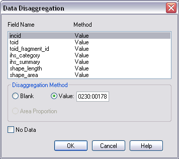

**************
User Interface
**************

DOs and DON’Ts
================

It is essential that the following guidelines are followed to ensure that the tool runs smoothly:

* :strong:`DO` close all instances of ArcGIS or MapInfo before the tool launching the tool. The tool will automatically communicate with the correct instance; however multiple instances will require more memory and will therefore affect tool performance.
* :strong:`DO NOT` remove the HLU layer from the map while the tool is running.
* For ArcGIS users, :strong:`DO NOT` create or open another map document in the associated GIS window while the tool is running.
* :strong:`DO NOT` close the associated GIS while the tool is running, otherwise the tool will display an error message.
* :strong:`DO` ensure that the HLU GIS layer contains polygons for all INCIDs in the HLU database.
* For ArcGIS users, :strong:`DO` use a file geodatabase or personal geodatabase to store spatial information. :strong:`DO NOT` use a shapefile as this affects performance.

.. raw:: latex

	\newpage

HLU GIS Tool Window
===================

Once the HLU GIS Tool has been configured, the tool will start the associated GIS, then the main window will appear as shown in the figure :ref:`figUIMW`.

.. _figUIMW:

.. figure:: ../images/figures/UserInterfaceMainWindow.png
	:align: center
	:scale: 70

	HLU GIS Tool window

The following sections provide some guidelines for use and summarise the menu functionality. All menu functions are also available on the toolbar and the relevant icon is shown next to each heading.

.. raw:: latex

	\newpage

File Menu
=========

.. |export| image:: ../images/icons/FileExport.png
	:height: 16px
	:width: 16px

|export| Export
---------------

Allows you to export data from the HLU database to a GIS layer using a pre-defined export format (see the figure :ref:`figED`. For details on defining export formats, see section 3.3.

.. _figED:

.. figure:: ../images/figures/ExportDialog.png
	:align: center

	Export dialog

Select one of the export formats from the drop-down list.

If the database records have been filtered, the 'Selected only' checkbox is automatically ticked as shown in Figure 2 and only the records related to the selected INCIDs will be exported. Untick this box to export all records. For details on how to filter records, see section 2.6.

The 'Export Descriptions' checkbox replaces habitat codes with textual descriptions. This feature is only available for ArcGIS users due to record length restrictions in MapInfo.

.. |exit| image:: ../images/icons/FileExit.png
	:height: 16px
	:width: 16px

|exit| Exit
-----------

Exits the HLU GIS tool and allows you to decide whether or not to close the GIS window.

.. raw:: latex

	\newpage

Edit Menu
=========

When the tool is launched, the database tool is read-only by default as indicated. To enable edit mode, the user details must be configured in the database (see section 3.2) and the spatial data must be editable in the GIS software.

.. |copy| image:: ../images/icons/EditCopy.png
	:height: 16px
	:width: 16px

|copy| Copy
-----------

Copies selected attributes so they can be applied to these fields in another record.

.. _figCC:

.. figure:: ../images/figures/CopyCheckboxes.png
	:align: center

	Checkboxes ticked to copy data

Tick the checkboxes next to the fields you wish to copy, as shown in the figure :ref:`figCC`, then click ‘Copy’.

.. |paste| image:: ../images/icons/EditPaste.png
	:height: 16px
	:width: 16px

|paste| Paste
-------------

Pastes the data copied by the ‘Copy’ tool into the same fields in another record.

For example, the fields copied in the figure above would be pasted into 'Source 3' on the new record.

.. Note:: It is not possible to copy data from one field in one record and paste it into a different field in another.

.. |bulkupdate| image:: ../images/icons/EditBulkUpdate.png
	:height: 16px
	:width: 16px

|bulkupdate| Bulk Update
------------------------

Allows you to update the attributes for all selected database records.

.. Note:: This feature is only available to configured users who have been given bulk update permissions. For details on configuring users, see section 3.2.

To perform a bulk update:

* Filter the database records using ‘Select by attributes’ or select polygons in the GIS layer and click ‘Get Map Selection’. For details on filtering records, see section 2.6.

* Click ‘Bulk Update’ on the Edit menu or toolbar. The HLU GIS Tool enters bulk update mode and an empty form is displayed as shown in the figure :ref:`figUIBU`.

* The ‘Bulk Update’ box displays the number of INCIDs, TOIDs and fragments affected by the update and allows you to select whether to create a History record for this process.

* Enter the updated details in the IHS, Details, and Sources tabs, then click Apply. These fields will be updated for all the selected INCIDs.

.. Warning:: If ‘Delete Empty Bulk Update Rows’ is checked in the Options, child records will be deleted if these fields are not completed in the bulk update form. For details, see section 2.8.1.1.

.. _figUIBU:

.. figure:: ../images/figures/UserInterfaceBulkUpdate.png
	:align: center
	:scale: 80

	HLU Main Window in Bulk Update Mode

.. raw:: latex

	\newpage

View Menu
=========

.. |winmaximise| image:: ../images/icons/GisWinMaximise.png
	:height: 16px
	:width: 16px

|winmaximise| Maximise GIS window
---------------------------------

Maximises the ArcGIS or MapInfo window and sets it as the active window.

.. |winsidebyside| image:: ../images/icons/GisWinSideBySide.png
	:height: 16px
	:width: 16px

|winsidebyside| Windows side by side
------------------------------------

Aligns the HLU window to the top left of the screen and expands the GIS window to fill the remaining area as shown in the figure :ref:`figWSBS`.

.. _figWSBS:

.. figure:: ../images/figures/WindowsSideBySide.png
	:align: center

	Windows arranged side by side

Keep DB window on top
---------------------

Sets the HLU database window to remain floating on top of any other open windows so that the database window is always visible. Enabling this option will ensure that the database window will not disappear behind the GIS window when the GIS window is active.

|winswitch| Switch to GIS window
--------------------------------

Sets ArcGIS or MapInfo as the active window but does not alter its size.

.. |zoom| image:: ../images/icons/ZoomSelection.png
	:height: 16px
	:width: 16px

|zoom| Zoom to selection
---------------------------

Zooms to the current database selection in the GIS window.

.. Warning:: This process may take a long time depending upon the layer size, the number of selected records and their geographical distribution.

.. raw:: latex

	\newpage

Select Menu
===========

.. |selectbyattr| image:: ../images/icons/SelectByAttributes.png
	:height: 16px
	:width: 16px

|selectbyattr| Select by Attributes
-----------------------------------

Allows you to filter the database records using the query builder shown in the figure :ref:`figQB`.

.. _figQB:

.. figure:: ../images/figures/QueryBuilder.png
	:align: center

	HLU Query Builder

* Boolean Operator allows you to perform logical selections using:

	* 'AND', 'AND NOT', 'OR', 'OR NOT'.

.. Note:: The value of the ‘Boolean Operator’ field on the first row is not used.

* ‘(‘ and ‘)’ fields allow you to add additional brackets as shown in the example in the figure :ref:`figQB` to define how the query is executed.
* ‘Table’ and ‘Column’ define the table and field to be searched.
* ‘Operator’ provides a drop-down list of the available operators as shown in the figure :ref:`figSOL`.
* Value’ is the value to search for. Values can either be entered as text or selected from the drop-down list (where available).

.. _figSOL:

.. figure:: ../images/figures/SQLOperatorList.png
	:align: center

	List of Operators

Once you have entered the values for the current row, click on another row in the query builder to confirm the entry and enable the ‘OK’ button.

If you have made a mistake when entering the selection criteria, click on the grey box to the left of ‘Boolean Operator’ to select the row, then press the ‘Delete’ key on your keyboard to remove it.

.. Tip:: It will typically be quicker to select data from these fields in the GIS, then use ‘Get Map Selection’.

.. |clearfilter| image:: ../images/icons/ClearFilter.png
	:height: 16px
	:width: 16px

|clearfilter| Clear Filter
--------------------------

Removes the current filter so that all database records are visible.

.. |selectonmap| image:: ../images/icons/SelectOnMap.png
	:height: 16px
	:width: 16px

|selectonmap| Select Current INCID on Map
-----------------------------------------

Selects all MasterMap polygons associated with the INCID on the current database record in the GIS layer.

.. |getmapsel| image:: ../images/icons/ReadMapSelection.png
	:height: 16px
	:width: 16px

|getmapsel| Get Map Selection
-----------------------------

Filters the database records to retrieve the attributes associated with the selected polygons in the GIS layer.

.. |selectbyincid| image:: ../images/icons/SelectByIncid.png
	:height: 16px
	:width: 16px

|selectbyincid| Select by INCID
-------------------------------

Select a polygon on the map and go to ‘Get Map Selection’ to select the database records.

Once the records are filtered in the database, if all the polygons are part of the same INCID, ‘Select by INCID’ allows you to expand the map selection to include all polygons belonging to that INCID.

.. raw:: latex

	\newpage

Split/Merge Menu
================

.. Note:: Both options in this menu are disabled until the database records have been filtered and a process has been selected from the ‘Process’ drop-down list in the INCID box on the main window. For details on the INCID box, see section 2.9.1.

.. |split| image:: ../images/icons/SplitFeatures.png
	:height: 16px
	:width: 16px

|split| Split Features
----------------------

Split features performs two types of split: Logical Split and Physical Split.

Logical Split
^^^^^^^^^^^^^

Logical split is used to create a new INCID in the database based upon polygons selected from the GIS layer. The habitat details for the new INCID can then be updated.

To perform a logical split:

* Click ‘Switch to GIS Window’ and select the polygons in the GIS layer.
* Return to the HLU main window and click ‘Get Map Selection’.
* Select one of the options in the ‘Process’ list.
* Click on ‘Split Features’. The new INCID will be created and set as the current record.

.. Note:: The selected polygons must all belong to the same INCID.

Physical Split
^^^^^^^^^^^^^^

Physical split creates a new TOID fragment in the database based upon a single TOID which has been split in the GIS layer.

ArcGIS
""""""

To perform a physical split:

* On the ‘Editor’ toolbar, click on ‘Editor’ and select ‘Start Editing’.
* Select the polygon you wish to split.
* In the ‘Task’ drop-down list on the ‘Editor’ toolbar, select ‘Cut Polygon Features’ as shown in the figure :ref:`figArcEMB`.

.. _figArcEMB:

.. figure:: ../images/figures/ArcGISEditMenuBar.png
	:align: center

	Edit Settings for Physical Split (ArcGIS)

* Using the Sketch tool on ‘Editor’ toolbar, draw a polyline.
* On the ‘Editor’ toolbar, click on ‘Editor’ and select ‘Save Edits’.
* The polygon will be split but still selected as shown in the figure :ref:`figArcSFD`. Return to the HLU GIS Tool and click ‘Get Map Selection’.

.. _figArcSFD:

.. figure:: ../images/figures/ArcGISSplitFeaturesDiagram.png
	:align: center

	Split Features (ArcGIS)

* Select one of the options in the ‘Process’ list.
* Click on ‘Split Features’. The record will be updated and details added to the History tab for the INCID.

MapInfo
"""""""

To perform a physical split:

* Set the Cosmetic layer as ‘Editable’ and draw the polygon to split by.

.. Tip:: The Cosmetic layer should be used due to the time required for MapInfo to add a new polygon to the full HLU layer.

* Set the HLU layer as ‘Editable’.
* Select the polygon you wish to split and go to Objects > Set Target.
* Select the polygon in the Cosmetic layer and go to Objects > Split.
* In the Data Disaggregation box, ensure that ‘Method’ for all fields is set to ‘Value’ as shown in the figure :ref:`figMIDD`, then click OK.

.. _figMIDD:

	Data Disaggregation Dialog (MapInfo)

* The polygon will be split but still selected as shown in :ref:`figMISF`. Return to the HLU GIS Tool and click ‘Get Map Selection’.

.. _figMISF:

.. figure:: ../images/figures/MapInfoSplitFeaturesDiagram.png
	:align: center

	Split Features (MapInfo)

* Select one of the options in the ‘Process’ list.
* Click on ‘Split Features’. The record will be updated and details added to the History tab for the INCID. The Cosmetic layer will be cleared.

.. note::

	* Only one polygon should be split in a single operation. Splitting multiple polygons will cause database synchronisation issues. 
	* If several polygons have been split, select the fragments for one original polygon and split using the tool. Repeat this operation for the remaining polygons.
	* Ensure that the physical split is completed in the database prior to commencing any other operations such as ‘Select by attributes…’ to avoid database synchronisation issues.

.. |merge| image:: ../images/icons/MergeFeatures.png
	:height: 16px
	:width: 16px

|merge| Merge Features
----------------------

Merge features performs two types of merge: Logical Merge and Physical Merge

Logical Merge
^^^^^^^^^^^^^

Logical merge combines the selected TOIDs on the map with the INCID selected from the list.

To perform a logical merge:

* Click ‘Switch to GIS Window’ and select the polygons you wish to merge and a polygon from the INCID you wish to merge them with in the GIS layer.
* Return to the HLU main window and click ‘Get Map Selection’.
* Select one of the options in the ‘Process’ list.
* Click on ‘Merge Features’. A list of INCIDs will be displayed as shown in the figure :ref:`figLMD`.

.. _figLMD:

.. figure:: ../images/figures/LogicalMergeDialog.png
	:align: center

	Select INCID to Keep Dialog

* Click on the grey box to the left of the row to select an INCID. The associated polygon will blink in the GIS window. Click ‘OK’.
* The selected Mastermap polygons will be merged with the selected INCID and details added to the History tab.
* If the merge polygons are fragments of a single TOID, you will be given the option to perform a physical merge.

Physical Merge
^^^^^^^^^^^^^^

Physical merge combines fragments of a single TOID into a single polygon in the GIS layer.

To perform a physical merge:

* Select two or more fragments from one TOID in the GIS layer as shown in the figure :Ref:`figPMD` (left).
* Return to the HLU main window and click ‘Get Map Selection’.
* Select one of the options in the ‘Process’ list.
* Click on ‘Merge Features’. The polygons will be combined in the GIS layer as shown in figure :Ref:`figPMD` (right).

.. _figPMD:

.. figure:: ../images/figures/PhysicalMergeDiagram.png
	:align: center

	Physical Merge – Before (left) and After (right)

.. Note:: Only fragments belonging to the same TOID can be merged in a single operation. If fragments for several TOIDs need to be merged, the operation must be repeated for each TOID.

.. raw:: latex

	\newpage

Tools Menu
==========

|options| Options
-----------------

Allows you to alter your HLU configuration. There are three categories of options as shown in the figure :ref:`figOD`.

.. _figOD:

.. figure:: ../images/figures/OptionsDialog.png
	:align: center

	HLU Options Dialog

Database Options
^^^^^^^^^^^^^^^^

* ‘Timeout’ sets the amount of time the tool will wait for the database to respond. The default value is 15. This value should be increased if an error occurs such as ‘The connection to the database timed out’.
* ‘Page Size’ sets how many records are retrieved from the database and stored in memory. The default value is 100. Increasing this value can improve performance when browsing records, however this will increase the amount of RAM required by the application and significant increases in the page size value could cause the tool to stop responding.
* ‘Display History Rows’ sets the number of entries displayed in the ‘History’ tab of the main window. For detail on the ‘History’ tab - see section 2.9.5.
* ‘Delete Empty Bulk Update Rows’ removes the details of child records if they are these fields are not completed in the bulk update form if this box is checked. By default this box is unchecked. 

	This affects the following sections of the main window:

	* IHS Matrix
	* IHS Formation
	* IHS Management
	* IHS Complex
	* BAP Habitat
	* Potential BAP Habitats
	* Sources

.. Warning::

	If the 'Delete Empty Bulk Update Rows' option is checked and a bulk update record has only 1 source record completed then, for each of the selected records, source 1 will be updated and if the selected record has data entered in sources 2 and 3, it will be deleted.

GIS Options
^^^^^^^^^^^

* ‘History Columns’ allows you to select which additional columns from the GIS layer are displayed in the History tab for each update. If the box is unchecked, the field will not be displayed.
* ‘Preferred GIS’ allows you to select whether the tool should use ArcGIS or MapInfo if both applications are installed on your computer. 

.. Note:: The tool must be closed and restarted for this change to take effect.

* ‘Map Document/Workspace’ sets the default map document or workspace opened by the HLU GIS Tool. As this field cannot be edited directly, you must click on the “…” button and browse to the new map document or workspace. 

.. Note:: If the preferred GIS is altered, this field must also be updated.

* ‘Warn before GIS selection’ allows you to enable or disable the warning message indicating the number of polygons which will be selected by the current query as shown in the figure :ref:`figGSWD`.

.. _figGSWD:

.. figure:: ../images/figures/GISSelectionWarningDialog.png
	:align: center

	GIS Selection Warning Box

Vague Date Season Names
^^^^^^^^^^^^^^^^^^^^^^^

These fields allow you to define how vague dates, such as 'Spring 2010-Autumn 2010' or '1989-2010', are entered so that they can be converted to dates in the HLU database.

 
The default value for the ‘Vague Date Delimiter’ is a hyphen ( - ). This can be altered to any character, however it must not be the same delimiter used by your computer to enter precise dates, such as 01/04/2010. The default delimiter used by Windows for English-format dates is a forward slash ( / ).

.. raw:: latex

	\newpage

Data
====

Records can be viewed or updated through the main window of the HLU GIS Tool. The following sections summarise the details available for each record. 

Required fields are highlighted in red on each tab. The ‘Apply’ button will be active when the required fields have been completed on all tabs.

INCID Box
---------

The ‘INCID’ box displays summary information for each INCID in the database, including area, perimeter, date created and date last modified as shown in the figure :ref:`figUIIS`.

.. Note:: If the user is not configured, the ‘By’ fields will display their Windows login. For details on configuring users, see section 3.1.

.. _figUIIS:

.. figure:: ../images/figures/UserInterfaceIncidSection.png
	:align: center

	INCID Section

* ‘Reason’ and ‘Process’ are required fields for all updates and are used on the History tab to indicate why the record was last updated. These fields are sticky i.e. the selected reason and process will be used for all updates in the current session unless they are altered manually.

IHS Tab
-------

The IHS tab displays the IHS details for the current database record as shown in the figure :Ref:`figUIIT`.

.. _figUIIT:

.. figure:: ../images/figures/UserInterfaceIHSTab.png
	:align: center
	:scale: 80

	IHS Tab

* ‘Category’ and ‘NVC’ drop-down lists are used to filter the ‘Habitat’ drop-down list to relevant IHS codes. The entries in these fields are not saved to the database.
* The drop-down lists in the IHS Matrix, IHS Formation, IHS Management and IHS Complex boxes allow you to define the habitat according to the SERC IHS guidelines.
* ‘IHS Summary’ is automatically generated based upon the options selected from the preceding drop-down lists.
* ‘Legacy Habitat’ is the pre-IHS habitat code.

Details Tab
-----------

Click on ‘Details’ to display the Details tab as shown in the figure :ref:`figUIDT`.

.. _figUIDT:

.. figure:: ../images/figures/UserInterfaceDetailsTab.png
	:align: center
	:scale: 80

	Details Tab

* ‘BAP Habitats’ is automatically updated based upon the habitat code selected on the ‘IHS’ tab. For new BAPhabitats, ‘Determination Quality’ and ‘Interpretation Quality’ must be entered.
* ‘Potential BAP Habitats’ allows you to define other BAP habitats which may also be present within the BAP habitat. An INCID may have a potential BAP habitat even if no BAP habitats are present.
* ‘General Comments’ is a text field which allows you to enter any additional comments up to 254 characters.
* ‘Maps’ contains two drop-down lists:
* ‘Boundary Map’ defines the source data used to identify the boundary.
* ‘Digitisation Map’ defines the map data used to digitise the boundary.
* ‘BiositeName’ is a text field which allows you to enter the name of the biosite.

Sources Tab
-----------

Click on ‘Sources’ to display the Sources tab as shown in the figure :ref:`figUIST`. Up to three sources can be defined for each INCID.

.. _figUIST:

.. figure:: ../images/figures/UserInterfaceSourcesTab.png
	:align: center
	:scale: 80

	Sources Tab

* ‘Name’ contains a list of data sources. For details on adding new sources, see section 3.1.
* ‘Vague Date’ allows you to enter the date of the dataset. This can be either a precise date e.g. 01/04/2010 or a vague date e.g. Spring 2010-Summer 2010, 1980-2010 or ‘Unknown’. For details on defining vague dates, see section 2.8.1.3.
* ‘Habitat Class’ defines the habitat classification used for this data source. If no habitat classification is used, select ‘Not Applicable’.
* ‘Habitat Type’ defines the type of habitat. This list is filtered based upon the habitat class.
* ‘Boundary Imp.’ sets the importance of the source data in determining the habitat boundary.
* ‘Habitat Imp.’ sets the importance of the source data in determining the habitat type.

.. Note::

	* If the default date for the selected data source has been configured, the ‘Vague Date’ field will be updated to the default date. If the default date has not been defined, then the ‘Vague Date’ field must be updated manually.
	* For boundary importance and habitat importance, there must only be one source set as ‘Primary’ or ‘Secondary’ for each field.

History Tab
-----------

The History tab displays a list of modifications made to the current INCID and the associated TOIDs. Each entry details what modification was made, when and by whom as shown in Figure 20. Entries are shown in descending date order. The number of entries can be configured in the Options, see section 2.8.1.

.. _figUIHT:

.. figure:: ../images/figures/UserInterfaceHistoryTab.png
	:align: center
	:scale: 80

	History Tab
