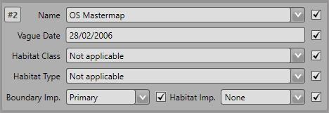
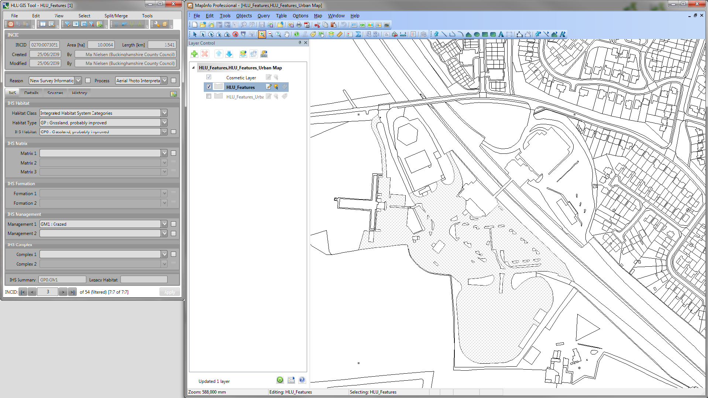

.. index::
	single: Menus

*****
Menus
*****

The following sections summarise the menu functionality and provide some guidelines for their use. Where menu functions are also available on one of the toolbars the relevant icon is shown next to each heading.

.. _figUITB:

	Main window - Toolbars

.. index::
	single: Menus; File Menu

.. _file_menu:

File Menu
=========

.. |export| image:: ../icons/FileExport.png
	:height: 16px
	:width: 16px

|export| Export
---------------

Allows users to export data from the HLU database to a GIS layer using a pre-defined export format.

.. seealso::
	See :ref:`export_window` for more information.

|exit| Exit
-----------

Exits the HLU GIS tool and allows users to decide whether or not to close the associated GIS window.

.. raw:: latex

	\newpage

.. index::
	single: Menus; Edit Menu

.. _edit_menu:

Edit Menu
=========

When the tool is launched, the database tool is read-only by default as indicated. To enable edit mode, the user details must be configured in the database (see 'Lookup Tables' in the `HLUTool-TechnicalGuide <https://readthedocs.org/projects/hlutool-technicalguide/>`_ for details) and the spatial data must be editable in the GIS application.

.. |copy| image:: ../icons/EditCopy.png
	:height: 16px
	:width: 16px

|copy| Copy
-----------

Copies selected attributes so they can be applied to these fields in another record.

.. _figCC:

	Checkboxes ticked to copy data

Tick the checkboxes next to the fields to be copied, as shown in the figure :ref:`figCC`, then click :guilabel:`Copy`.

.. |paste| image:: ../icons/EditPaste.png
	:height: 16px
	:width: 16px

|paste| Paste
-------------

Pastes the data copied by the 'Copy' tool into the same fields in another record.

For example, the fields copied in the figure above would be pasted into 'Source 3' on the new record.

.. note::
	It is not possible to copy data from one field in one record and paste it into a different field in another record.

Bulk Update
-----------

Allows users to update the attributes for multiple selected database records (INCIDs) simultaneously.

.. seealso::
	See :ref:`bulk_update_window` for more information.

.. raw:: latex

	\newpage

.. index::
	single: Menus; View Menu

View Menu
=========

.. |winmaximise| image:: ../icons/GisWinMaximise.png
	:height: 16px
	:width: 16px

|winmaximise| Maximise GIS window
---------------------------------

Maximises the ArcGIS or MapInfo window and sets it as the active window.

.. |winsidebyside| image:: ../icons/GisWinSideBySide.png
	:height: 16px
	:width: 16px

|winsidebyside| Windows side by side
------------------------------------

Aligns the HLU window to the top left of the screen and expands the GIS window to fill the remaining area as shown in the figure :ref:`figWSBS`.

.. _figWSBS:

	Windows arranged side by side

Keep DB window on top
---------------------

Sets the HLU database window to remain floating on top of any other open windows so that the database window is always visible. Enabling this option will ensure that the database window will not disappear behind the GIS window when the GIS window is active.

Switch to GIS window
--------------------

Sets ArcGIS or MapInfo as the active window but does not alter its size.

|zoom| Zoom to selection
---------------------------

Zooms to the currently selected features in the active GIS layer.

.. caution::
	This process may take a long time depending upon the number of currently selected features, the GIS layer size and their geographical distribution.

.. raw:: latex

	\newpage

.. index::
	single: Menus; Select Menu

.. _select_menu:

Select Menu
===========

|filterbyattr| Filter by Attributes
-----------------------------------

Allows users to filter the database records based upon non-spatial or complex criteria using the query builder. Only INCID records matching the filter criteria will be available for viewing using the record selectors.

.. seealso::
	See :ref:`query_builder_window` and `advanced_query_builder_window` for more information.

|selectonmap| Select Current INCID on Map
-----------------------------------------

Selects **all** the GIS features associated only with the **current** INCID record in the GIS layer.

|selectallonmap| Select All Filtered INCIDs on Map
--------------------------------------------------

Selects **all** the GIS features associated with **all** the currently filtered INCID records in the GIS layer.

.. caution::
	This process may take a long time depending upon the number of currently filtered INCID records, the GIS layer size and their geographical distribution.

|clearfilter| Clear Filter
--------------------------

Removes the current filter so that all database records can be viewed using the record selectors.

|getmapselection| Get Map Selection
-----------------------------------

Filters the database records to retrieve the attributes associated with the selected features in the GIS layer.

.. tip::
	Selecting one or more features on the map and clicking **Get Map Selection** will select only the database records associated with the selected features. The INCID records can then be viewed using the record selectors and the number of selected features associated with the current INCID record will be displayed in the INCID status area to the right (together with the total number of features associated with the current INCID). Clicking **Select Current INCID on Map** allows users to expand the map selection to include all features belonging to the current INCID.

.. raw:: latex

	\newpage

.. index::
	single: Menus; Split/Merge Menu

.. _split_merge_menu:

Split/Merge Menu
================

.. note::
	All options in this menu are disabled until the database records have been filtered and a process and reason has been selected from the 'Process' and 'Reason' drop-down lists in the INCID section on the main window. For details on the INCID section see :ref:`incid_section`.

.. |logicalsplit| image:: ../icons/LogicalSplit.png
	:height: 16px
	:width: 16px

|logicalsplit| Logical Split
----------------------------

Splits features from the same current INCID into a new INCID. Logical splits are used to isolate one or more features from one INCID into a new INCID so that they can be updated independently.

.. seealso::
	See :ref:`logical_split`  for more information on this action.

|logicalmerge| Logical Merge
----------------------------

Combines two or more features selected in GIS into the INCID of one of the selected features (which must be selected from the list of INCIDs displayed during the logical merge process).

.. seealso::
	See :ref:`logical_merge`  for more information on this action.

|physicalsplit| Physical Split
------------------------------

Sub-divides a single feature, that has already been split in the GIS layer, into one or more new TOID fragments in the database by assigning new TOID fragment identifiers. The fragments can then be assigned different attributes (once they have been logically split from one another).

.. seealso::
	See :ref:`physical_split`  for more information on this action.

|physicalmerge| Physical Merge
------------------------------

Combines two or more fragments of a single TOID, that are also associated with the same INCID, into a new single merged feature in the GIS layer and assigns them to the same TOID fragment identifier.

.. seealso::
	See :ref:`physical_merge`  for more information on this action.

.. raw:: latex

	\newpage

.. index::
	single: Menus; Tools Menu

.. _tools_menu:

Tools Menu
==========

|options| Options
-----------------

Allows users to alter some aspects of the HLU Tool configuration specific to their own requirements.

.. seealso::
	See :ref:`options_window`  for more information.

|switch| Switch GIS Layer
-------------------------

Allows users to switch between valid HLU layers in the GIS application.

.. seealso::
	See :ref:`switch_layer_window`  for more information.

Styles
------

Allows the user to select one of three user interface styles for all interfaces and windows:

* Original
* Light Grey
* Dark Grey

About
-----

Displays the current application and database versions of the HLU Tool, the current user's id and name, and the HLU Tool's copyright statements.

