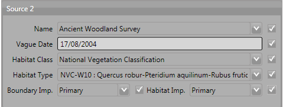
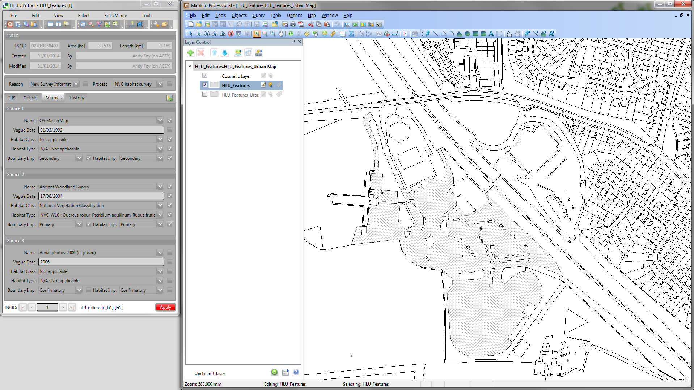

.. index::
	single: Menus

*****
Menus
*****

The following sections summarise the menu functionality and provide some guidelines for their use. Where menu functions are also available on one of the toolbars the relevant icon is shown next to each heading.

.. _figUITB:

	Main window - Toolbars

.. index::
	single: Menus; File Menu

.. _file_menu:

File Menu
=========

.. |exit| image:: ../images/icons/FileExit.png
	:height: 16px
	:width: 16px

|exit| Exit
-----------

Exits the HLU GIS tool and allows users to decide whether or not to close the GIS window.

.. |export| image:: ../images/icons/FileExport.png
	:height: 16px
	:width: 16px

|export| Export
---------------

Allows users to export data from the HLU database to a GIS layer using a pre-defined export format.

.. seealso::
	See :ref:`export_window` for more information.

.. raw:: latex

	\newpage

.. index::
	single: Menus; Edit Menu

.. _edit_menu:

Edit Menu
=========

When the tool is launched, the database tool is read-only by default as indicated. To enable edit mode, the user details must be configured in the database (see 'Lookup Tables' in the `HLUTool-TechnicalGuide <https://readthedocs.org/projects/hlutool-technicalguide/>`_ for details) and the spatial data must be editable in the GIS application.

|copy| Copy
-----------

Copies selected attributes so they can be applied to these fields in another record.

.. _figCC:

	Checkboxes ticked to copy data

Tick the checkboxes next to the fields to be copied, as shown in the figure :ref:`figCC`, then click **Copy**.

|paste| Paste
-------------

Pastes the data copied by the 'Copy' tool into the same fields in another record.

For example, the fields copied in the figure above would be pasted into 'Source 3' on the new record.

.. note::
	It is not possible to copy data from one field in one record and paste it into a different field in another record.

Bulk Update
-----------

Allows users to update the attributes for multiple selected database records (INCIDs) simultaneously.

.. raw:: latex

	\newpage

.. index::
	single: Menus; View Menu

View Menu
=========

|winmaximise| Maximise GIS window
---------------------------------

Maximises the ArcGIS or MapInfo window and sets it as the active window.

.. |winsidebyside| image:: ../images/icons/GisWinSideBySide.png
	:height: 16px
	:width: 16px

|winsidebyside| Windows side by side
------------------------------------

Aligns the HLU window to the top left of the screen and expands the GIS window to fill the remaining area as shown in the figure :ref:`figWSBS`.

.. _figWSBS:

	Windows arranged side by side

Keep DB window on top
---------------------

Sets the HLU database window to remain floating on top of any other open windows so that the database window is always visible. Enabling this option will ensure that the database window will not disappear behind the GIS window when the GIS window is active.

Switch to GIS window
--------------------

Sets ArcGIS or MapInfo as the active window but does not alter its size.

|zoom| Zoom to selection
---------------------------

Zooms to the current database selection in the GIS window.

.. caution::
	This process may take a long time depending upon the layer size, the number of selected records and their geographical distribution.

.. raw:: latex

	\newpage

.. index::
	single: Menus; Select Menu

.. _select_menu:

Select Menu
===========

.. |selectbyattr| image:: ../images/icons/SelectByAttributes.png
	:height: 16px
	:width: 16px

|selectbyattr| Select by Attributes
-----------------------------------

Allows users to filter the database records based upon non-spatial or complex criteria using the query builder.

|selectonmap| Select Current INCID on Map
-----------------------------------------

Selects all MasterMap polygons associated with the INCID on the current database record in the GIS layer.

|clearfilter| Clear Filter
--------------------------

Removes the current filter so that all database records are visible.

.. |getmapsel| image:: ../images/icons/ReadMapSelection.png
	:height: 16px
	:width: 16px

|getmapsel| Get Map Selection
-----------------------------

Filters the database records to retrieve the attributes associated with the selected polygons in the GIS layer.

|selectbyincid| Select by INCID
-------------------------------

Select a polygon on the map and go to 'Get Map Selection' to select the database records.

Once the records are filtered in the database, if all the polygons are part of the same INCID, 'Select by INCID' allows users to expand the map selection to include all polygons belonging to that INCID.

.. raw:: latex

	\newpage

.. index::
	single: Menus; Split/Merge Menu

.. _split_merge_menu:

Split/Merge Menu
================

.. note::
	Both options in this menu are disabled until the database records have been filtered and a process has been selected from the 'Process' drop-down list in the INCID section on the main window. For details on the INCID section see :ref:`incid_section`.

.. |split| image:: ../images/icons/SplitFeatures.png
	:height: 16px
	:width: 16px

|split| Split Features
----------------------

Split features performs two types of split:

* Logical splits are used to isolate one or more features from one INCID into a new INCID so that they can be updated independently.
* Physical splits can be used to sub-divide a single feature, that has been split in the GIS layer, into one or more new TOID fragments in the database so that they can then be assigned different attributes.

|merge| Merge Features
----------------------

Merge features performs two types of merge:

* Logical merges are used to combine two or more fragments selected in GIS into the INCID of one of the selected fragments by selecting it from a list.
* Physical merges will combine fragments of a single TOID into a single feature in the GIS layer.

.. raw:: latex

	\newpage

.. index::
	single: Menus; Tools Menu

.. _tools_menu:

Tools Menu
==========

.. |options| image:: ../images/icons/Options.png
	:height: 16px
	:width: 16px

|options| Options
-----------------

Allows users to alter some aspects of the HLU Tool configuration.

.. seealso::
	See :ref:`options_window`  for more information.

.. |switch| image:: ../images/icons/SwitchGISLayer.png
	:height: 16px
	:width: 16px

|switch| Switch GIS Layer
-------------------------

Allows users to switch between valid HLU layers in the GIS application.

About
-----

Displays the current version of the HLU Tool and the user's id and name.

