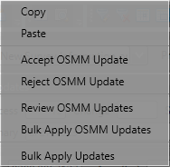
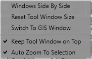
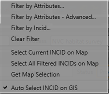

.. |copy| image:: ../icons/EditCopy.png
	:height: 16px
	:width: 16px

.. |export| image:: ../icons/FileExport.png
	:height: 16px
	:width: 16px

.. |exit| image:: ../icons/FileExit.png
	:height: 16px
	:width: 16px

.. |paste| image:: ../icons/EditPaste.png
	:height: 16px
	:width: 16px

.. |winmaximise| image:: ../icons/GisWinMaximise.png
	:height: 16px
	:width: 16px

.. |zoom| image:: ../icons/ZoomSelection.png
	:height: 16px
	:width: 16px

.. |filterbyattr| image:: ../icons/FilterByAttributes.png
	:height: 16px
	:width: 16px

.. |selectonmap| image:: ../icons/SelectOnMap.png
	:height: 16px
	:width: 16px

.. |selectallonmap| image:: ../icons/SelectAllOnMap.png
	:height: 16px
	:width: 16px

.. |getmapselection| image:: ../icons/GetMapSelection.png
	:height: 16px
	:width: 16px

.. |logicalsplit| image:: ../icons/LogicalSplit.png
	:height: 16px
	:width: 16px

.. |logicalmerge| image:: ../icons/LogicalMerge.png
	:height: 16px
	:width: 16px

.. |options| image:: ../icons/Options.png
	:height: 16px
	:width: 16px

.. |switch| image:: ../icons/SwitchGISLayer.png
	:height: 16px
	:width: 16px

*****
Menus
*****

The following sections summarise the menu functionality and provide some guidelines for their use. Where menu functions are also available on one of the toolbars the relevant icon is shown next to each heading.

.. _figUITB:

.. figure:: figures/UserInterfaceToolbars.png
	:align: center

	Main Window - Toolbars

.. index::
	single: Menus; File Menu
	see: Files Menu; Menus; Files Menu

.. _file_menu:

File Menu
=========

.. _figUIFM:

	Main Window - File Menu

The File menu contains the following functions:

Export...
---------

Allows users to export data from the HLU database to a GIS layer using a pre-defined export format.

.. seealso::
	See :ref:`export_window` and :ref:`export_function` for more information.

|exit| Exit
-----------

Exits the HLU Tool and prompts users to choose whether or not to close the associated GIS window.

.. raw:: latex

	\newpage

.. index::
	single: Menus; Edit Menu
	see: Edit Menu; Menus; Edit Menu

.. _edit_menu:

Edit Menu
=========

.. _figUIEM:

	Main Window - Edit Menu

The Edit menu contains the following functions:

.. note::
	When the tool is launched, the database tool is read-only by default as indicated. To enable edit mode, the user details must be configured in the database (see 'Lookup Tables' in the HLU Tool Technical Guide at `readthedocs.org/projects/hlutool-technicalguide <https://readthedocs.org/projects/hlutool-technicalguide/>`_ for details) and the spatial data must be editable in the GIS application.

|copy| Copy
-----------

Copies selected attributes so they can be applied to these fields in another record.

.. _figCC:

.. figure:: figures/CopyCheckboxes.png
	:align: center
	:scale: 90

	Main Window - Copy Checkboxes

Tick the checkboxes next to the fields to be copied, as shown in the figure :ref:`figCC`, then click :guilabel:`Copy`.

|paste| Paste
-------------

Pastes the data copied by the 'Copy' function into the same fields in another record. For example, the fields copied in the figure above would be pasted into 'Source 2' on the new record.

.. note::
	It is not possible to copy data from one field and paste it into a different field.

Review OSMM Updates
-------------------

Allows users to review any outstanding Ordnance Survey MasterMap (OSMM) updates and choose to accept or reject each update. Once accepted, the updates will be pending and must then be applied using the **Bulk Apply OSMM Updates** function.

.. seealso::
	See :ref:`review_osmm_window` for more information.

Bulk Apply OSMM Updates
-----------------------

Enables users to apply pending OSMM updates for multiple selected features and database records (INCIDs) simultaneously.

.. seealso::
	See :ref:`bulk_osmm_update_window` for more information.

Bulk Apply Updates
------------------

Enables users to update the attributes for multiple selected features and database records (INCIDs) simultaneously.

.. seealso::
	See :ref:`bulk_update_window` for more information.

.. raw:: latex

	\newpage

.. index::
	single: Menus; View Menu
	see: View Menu; Menus; View Menu

View Menu
=========

.. _figUIVM:

	Main Window - View Menu

The View menu contains the following functions:

|winsidebyside| Windows Side By Side
------------------------------------

Aligns the HLU window to the top left of the screen and expands the GIS window to fill the remaining area as shown in the figure :ref:`figWSBS`.

.. _figWSBS:

	Main Window - Side by Side

|zoom| Zoom to Selection
------------------------

Zooms to the currently selected features in the active GIS layer.

Reset Tool window Size
----------------------

Returns the window height and width to their default size.

Switch to GIS window
--------------------

Sets the connected ArcGIS or MapInfo session as the active window but does not alter its size.

Keep Tool window on top
-----------------------

An option to keep the HLU Tool window floating on top of any other application windows so that it is always visible. Enabling this option will ensure that the window will not disappear behind the GIS window when the GIS window is active.

|zoom| Auto Zoom to selection
-----------------------------

An option to automatically zoom to the GIS features associated with an INCID in the active GIS layer whenever the INCID selection is changed using the HLU Tool.

.. raw:: latex

	\newpage

.. index::
	single: Menus; Select Menu
	see: Select Menu; Menus; Select Menu

.. _select_menu:

Select Menu
===========

.. _figUISM:

	Main Window - Select Menu

The Select menu contains the following functions:

|filterbyattr| Filter by Attributes...
--------------------------------------

Allows users to filter the INCID records based upon non-spatial or complex criteria using the query builder or advanced query builder. Only INCID records matching the filter criteria will be available for viewing using the record selectors.

.. seealso::
	See :ref:`query_builder_window` and :ref:`advanced_query_builder_window` for more information.

Filter by Attributes - Advanced...
----------------------------------

When reviewing OSMM updates, allows users to filter the INCID records based upon non-spatial or complex criteria using the advanced query builder. Only INCID records matching the filter criteria, and where the OSMM update status is not 'Pending' or 'Applied', will be available for reviewing.

.. seealso::
	See :ref:`advanced_query_builder_window` for more information.

Filter by Incid...
------------------

Allows users to filter the INCID records for a specific INCID.

.. seealso::
	See :ref:`filter_by_incid_window` for more information.

Allows users to filter the INCID records based upon non-spatial or complex criteria using the Filter by Incid window. Only INCID records matching the filter criteria will be available for viewing using the record selectors.

|clearfilter| Clear Filter
--------------------------

Clears the current INCID filter so that all records are available for viewing using the record selectors.

|selectonmap| Select Current INCID on Map
-----------------------------------------

Selects **all** of the GIS features associated with only the **current** INCID record in the GIS layer.

|selectallonmap| Select All Filtered INCIDs on Map
--------------------------------------------------

Selects **all** of the GIS features associated with **all** of the currently filtered INCID records in the active GIS layer.

.. caution::
	This process may take a long time depending upon the number of currently filtered INCID records, the GIS layer size and their geographical distribution.

|getmapselection| Get Map Selection
-----------------------------------

Filters the database records to retrieve the attributes associated with the selected features in the active GIS layer.

.. tip::
	Selecting one or more features on the map and clicking **Get Map Selection** will select only the database records associated with the selected features. The INCID records can then be viewed using the record selectors and the number of selected features associated with the current INCID record will be displayed in the INCID status area to the right (together with the total number of features associated with the current INCID). Clicking **Select Current INCID on Map** allows users to expand the map selection to include all features belonging to the current INCID.

Auto Select INCID on GIS
------------------------

An option to automatically select the GIS features associated with the current INCID record in the active GIS layer.

.. raw:: latex

	\newpage

.. index::
	single: Menus; Split/Merge Menu
	see: Split/Merge Menu; Menus; Split/Merge Menu

.. _split_merge_menu:

Split/Merge Menu
================

.. _figUISMM:

	Main Window - Split/Merge Menu

.. note::
	All options in this menu are disabled until the database records have been filtered and a process and reason has been selected from the 'Process' and 'Reason' drop-down lists in the INCID section on the main window. For details on the INCID section see :ref:`incid_section`.

The Split/Merge menu contains the following functions:

|logicalsplit| Logical Split
----------------------------

Splits features from the same current INCID into a new INCID. Logical splits are used to isolate one or more features from one INCID into a new INCID so that they can be updated independently.

.. seealso::
	See :ref:`logical_split`  for more information on this action.

|logicalmerge| Logical Merge
----------------------------

Combines two or more features selected in GIS into the INCID of one of the selected features (which must be selected from the list of INCIDs displayed during the logical merge process).

.. seealso::
	See :ref:`logical_merge`  for more information on this action.

|physicalsplit| Physical Split
------------------------------

Sub-divides a single feature, that has already been split in the GIS layer, into one or more new TOID fragments in the database by assigning new TOID fragment identifiers. The fragments can then be assigned different attributes (once they have been logically split from one another).

.. seealso::
	See :ref:`physical_split`  for more information on this action.

|physicalmerge| Physical Merge
------------------------------

Combines two or more fragments of a single TOID, that are also associated with the same INCID, into a new single merged feature in the GIS layer and assigns them to the same TOID fragment identifier.

.. seealso::
	See :ref:`physical_merge`  for more information on this action.

.. raw:: latex

	\newpage

.. index::
	single: Menus; Tools Menu
	see: Tools Menu; Menus; Tools Menu

.. _tools_menu:

Tools Menu
==========

.. _figUITM:

	Main Window - Tools Menu

The Tools menu contains the following functions:

|options| Options...
--------------------

Allows users to alter many aspects of the HLU Tool configuration specific to their own requirements.

.. seealso::
	See :ref:`options_window`  for more information.

|switch| Switch GIS Layer
-------------------------

Allows users to switch between valid HLU layers in the GIS application.

.. seealso::
	See :ref:`switch_layer_window`  for more information.

Styles
------

Allows the user to select one of the following styles for all HLU Tool interfaces and windows:

	* Original
	* Light Grey
	* Dark Grey
	* Shiny Blue

About
-----

Displays the following information about the HLU Tool:

	* Current application and database versions
	* Current database connection details
	* Current user id and name
	* Copyright statements
	* Links to the on-line User and Technical Guides

