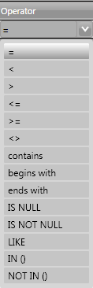
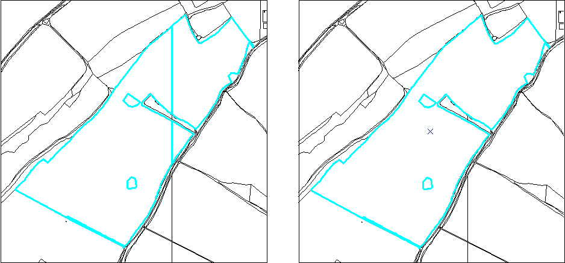

**********
User Menus
**********

The following sections summarise the menu functionality and provide some guidelines for their use. Where menu functions are also available on one of the toolbars the relevant icon is shown next to each heading.

File Menu
=========

.. |export| image:: ../images/icons/FileExport.png
	:height: 16px
	:width: 16px

|export| Export
---------------

Allows you to export data from the HLU database to a GIS layer using a pre-defined export format.

.. seealso::
	See :ref:`Export Window` for more information.

.. |exit| image:: ../images/icons/FileExit.png
	:height: 16px
	:width: 16px

|exit| Exit
-----------

Exits the HLU GIS tool and allows you to decide whether or not to close the GIS window.

.. raw:: latex

	\newpage

Edit Menu
=========

When the tool is launched, the database tool is read-only by default as indicated. To enable edit mode, the user details must be configured in the database (see section 3.2) and the spatial data must be editable in the GIS software.

.. |copy| image:: ../images/icons/EditCopy.png
	:height: 16px
	:width: 16px

|copy| Copy
-----------

Copies selected attributes so they can be applied to these fields in another record.

.. _figCC:

.. figure:: ../images/figures/CopyCheckboxes.png
	:align: center

	Checkboxes ticked to copy data

Tick the checkboxes next to the fields you wish to copy, as shown in the figure :ref:`figCC`, then click ‘Copy’.

.. |paste| image:: ../images/icons/EditPaste.png
	:height: 16px
	:width: 16px

|paste| Paste
-------------

Pastes the data copied by the ‘Copy’ tool into the same fields in another record.

For example, the fields copied in the figure above would be pasted into 'Source 3' on the new record.

.. Note:: It is not possible to copy data from one field in one record and paste it into a different field in another.

.. |bulkupdate| image:: ../images/icons/EditBulkUpdate.png
	:height: 16px
	:width: 16px

|bulkupdate| Bulk Update
------------------------

Allows you to update the attributes for all selected database records.

.. Note:: This feature is only available to configured users who have been given bulk update permissions. For details on configuring users, see section 3.2.

To perform a bulk update:

* Filter the database records using ‘Select by attributes’ or select polygons in the GIS layer and click ‘Get Map Selection’. For details on filtering records, see section 2.6.

* Click ‘Bulk Update’ on the Edit menu or toolbar. The HLU GIS Tool enters bulk update mode and an empty form is displayed as shown in the figure :ref:`figUIBU`.

* The ‘Bulk Update’ box displays the number of INCIDs, TOIDs and fragments affected by the update and allows you to select whether to create a History record for this process.

* Enter the updated details in the IHS, Details, and Sources tabs, then click Apply. These fields will be updated for all the selected INCIDs.

.. Warning:: If ‘Delete Empty Bulk Update Rows’ is checked in the Options, child records will be deleted if these fields are not completed in the bulk update form. For details, see section 2.8.1.1.

.. _figUIBU:

.. figure:: ../images/figures/UserInterfaceBulkUpdate.png
	:align: center
	:scale: 60

	HLU Main Window in Bulk Update Mode

.. raw:: latex

	\newpage

View Menu
=========

.. |winmaximise| image:: ../images/icons/GisWinMaximise.png
	:height: 16px
	:width: 16px

|winmaximise| Maximise GIS window
---------------------------------

Maximises the ArcGIS or MapInfo window and sets it as the active window.

.. |winsidebyside| image:: ../images/icons/GisWinSideBySide.png
	:height: 16px
	:width: 16px

|winsidebyside| Windows side by side
------------------------------------

Aligns the HLU window to the top left of the screen and expands the GIS window to fill the remaining area as shown in the figure :ref:`figWSBS`.

.. _figWSBS:

.. figure:: ../images/figures/WindowsSideBySide.png
	:align: center

	Windows arranged side by side

Keep DB window on top
---------------------

Sets the HLU database window to remain floating on top of any other open windows so that the database window is always visible. Enabling this option will ensure that the database window will not disappear behind the GIS window when the GIS window is active.

.. |winswitch| image:: ../images/icons/GisWinSwitchTo.png
	:height: 16px
	:width: 16px

|winswitch| Switch to GIS window
--------------------------------

Sets ArcGIS or MapInfo as the active window but does not alter its size.

.. |zoom| image:: ../images/icons/ZoomSelection.png
	:height: 16px
	:width: 16px

|zoom| Zoom to selection
---------------------------

Zooms to the current database selection in the GIS window.

.. Warning:: This process may take a long time depending upon the layer size, the number of selected records and their geographical distribution.

.. raw:: latex

	\newpage

Select Menu
===========

.. |selectbyattr| image:: ../images/icons/SelectByAttributes.png
	:height: 16px
	:width: 16px

|selectbyattr| Select by Attributes
-----------------------------------

Allows you to filter the database records using the query builder shown in the figure :ref:`figQB`.

.. _figQB:

.. figure:: ../images/figures/QueryBuilder.png
	:align: center

	HLU Query Builder

* Boolean Operator allows you to perform logical selections using:

	* 'AND', 'AND NOT', 'OR', 'OR NOT'.

.. Note:: The value of the ‘Boolean Operator’ field on the first row is not used.

* ‘(‘ and ‘)’ fields allow you to add additional brackets as shown in the example in the figure :ref:`figQB` to define how the query is executed.
* ‘Table’ and ‘Column’ define the table and field to be searched.
* ‘Operator’ provides a drop-down list of the available operators as shown in the figure :ref:`figSOL`.
* Value’ is the value to search for. Values can either be entered as text or selected from the drop-down list (where available).

.. _figSOL:

	List of Operators

Once you have entered the values for the current row, click on another row in the query builder to confirm the entry and enable the ‘OK’ button.

If you have made a mistake when entering the selection criteria, click on the grey box to the left of ‘Boolean Operator’ to select the row, then press the ‘Delete’ key on your keyboard to remove it.

.. Tip:: It will typically be quicker to select data from these fields in the GIS, then use ‘Get Map Selection’.

.. |clearfilter| image:: ../images/icons/ClearFilter.png
	:height: 16px
	:width: 16px

|clearfilter| Clear Filter
--------------------------

Removes the current filter so that all database records are visible.

.. |selectonmap| image:: ../images/icons/SelectOnMap.png
	:height: 16px
	:width: 16px

|selectonmap| Select Current INCID on Map
-----------------------------------------

Selects all MasterMap polygons associated with the INCID on the current database record in the GIS layer.

.. |getmapsel| image:: ../images/icons/ReadMapSelection.png
	:height: 16px
	:width: 16px

|getmapsel| Get Map Selection
-----------------------------

Filters the database records to retrieve the attributes associated with the selected polygons in the GIS layer.

.. |selectbyincid| image:: ../images/icons/SelectByIncid.png
	:height: 16px
	:width: 16px

|selectbyincid| Select by INCID
-------------------------------

Select a polygon on the map and go to ‘Get Map Selection’ to select the database records.

Once the records are filtered in the database, if all the polygons are part of the same INCID, ‘Select by INCID’ allows you to expand the map selection to include all polygons belonging to that INCID.

.. raw:: latex

	\newpage

Split/Merge Menu
================

.. Note:: Both options in this menu are disabled until the database records have been filtered and a process has been selected from the ‘Process’ drop-down list in the INCID box on the main window. For details on the INCID box, see section 2.9.1.

.. |split| image:: ../images/icons/SplitFeatures.png
	:height: 16px
	:width: 16px

|split| Split Features
----------------------

Split features performs two types of split: Logical Split and Physical Split.

Logical Split
^^^^^^^^^^^^^

Logical split is used to create a new INCID in the database based upon polygons selected from the GIS layer. The habitat details for the new INCID can then be updated.

To perform a logical split:

* Click ‘Switch to GIS Window’ and select the polygons in the GIS layer.
* Return to the HLU main window and click ‘Get Map Selection’.
* Select one of the options in the ‘Process’ list.
* Click on ‘Split Features’. The new INCID will be created and set as the current record.

.. Note:: The selected polygons must all belong to the same INCID.

Physical Split
^^^^^^^^^^^^^^

Physical split creates a new TOID fragment in the database based upon a single TOID which has been split in the GIS layer.

ArcGIS
""""""

To perform a physical split:

* On the ‘Editor’ toolbar, click on ‘Editor’ and select ‘Start Editing’.
* Select the polygon you wish to split.
* In the ‘Task’ drop-down list on the ‘Editor’ toolbar, select ‘Cut Polygon Features’ as shown in the figure :ref:`figArcEMB`.

.. _figArcEMB:

.. figure:: ../images/figures/ArcGISEditMenuBar.png
	:align: center

	Edit Settings for Physical Split (ArcGIS)

* Using the Sketch tool on ‘Editor’ toolbar, draw a polyline.
* On the ‘Editor’ toolbar, click on ‘Editor’ and select ‘Save Edits’.
* The polygon will be split but still selected as shown in the figure :ref:`figArcSFD`. Return to the HLU GIS Tool and click ‘Get Map Selection’.

.. _figArcSFD:

.. figure:: ../images/figures/ArcGISSplitFeaturesDiagram.png
	:align: center

	Split Features (ArcGIS)

* Select one of the options in the ‘Process’ list.
* Click on ‘Split Features’. The record will be updated and details added to the History tab for the INCID.

MapInfo
"""""""

To perform a physical split:

* Set the Cosmetic layer as ‘Editable’ and draw the polygon to split by.

.. Tip:: The Cosmetic layer should be used due to the time required for MapInfo to add a new polygon to the full HLU layer.

* Set the HLU layer as ‘Editable’.
* Select the polygon you wish to split and go to Objects > Set Target.
* Select the polygon in the Cosmetic layer and go to Objects > Split.
* In the Data Disaggregation box, ensure that ‘Method’ for all fields is set to ‘Value’ as shown in the figure :ref:`figMIDD`, then click OK.

.. _figMIDD:

.. figure:: ../images/figures/MapInfoDataDisaggregationDialog.png
	:align: center

	Data Disaggregation Dialog (MapInfo)

* The polygon will be split but still selected as shown in :ref:`figMISF`. Return to the HLU GIS Tool and click ‘Get Map Selection’.

.. _figMISF:

.. figure:: ../images/figures/MapInfoSplitFeaturesDiagram.png
	:align: center

	Split Features (MapInfo)

* Select one of the options in the ‘Process’ list.
* Click on ‘Split Features’. The record will be updated and details added to the History tab for the INCID. The Cosmetic layer will be cleared.

.. note::

	* Only one polygon should be split in a single operation. Splitting multiple polygons will cause database synchronisation issues. 
	* If several polygons have been split, select the fragments for one original polygon and split using the tool. Repeat this operation for the remaining polygons.
	* Ensure that the physical split is completed in the database prior to commencing any other operations such as ‘Select by attributes…’ to avoid database synchronisation issues.

.. |merge| image:: ../images/icons/MergeFeatures.png
	:height: 16px
	:width: 16px

|merge| Merge Features
----------------------

Merge features performs two types of merge: Logical Merge and Physical Merge

Logical Merge
^^^^^^^^^^^^^

Logical merge combines the selected TOIDs on the map with the INCID selected from the list.

To perform a logical merge:

* Click ‘Switch to GIS Window’ and select the polygons you wish to merge and a polygon from the INCID you wish to merge them with in the GIS layer.
* Return to the HLU main window and click ‘Get Map Selection’.
* Select one of the options in the ‘Process’ list.
* Click on ‘Merge Features’. A list of INCIDs will be displayed as shown in the figure :ref:`figLMD`.

.. _figLMD:

.. figure:: ../images/figures/LogicalMergeDialog.png
	:align: center

	Select INCID to Keep Dialog

* Click on the grey box to the left of the row to select an INCID. The associated polygon will blink in the GIS window. Click ‘OK’.
* The selected Mastermap polygons will be merged with the selected INCID and details added to the History tab.
* If the merge polygons are fragments of a single TOID, you will be given the option to perform a physical merge.

Physical Merge
^^^^^^^^^^^^^^

Physical merge combines fragments of a single TOID into a single polygon in the GIS layer.

To perform a physical merge:

* Select two or more fragments from one TOID in the GIS layer as shown in the figure :Ref:`figPMD` (left).
* Return to the HLU main window and click ‘Get Map Selection’.
* Select one of the options in the ‘Process’ list.
* Click on ‘Merge Features’. The polygons will be combined in the GIS layer as shown in figure :Ref:`figPMD` (right).

.. _figPMD:

	Physical Merge – Before (left) and After (right)

.. Note:: Only fragments belonging to the same TOID can be merged in a single operation. If fragments for several TOIDs need to be merged, the operation must be repeated for each TOID.

.. raw:: latex

	\newpage

Tools Menu
==========

.. |options| image:: ../images/icons/Options.png
	:height: 16px
	:width: 16px

|options| Options
-----------------

Allows users to alter some aspects of the HLU Tool configuration.

.. seealso::
	See :ref:`Options Menu` for more information.

----